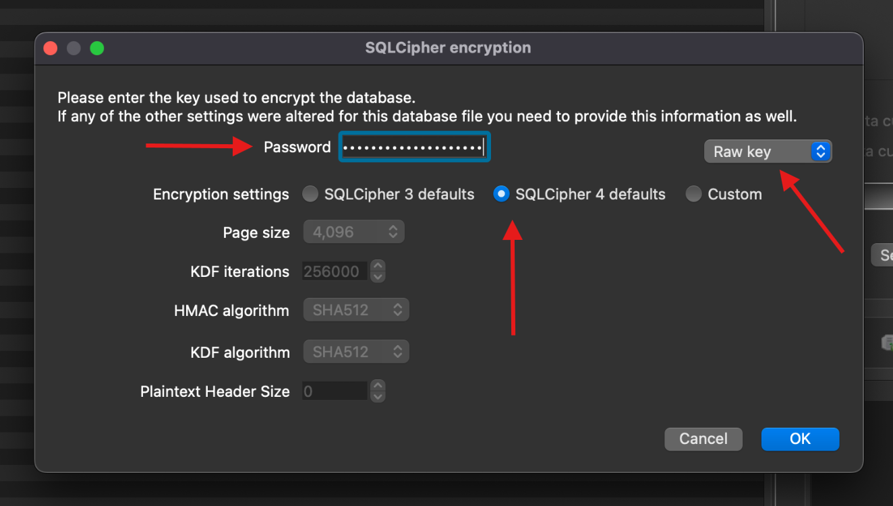
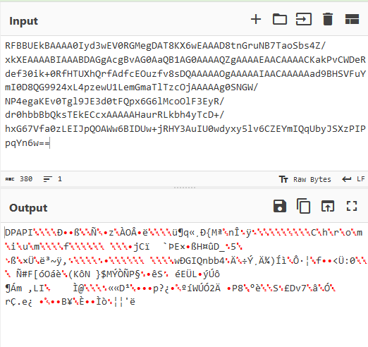

+++
date = '2025-01-26T23:28:04-05:00'
draft = false
title = 'HowTo - Decryption of Signal Messages on Windows'
+++

During HackTheBox University CTF, I played a challenge that involved decrypting Signal messages from a Windows computer that was running a new version of the Signal Windows Application.  If you're interested in the full writeup of the challenge you can check it out [here](https://stolenfootball.github.io/posts/writeups/2024/htb-uni-ctf/signaling-victorious/).

While doing the challenge, I noticed that there wasn't much public information available about how to decrypt the messages database in the new Signal Windows app, and that information could be valuable for forensic investigators. With that in mind, I decided to strip out just the relevant parts from the earlier writeup to provide a better resource to that effect.

## History

The Signal App for Windows stores its messages database as `%APPDATA%\Roaming\Signal\sql\db.sqlite`.  This file is always SQL-Cipher encrypted with a long randomly generated key which isn't practical to crack.

In previous versions of the application, Signal stored the encryption key for this file in plaintext in `%APPDATA%\Roaming\Signal\config.json`.  An example of what `config.json` would look like is below:

```json
{
  "key": "d07de8ee1be42b41d040cf9090a31115671cfe812a6305d0517a2da88bf5c7fc",
  "mediaPermissions": true,
  "mediaCameraPermissions": true
}
```

Because of this, decrypting the database and recovering the messages for the old version of the app is a trivial task.  

1. Open the file in [DB Browser for SQLite](https://sqlitebrowser.org/)
2. Set the drop down to "Raw key"
3. Set the button menu to "SQLCipher 4 defaults"
4. Enter the key in hex as seen in `config.json`  (Note, you must prepend 0x to the key, so if the key value is 1234, you must enter 0x1234).

The menu as it would appear is shown below.




## Changes

Signal was perfectly happy to continue operating this way, but after a [shocking amout of outrage on Twitter](https://gizmodo.com/signal-is-working-to-close-a-security-vulnerability-in-its-desktop-app-2000469908) (or X, who knows at this point) they decided to make the encryption key a bit more difficult to access.  They accomplished this by using device-native solutions to store all of its encryption keys. On Linux it was the keyring, on MacOS it was the keychain, and on Windows it was DPAPI.

## A Brief Aside - DPAPI

DPAPI is the Windows Data Protection API.  It allows application developers to store data encrypted with the user's password on the disk securely, without actually having access to the user's password.  It also allows retrieval of that data.

DPAPI is the way Microsoft is recommending secrets be stored on the disk in modern Windows applications, and is something forensic investigators should take the time to familiarize themselves with, as it is becoming more and more common.

Application developers can use the API through the `CryptProtectData` and `CryptUnprotectData` functions. `CryptProtectData` takes plaintext and returns a `DPAPI_BLOB` structure, which contains the encrypted data and metadata regarding the encryption. `CryptUnprotectData` takes a `DPAPI_BLOB`, and returns plaintext.

Under the hood DPAPI (when encrypting secrets for a specific user) uses a 64 byte "Master Key" during encryption, which is saved in the `%APPDATA\Roaming\Microsoft\Protect\[USER_SID]` folder. The Master Key is combined with the SHA1 hash of the user's password, the user's SID, and some metadata stored in the `DPAPI_BLOB` to derive the encryption key used to encrypt the plaintext.

The end result of all of this is that an application developer can store serialized `DPAPI_BLOB` structures on the disk and have a degree of assurance that they cannot be decrypted without the user's password.

For a more detailed discussion of DPAPI internals, I highly recommend the blog post I'm linking here. It does a great job of making a complex topic clear, and provides a lot of fantastic detail.

https://www.insecurity.be/blog/2020/12/24/dpapi-in-depth-with-tooling-standalone-dpapi/


## New Database Decryption Process

Frankly, Signal made this more complicated than it needed to be, and they didn't use DPAPI entirely as it was meant to be used.  Even so, the security guarantees of DPAPI are still intact, and there isn't a way I could see to circumvent DPAPI even given the janky implementation.

That said, here is the decryption chain:

- A DPAPI blob is stored in the `%APPDATA%\Roaming\Signal\Local State` file
- This DPAPI blob contains an `AES-256-GCM` Initialization Vector, Encryption Key, and GCM Tag
- The IV, Key, and Tag stored in the `Local State` blob are used to decrypt the `encryptedKey` stored in `%APPDATA%\Roaming\Signal\config.json`
- The decrypted `encryptedKey` is used to decrypt the SQL-Cipher file

Let's go through each of these steps for a better look at what is going on.

## Local State

`%APPDATA%\Roaming\Signal\Local State` is actually a `json` file, despite the fact that it has no file extension.  An example of what a typical `Local State` file will look like is below:

```json
{
  "os_crypt": {
    "audit_enabled": true,
    "encrypted_key": "RFBBUEkBAAAA0Iyd3wEV0RGMegDAT8KX6wEAAAD8tnGruNB7TaoSbs4Z/xkXEAAAABIAAABDAGgAcgBvAG0AaQB1AG0AAAAQZgAAAAEAACAAAACKakPvCWDeRdef30ik+0RfHTUXhQrfAdfcEOuzfv8sDQAAAAAOgAAAAAIAACAAAAAad9BHSVFuYmI0D8QG9924xL4pzewU1LemGmaTlTzcOjAAAAAg0SNGW/NP4egaKEv0Tgl9JE3d0tFQpx6G6lMcoOlF3EyR/dr0hbbBbQksTEkECcxAAAAAHaurRLkbh4yTcD+/hxG67Vfa0zLEIJpQOAWw6BIDUw+jRHY3AuIU0wdyxy5lv6CZEYmIQqUbyJSXzPIPpqYn6w=="
  }
}
```

The value stored in `encrypted_key` is a DPAPI blob with some stuff tacked on to it.  If you Base64 decode the above `encrypted_key` field, you'll see the following:



The string "DPAPI" appended to the front of the blob is entirely a Signal artifact, and one I have not been able to find any reason for.  That said, it must be removed before parsing the data further using standard tools.

To make the value parsable by standard tooling, you must:

1. Decode the `encrypted_key` value from Base64
2. Remove the "DPAPI" string from the front
3. Convert what remains back to hex

This can be accomplished with the [CyberChef formula linked here](https://gchq.github.io/CyberChef/#recipe=From_Base64('A-Za-z0-9%2B/%3D',true,false)Drop_bytes(0,5,false)To_Hex('None',0)&oeol=NEL).

Once the value is fixed up, it can be parsed by [pypykatz](https://github.com/skelsec/pypykatz) with the following command:

```bash
jeremydunn@Jeremys-MacBook-Pro % pypykatz dpapi describe blob 01000000d08c9ddf0115d1118c7a00c04fc297eb01000000fcb671abb8d07b4daa126ece19ff191710000000120000004300680072006f006d00690075006d0000001066000000010000200000008a6a43ef0960de45d79fdf48a4fb445f1d3517850adf01d7dc10ebb37eff2c0d000000000e80000000020000200000001a77d04749516e6262340fc406f7ddb8c4be29cdec14d4b7a61a6693953cdc3a3000000020d123465bf34fe1e81a284bf44e097d244dddd2d150a71e86ea531ca0e945dc4c91fddaf485b6c16d092c4c490409cc400000001dabab44b91b878c93703fbf8711baed57dad332c4209a503805b0e81203530fa344763702e214d30772c72e65bfa09911898842a51bc89497ccf20fa6a627eb
== DPAPI_BLOB ==
version: 1
credential_guid: b'\xd0\x8c\x9d\xdf\x01\x15\xd1\x11\x8cz\x00\xc0O\xc2\x97\xeb'
masterkey_version: 1
masterkey_guid: ab71b6fc-d0b8-4d7b-aa12-6ece19ff1917
flags: 16
description_length: 18
description: b'C\x00h\x00r\x00o\x00m\x00i\x00u\x00m\x00\x00\x00'
crypto_algorithm: 26128
crypto_algorithm_length: 256
salt_length: 32
salt: b'\x8ajC\xef\t`\xdeE\xd7\x9f\xdfH\xa4\xfbD_\x1d5\x17\x85\n\xdf\x01\xd7\xdc\x10\xeb\xb3~\xff,\r'
HMAC_key_length: 0
HMAC_key: b''
hash_algorithm: 32782
HMAC: b'\x1aw\xd0GIQnbb4\x0f\xc4\x06\xf7\xdd\xb8\xc4\xbe)\xcd\xec\x14\xd4\xb7\xa6\x1af\x93\x95<\xdc:'
data_length: 48
data: b' \xd1#F[\xf3O\xe1\xe8\x1a(K\xf4N\t}$M\xdd\xd2\xd1P\xa7\x1e\x86\xeaS\x1c\xa0\xe9E\xdcL\x91\xfd\xda\xf4\x85\xb6\xc1m\t,LI\x04\t\xcc'
signature_length: 64
signature: b"\x1d\xab\xabD\xb9\x1b\x87\x8c\x93p?\xbf\x87\x11\xba\xedW\xda\xd32\xc4 \x9aP8\x05\xb0\xe8\x12\x03S\x0f\xa3Dv7\x02\xe2\x14\xd3\x07r\xc7.e\xbf\xa0\x99\x11\x89\x88B\xa5\x1b\xc8\x94\x97\xcc\xf2\x0f\xa6\xa6'\xeb"
hash_algorithm_length: 512
HMAC_length: 32
to_sign: b'\x01\x00\x00\x00\xfc\xb6q\xab\xb8\xd0{M\xaa\x12n\xce\x19\xff\x19\x17\x10\x00\x00\x00\x12\x00\x00\x00C\x00h\x00r\x00o\x00m\x00i\x00u\x00m\x00\x00\x00\x10f\x00\x00\x00\x01\x00\x00 \x00\x00\x00\x8ajC\xef\t`\xdeE\xd7\x9f\xdfH\xa4\xfbD_\x1d5\x17\x85\n\xdf\x01\xd7\xdc\x10\xeb\xb3~\xff,\r\x00\x00\x00\x00\x0e\x80\x00\x00\x00\x02\x00\x00 \x00\x00\x00\x1aw\xd0GIQnbb4\x0f\xc4\x06\xf7\xdd\xb8\xc4\xbe)\xcd\xec\x14\xd4\xb7\xa6\x1af\x93\x95<\xdc:0\x00\x00\x00 \xd1#F[\xf3O\xe1\xe8\x1a(K\xf4N\t}$M\xdd\xd2\xd1P\xa7\x1e\x86\xeaS\x1c\xa0\xe9E\xdcL\x91\xfd\xda\xf4\x85\xb6\xc1m\t,LI\x04\t\xcc'
```

## Decrpyting the Blob

At its root a DPAPI blob is simply a container for encrypted data.  Most of these fields are describing the encryption method, and aren't required to be interacted with by an investigator.

There are three pieces of information required to decrypt a DPAPI blob.  These are:

1. The DPAPI "Master Key Seed"
2. The SHA1 hash of the user's password
3. The user's SID

Of these, the user's SID should be trivial for an investigator to retrieve, so I won't go into how to recover it here.

The SHA1 hash can be obtained through a number of ways, the easiest of which is likely to use a tool such as [Passware](https://www.passware.com/) to recover the plaintext password, then use a tool such as Eric Zimmerman's [Hasher](https://www.sans.org/tools/hasher/) to obtain the hash  (Note - an NTLM hash such as those stored in the registry will not work for this process, and cannot be directly transformed into a SHA1 hash without first being "cracked" into plaintext).

The DPAPI Master Key Seed is stored in `%APPDATA\Roaming\Microsoft\Protect\[USER_SID]\[MASTER_KEY_GUID]`.  The Master Key GUID associated with the current blob can be seen in the `pypykatz` output above under `masterkey_guid` - in our example case it is `ab71b6fc-d0b8-4d7b-aa12-6ece19ff1917`.

Once all of the information is gathered, there are three `pypykatz` commands required to decrypt the database.  First, we must generate "prekeys" using the GUID and SHA1 hash of the password.

```bash
jeremydunn@Jeremys-MacBook-Pro % pypykatz dpapi prekey sha1 S-1-5-21-1208348762-991206961-812773293-1001 ded871d3a3992be2179840890d061c9f30a59a77 | tee prekeys.txt
d63766f8e020781d1b9c694b19af724aed16284b
ded871d3a3992be2179840890d061c9f30a59a77
```

Then we use those prekeys to calculate the correct master key.

```bash
jeremydunn@Jeremys-MacBook-Pro % pypykatz dpapi masterkey ./backup/Users/frontier-user-01/AppData/Roaming/Microsoft/Protect/S-1-5-21-1208348762-991206961-812773293-1001/ab71b6fc-d0b8-4d7b-aa12-6ece19ff1917 prekeys.txt
[GUID] ab71b6fc-d0b8-4d7b-aa12-6ece19ff1917
[MASTERKEY] 791ca70e650987684b043745c6f4b1c0f97eb2369317302c6c60f9cda19e1b4864fbece48341141501606d8d359ff7f54ee71e4a2b821d3df69582927742809f
```

And finally, we can use the calculated Master Key to decrypt the blob.

```bash
jeremydunn@Jeremys-MacBook-Pro % pypykatz dpapi blob masterkey_decrypted.json 01000000d08c9ddf0115d1118c7a00c04fc297eb01000000fcb671abb8d07b4daa126ece19ff191710000000120000004300680072006f006d00690075006d0000001066000000010000200000008a6a43ef0960de45d79fdf48a4fb445f1d3517850adf01d7dc10ebb37eff2c0d000000000e80000000020000200000001a77d04749516e6262340fc406f7ddb8c4be29cdec14d4b7a61a6693953cdc3a3000000020d123465bf34fe1e81a284bf44e097d244dddd2d150a71e86ea531ca0e945dc4c91fddaf485b6c16d092c4c490409cc400000001dabab44b91b878c93703fbf8711baed57dad332c4209a503805b0e81203530fa344763702e214d30772c72e65bfa09911898842a51bc89497ccf20fa6a627eb
HEX: 7582f084a7d00872eebe919c2c02da0a8f4d8e67e648bb55805e8994a8a165ef
STR: 艵蓰킧爈뻮鲑Ȭ૚䶏枎䣦喻庀钉ꆨ
```

## Sidenote on DPAPI Decryption

Much of this process can be bypassed if you have access to a memory capture of the machine of which you are conducting the analysis.

You can obtain the Master Key directly (and sometimes the SHA1 of the user's password) using [Volatility](https://github.com/volatilityfoundation/volatility3) and the [pypykatz Volatility3 plugin](https://github.com/skelsec/pypykatz-volatility3). Just run the plugin, and we get:

```bash
jeremydunn@Jeremys-MacBook-Pro % vol -f win10_memdump.elf -p pypykatz-volatility3 pypykatz
Volatility 3 Framework 2.8.0
credtype	domainname	username	NThash	LMHash	SHAHash	masterkey	masterkey(sha1)	key_guid	password
msv	DESKTOP-6MBJBAP	frontier-user-01	1d3e3e030ba1a179e1281406efd980bf		ded871d3a3992be2179840890d061c9f30a59a77
dpapi						791ca70e650987684b043745c6f4b1c0f97eb2369317302c6c60f9cda19e1b4864fbece48341141501606d8d359ff7f54ee71e4a2b821d3df69582927742809f	8d53efa8456b9ba43206f4c3a6dc1c957d26105a	ab71b6fc-d0b8-4d7b-aa12-6ece19ff1917
msv	DESKTOP-6MBJBAP	frontier-user-01	1d3e3e030ba1a179e1281406efd980bf		ded871d3a3992be2179840890d061c9f30a59a77
```

## Decrypting the Encryption Key

Once the information from the DPAPI Blob in the `%APPDATA%\Roaming\Signal\Local State` file has been obtained, it will be possible to decrypt the approptiate value in `%APPDATA%\Roaming\Signal\config.json`.  An example of the new format of `config.json` is shown here:

```json
{
  "encryptedKey": "763130cc1843cbf3949e872b373031e89c85f8e8d6e9ec3bd9340bb9c6fd844ca424d7e666feac3663f6c2810d6ddbdfb82f7faa4456eda119bacd2709fc2404eeeb74e69b2b3f2f71e765b74a068c5549a1871559d537de08a25c700a97cd"
}
```

This `encryptedKey` value is encrypted using `AES-256-GCM`.  `AES-256-GCM` refers to [Galois/Counter Mode](https://en.wikipedia.org/wiki/Galois/Counter_Mode), which is one of the most common methods of modern authenticated encryption. This describes crypto-systems that allow for verifiying the integrity of the data that was encrypted as a native part of the encryption scheme, which a more basic construction like `AES-CBC$` would not do.

The important part of this is that we need three separate items to decrypt ciphertext that was encrypted with `AES-256-GCM`.

1. The Initialization Vector (IV) (also commonly called Nonce)
2. The Encryption Key
3. The Message Authentication Code (MAC)

Fortunately for us, these things are now all readily available.

This `encryptedKey` value is actually a series of values packed together.  The format is as follows:

```json
{
    "header": "BYTES [1-3]",
    "nonce": "BYTES [4-16]",
    "encrypted_data": "BYTES [17-81]",
    "mac": "BYTES [82-98]"
}
```

Parsing out our example `encryptedKey` in this way, we get the following:

```json
{
  "header": "763130", // ('v', '1', '0') in ASCII hex
  "nonce": "cc1843cbf3949e872b373031",
  "encrypted_data": "e89c85f8e8d6e9ec3bd9340bb9c6fd844ca424d7e666feac3663f6c2810d6ddbdfb82f7faa4456eda119bacd2709fc2404eeeb74e69b2b3f2f71e765b74a068c",
  "mac": "5549a1871559d537de08a25c700a97cd"
}
```

The encryption key is the value obtained from the DPAPI Blob earlier.

We can now use [CyberChef](https://gchq.github.io/CyberChef) to decrypt the data. A link to the exact recipe that decrypts the test data is [here](<https://gchq.github.io/CyberChef/#recipe=AES_Decrypt(%7B'option':'Hex','string':'7582f084a7d00872eebe919c2c02da0a8f4d8e67e648bb55805e8994a8a165ef'%7D,%7B'option':'Hex','string':'cc1843cbf3949e872b373031'%7D,'GCM','Hex','Raw',%7B'option':'Hex','string':'5549a1871559d537de08a25c700a97cd'%7D,%7B'option':'Hex','string':''%7D)&input=ZTg5Yzg1ZjhlOGQ2ZTllYzNiZDkzNDBiYjljNmZkODQ0Y2E0MjRkN2U2NjZmZWFjMzY2M2Y2YzI4MTBkNmRkYmRmYjgyZjdmYWE0NDU2ZWRhMTE5YmFjZDI3MDlmYzI0MDRlZWViNzRlNjliMmIzZjJmNzFlNzY1Yjc0YTA2OGM>).

## Decrypting the Database

The value that is obtained by decrypting the `encryptedKey` value in `config.json` is our raw decryption key.  Just follow the steps in the [History](#history) section using this key, and the database will open.

## Final Thoughts

Despite the oddities and seemingly excessive complexity (or maybe because of it), this new method of encrypting Signal data requires more effort from an investigator to decrypt, but it is not impossible.  I hope this writeup has been valuable in assisting that effort.

If anyone reading this has any questions / information they want to share regarding this, feel free to reach out to one of my points of contact listed on this blog. 