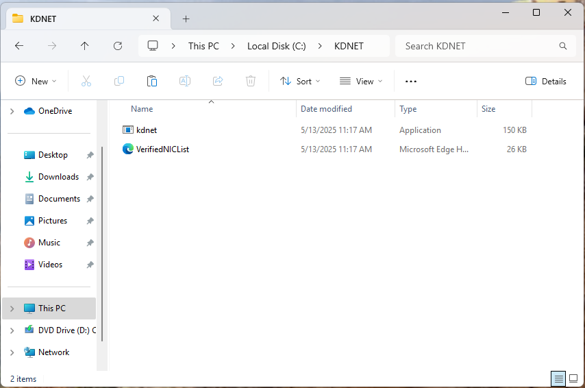
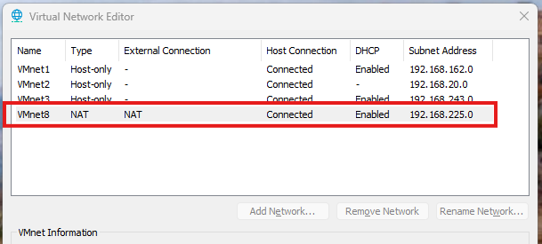

+++
date = '2025-08-06 14:59:28.145 -0400'
draft = false
title = 'HowTo - Set up Windows Kernel Debugging in VMware'
+++

There are two main ways people set up kernel debuggers for Windows - via the network and a via a virtual serial cable.

When possible, I recommend using the network variation.  It is a lot faster and more stable, and is what is currently recommended by Microsoft.  That said, for some older operating systems, particularly if dealing with Windows 7, the serial option is the only one possible.

I use VMware Workstation Pro as my hypervisor for kernel debugging so all examples given here will use that.  Many people also use Hyper-V though, and it should be easy enough to modify these instructions for that as well.

## Install WinDbg on the Host
The first step to take is to install WinDbg on your host computer, which is the bare metal OS running your hypervisor.  

> Yes, that means you should be running Windows while doing Windows development work.  It is possible to do all of this from MacOS or Linux, but your life will be more difficult than it needs to be.  
>
> If you're daily driving Linux I'll assume you know enough to set up a dual boot.  If you're using an ARM Mac, I'd recommend getting a cheap x64 computer you can hack on.  A decent used Thinkpad should be less than $100 on eBay, or you could take a dumpster diving trip to your local office park if that isn't feasible for some reason.  Dumpster diving for parts is a well respected pastime in the IT world.

You can download the Windows 11 SDK by navigating to [the official download page](https://developer.microsoft.com/en-us/windows/downloads/windows-sdk/) and clicking "Download the installer".


Make sure to "install the SDK on this computer".


When it comes time to select which features to install, I suggest installing all of them.  In particular, make sure the **Debugging Tools for Windows** get installed, as that is where WinDbg is located.  If you just want WinDbg, uncheck all of the other boxes and continue the installation.


## Network Kernel Debugging Setup
### Copy files to the guest VM
On the guest VM, create a directory called `C:\KDNET`.  We'll need to copy two files from the host computer to that directory:

- `kdnet.exe`
- `VerifiedNICList.xml`

Both of these will be located on the host machine at `C:\Program Files (x86)\Windows Kits\10\Debuggers\x64`.

When you're done, the `KDNET` directory on the VM should look like the following:



### Set up networking on the debugee
The next thing we need to do is establish a way for our VM and host machine to communicate.  This is typically done over a network connection these days.

To keep things simple, we'll keep the VM on the VMware internal NAT network, which is what it should be on by default.  To confirm this, right click on the VM and select "Settings":


Then make sure "NAT" is selected.


Now we need to make sure that the network on the VM is trusted.  Open the Windows Settings menu on the VM, click on "Network & internet" in the left hand menu bar, then click on "Ethernet".  Make sure that the network is set as a "Private network".


### Get the Host's IP address
We'll need an IP address so we can ping the host from the VM.  The VMware NAT network is set up on VMnet8 by default, which can be confirmed by navigating to "Edit" -> "Virtual Network Editor" in VMWare Workstation.


In this screenshot you can see NAT is VMnet8, as expected.



Now on the host machine, run `ipconfig` and scroll until you find the entry for VMnet8.  Write down the host IP - in my case it's `192.168.225.1`.

```
C:\Users\jerem>ipconfig

Windows IP Configuration


Ethernet adapter Ethernet:

   Media State . . . . . . . . . . . : Media disconnected
   Connection-specific DNS Suffix  . : hsd1.nh.comcast.net

...

Ethernet adapter VMware Network Adapter VMnet8:

   Connection-specific DNS Suffix  . :
   Link-local IPv6 Address . . . . . : fe80::7357:15af:c3ca:2d3b%24
   IPv4 Address. . . . . . . . . . . : 192.168.225.1
   Subnet Mask . . . . . . . . . . . : 255.255.255.0
   Default Gateway . . . . . . . . . :
```

### Set up debugging on the VM
On the VM, open up an **Administrative** command prompt and `cd` into the `C:\KDNET` directory.

Run `kdnet.exe`.  You should see something along the lines of the following output, which means debugging is supported on your adapter.

```
C:\KDNET>kdnet.exe

Network debugging is supported on the following NICs:
busparams=3.0.0, Intel(R) 82574L Gigabit Network Connection, Plugged in.

Network debugging is not supported on any of this machine's USB controllers.
```

Next, we'll open a port for network debugging using `kdnet.exe`.  The port number typically used for this is between `50000-50039`.  For this, I arbitrarily chose `50017`.

The command to enable debugging to be run on the VM is:
```
kdnet.exe [HOST IP ADDRESS] [PORT NUMBER]
```

Using my IP and port, a run of the command looks like this:

```
C:\KDNET>kdnet.exe 192.168.225.1 50017

Enabling network debugging on Intel(R) 82574L Gigabit Network Connection.

To debug this machine, run the following command on your debugger host machine.
windbg -k net:port=50017,key=10p145zzlg28h.8rtmc2s2tujk.6f4kt1ekmx9t.1pnjw2uxvjpk4

Then reboot this machine by running shutdown -r -t 0 from this command prompt.
```

Copy the command that starts with **windbg** to a safe place.  **Your key will be different from mine.  Use the one from your machine**.

### Connect to the VM with WinDbg
Open WinDbg on the host machine, then click on "File" -> "Attach to kernel" -> "Net"


Make sure to set the port number to the number we chose earlier, and the "Key" should be the key from the output from the VM.

If everything went right, WinDbg should open a window that looks like the following:


Now reboot the VM.  This can be accomplished through running `shutdown -r -t 0` from the same Administrative command prompt as earlier, or simply from the start menu.

Once the VM reboots, you should see it connect to the debugger.  WinDbg will output some messages that look like the following:


## Serial Kernel Debugging Setup

### Enable Debugging on the VM
Open an Administative command prompt on the VM, and issue these two commands:

```
C:\Windows\system32> bcdedit /copy {current} /d "Kernel Debugging On"
The entry was successfully copied to {03ea5c56-7301-11f0-8a3b-8fd393321330}

C:\Windows\system32> bcdedit /debug {03ea5c56-7301-11f0-8a3b-8fd393321330} on
The operation completed successfully.
```

Note that the GUID will be unique to you.  Make sure the GUID in the second command matches the output of the first.

This makes an entry in the boot table that has debugging enabled.  You can see this if you run `bcdedit` with no arguments in the same command prompt.


Now open the System Configuration app (`msconfig.exe`), click on the "Kernel Debugging On" entry, then select "Advanced options...".  In that menu, make the following configuration changes:

- Make sure "Debug" is checked
- Make sure "Debug port" is checked and set to `COM1`
- Make sure "Baud rate" is checked and set to `115200`


Press `OK` then `Apply` then `OK`, then restart the VM.

> Sometimes a different COM port has to be set for this to work.  If you get to the end and the debugger doesn't connect, try COM2, COM3, and COM4.  VMware is almost definitely listening on one of them, it just doesn't tell you which.  COM1 seems most common, so I used it here.

### Set up the Serial Port in VMware
Now turn off the VM, right click on it's entry in VMware Workstation and go to "Settings".

Click "Add" at the bottom, then "Serial Port", then "Finish"


Once that is added, click on the serial port in the settings and make the following changes:

- Make sure "Connect at power on" is checked
- Under "Connection" select "Use named pipe"
- Set the named pipe to a name that makes sense.  It must start with `\\.\pipe\`, but the pipe name can be anything.
- Make sure the first drop down is "This end is the server" and the other drop down is "The other end is an application"
- Check "Yield CPU on poll" under "I/O Mode".

The end result should look like this:


Click "OK" to save the settings.

### Connect to the VM from the host
Open WinDbg from the host computer.  Make sure you use the version of WinDbg corresponding to the version of the operating system of the VM.  For example, if I am debugging a 32 bit Windows 7 VM, I need to use WinDbg (x86).


When it opens, select "File" then "Kernel Debug"


Go to the "COM" tab, then make the following changes:

- Make sure "Baud Rate" is `115200`
- Set "Port" to the name of the pipe from the VM
- Check "Pipe" and "Reconnect"


When done, click "OK".

If all is well, a window will pop up that looks like this:


### Boot the VM and connect
Start the VM.  You'll get a menu that allows you to choose which boot configuration to boot with, make sure you choose the one where we have configured the debugger.


Once the OS finishes booting, you should see connect messages in WinDbg that look something like this:


You can now select "Break" from the debug menu and continue with your debugging session.