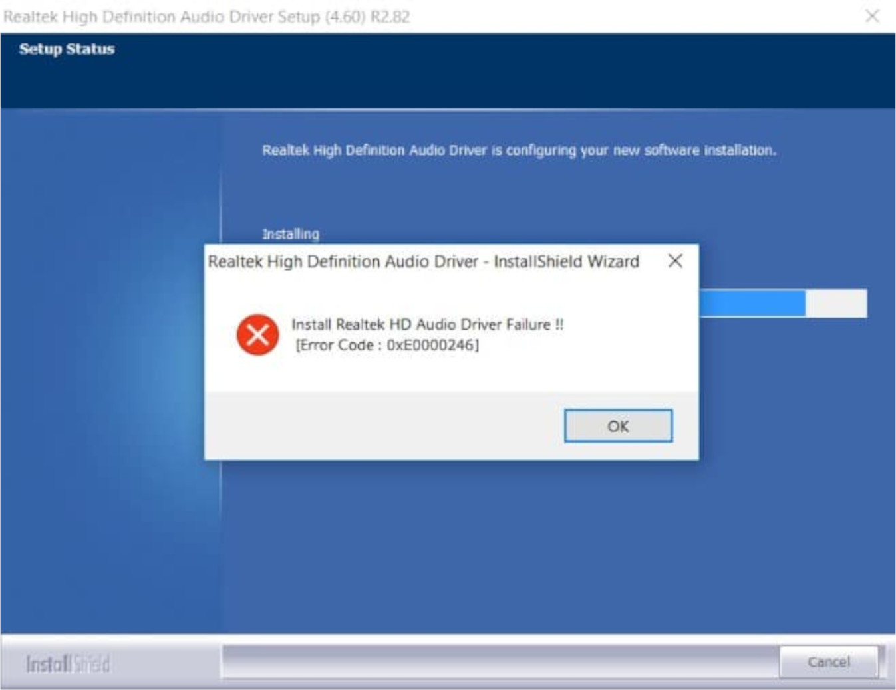
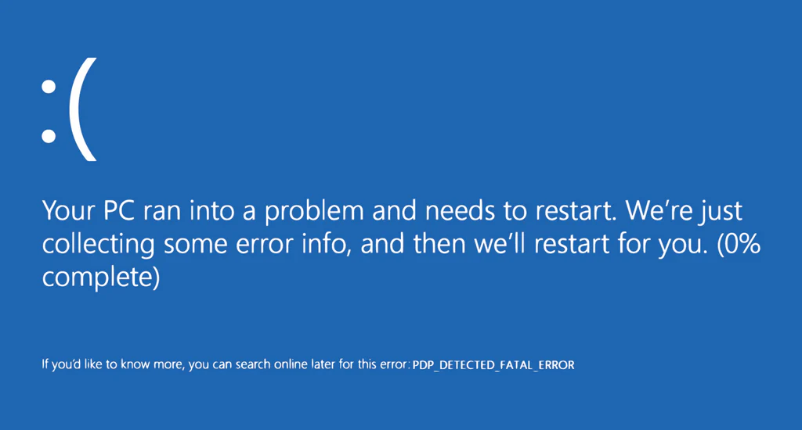
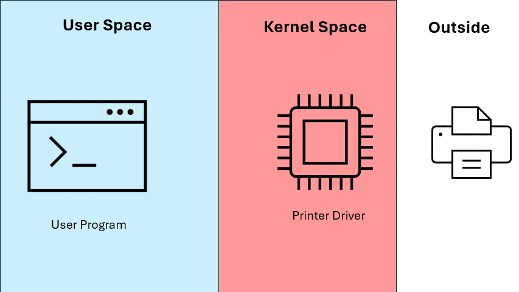
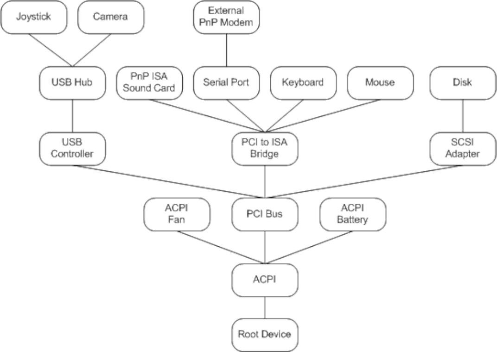
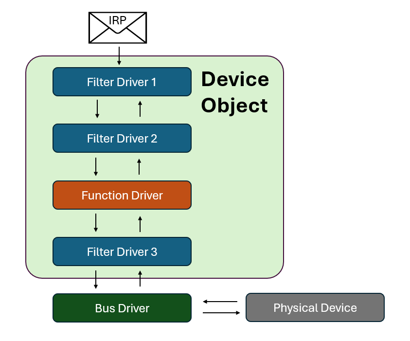

If you've used Windows long enough, chances are you've heard the term driver before.  Admittedly, it was probably in the context of something like this:

or this:

or potentially, given the audience for this kind of blog post, this?

However, if we're going to be doing exploit development work on drivers, it's important to have a fundemental understanding of what a driver does and the role it plays in a modern operating system.

## History you didn't ask for
When computers first started to become mainstream, operating systems came with the ability to directly program physical memory, but little else.  For more intrepid nerds, however, computers also had expansion slots.  

Expansion slots allowed a user to plug in any number of their own devices and interface with them, but the computer had no native support for any peripherals.  Therefore, using an expansion device usually required writing a small program in assembly that mapped all of the I/O memory regions to interrupt assignments and instructions that a PC could use.  These programs "drove" the hardware for the OS that couldn't use it directly, much like a taxi driver would drive a car for someone who didn't know how to drive.  These programs became known as drivers.

As computers became more powerful and compute resources became less valuable, people began to want to interface with their computers in a graphical manner.  A grapical wrapper called Windows was released for MS-DOS, and with it and number of drivers to drive the monitor, mouse, and keyboard.  

When the i386 came out there was another major jump - hardware supported virtual memory.  To take advantage of this, Microsoft began running all applications in their own virtual machine, which allowed easy multitasking and process isolation.  This created a problem because at the time processes still included their own drivers and drove hardware directly (which was possible because MS-DOS was a [RTOS](https://en.wikipedia.org/wiki/Real-time_operating_system)).  To fix this, Microsoft introduced the virtual device driver, which provided a virtual device in the process space for the program to drive.

Incidentally, the early virtual drivers were incredibly buggy because they functioned more as a mutex than as a driver - all they would do is make sure no other process was using the hardware, then provide a lock while the current process used the device.

Finally, Windows NT was released, and with it the advent of kernel mode and user mode.  User mode was used for applications and games, and kernel mode was for trusted operations such as interacting with hardware.  All drivers now ran in kernel space and were mananged by the operating system.  User programs could make requests to drivers through the kernel APIs, and the kernel would use the drivers to drive the devices for the programs.   

The device driver model turned out to work well for interaction with extensible kernel components, and there are now any number of virtual devices as well as physical - there are drivers for on the fly encryption, different filesystems, overclocking, and more.  Many functions performed in kernel space that are not directly related to basic OS functions are done with drivers.

## So what is a driver?
Microsoft's definition of a driver is "a software component that lets the operating system and a device communicate".  Keep in mind that a "device" does not need to be a physical device, and may be a virtual software component in the kernel that allows access to protected data structures. In modern Windows, drivers always run in kernel mode, and are accessible through special APIs that can be used to request functionality from them.

## Modern Windows driver types
There are three primary types of drivers in modern Windows:
- Function Drivers
- Filter Drivers
- Bus Drivers

### Function Drivers
A function driver is a driver written to control a physical or virtual device. It sits in kernel space and waits to have requests sent to it, then handles and responds to those requests.

Requests to these drivers are made in the form of an **IRP**, or Interrupt Request Packet.  IRPs are incredibly important for anyone working with drivers, and are a concept we will spend a lot of time with.  IRPs contain the message from user mode to be passed to the driver, as well as the response from the driver.

It's common to think of interacting with function drivers like interacting with a remote service in a typical client / server architecture.  The userland program is the client that sends a message (IRP) to a the driver, which is the server.  The driver then handles the request internally by controlling a device or retrieving protected information, and sends back the IRP with new information.

### Filter Drivers
A filter driver can sit above or below a device driver and modify the IRP before sending it to its destination. Continuing the client / server analogy, a filter driver is like middleware or a firewall.

What this means is that when passing an IRP to a function driver, we aren't passing the IRP directly to the driver.  Instead, the IRP is passed to the top of a **driver stack** associated with the device.  The driver stack might (and probably does) contain a number of fiter drivers that view the IRP, modify what they want, and pass it down.  Eventually the IRP will reach a driver that marks it as complete, and it is passed back up the chain and back to the user who initiated the request.

### Bus Driver
A bus driver is effectively a function driver for a common data bus such as PCI, ISCSI, and USB.  In addition to the normal responsibilities of a function driver, it also is responsible for power management of the devices attached to the bus.

## The Device Tree and Device Objects
Every PnP compatible device in Windows is kept track of as a **device node** and stored as a node in the **device tree**.  The tree shows which objects are connected to which - effectively "how to get to" a certain device from the operating system's perspective.

Each device node has its own **driver stack**, which is the linked list of function and filter drivers associated with it.

## Life of an IRP
So what happens when we send an IRP to a driver?

1. Using a Windows API such as `CreateFile`, the IRP is created with the appropriate fields initialized.
2. The IRP is sent to the kernel.
3. The kernel sends the IRP to the root of the device tree.
4. The IRP is transferred down the device tree to its appropriate node.
5. Once the IRP gets to the correct device node, it is sent to the top of the device's driver stack.
6. The IRP is sent down the stack, with each driver in the stack acting on the IRP then sending down it to the next level.
7. One of the drivers in the stack completes the IRP
8. The IRP walks back up the stack, with each driver in the stack acting on the IRP then sending up to the next level.
9. The IRP returns to the kernel
10. The kernel returns the requested information from the IRP to the user.

Note the same IRP contains both the request and the response.  The fields are just filled out without any additional allocation.

## The Big Picture
For the majority of these posts, particularly the early ones, I will be focusing on function drivers.  Function drivers are both the most common and simplest drivers in Windows.  You can think of them as mini-servers that receive IRPs, modify them, then return them to user space.  Don't get too caught up in the details yet, there will be plenty of time for that later.

## More reading
- [A Brief History of Device Drivers](https://flylib.com/books/en/4.168.1.14/1/)
- [Microsoft Learn - What is a Driver?](https://learn.microsoft.com/en-us/windows-hardware/drivers/gettingstarted/what-is-a-driver-)
- [Microsoft Learn - Driver Stacks](https://learn.microsoft.com/en-us/windows-hardware/drivers/gettingstarted/driver-stacks)
- [Microsoft Learn - Device Trees](https://learn.microsoft.com/en-us/windows-hardware/drivers/kernel/device-tree)

## Series Index
- [Part 1 - Overview](https://stolenfootball.github.io/posts/series/windows_drivers/p1_overview/index.html)
- [Part 2 - What's a Driver Anyways?](https://stolenfootball.github.io/posts/series/windows_drivers/p2_whats_a_driver/index.html)
- [Part 3 - The Minimum Viable Driver](https://stolenfootball.github.io/posts/series/windows_drivers/p3_minimum_viable_driver/index.html)
- [Part 4 - Interacting with the Driver](https://stolenfootball.github.io/posts/series/windows_drivers/p4_interacting_with_driver/)
- [Part 5 - Basic Driver Functionality](https://stolenfootball.github.io/posts/series/windows_drivers/p5_basic_driver_function/)