Alright, enough talk.  The best way to learn is by doing, and by coding our own simple driver, we'll get a good idea of what function driver code looks like.  

## Setting up the dev environment
There are several tools you'll need in order to compile your driver.  Driver development has gotten easier over the years, but it is still more complex than just compiling a userland C++ program.  You may benefit from installing all of this in a VM and saving a snapshot so you have it configured and ready to go whenever you want it, but it's also perfectly fine to install the tools on bare metal.

### Visual Studio 2022
Download the latest **Community** version of [Visual Studio 2022](https://visualstudio.microsoft.com/downloads/).


When running the installer, make sure to select the **Desktop development with C++** Workload.


Next, move over to the **Individual components** tab, and install all of the following:

- MSVC v143 - VS 2022 C++ ARM64/ARM64EC Spectre-mitigated libs (Latest)
- MSVC v143 - VS 2022 C++ x64/x86 Spectre-mitigated libs (Latest)
- C++ ATL for latest v143 build tools with Spectre Mitigations (ARM64/ARM64EC)
- C++ ATL for latest v143 build tools with Spectre Mitigations (x86 & x64)
- C++ MFC for latest v143 build tools with Spectre Mitigations (ARM64/ARM64EC)
- C++ MFC for latest v143 build tools with Spectre Mitigations (x86 & x64)
- Windows Driver Kit

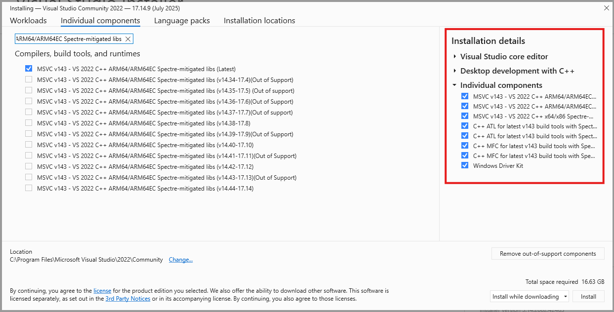

You may want to consult [this page](https://learn.microsoft.com/en-us/windows-hardware/drivers/gettingstarted/writing-a-very-small-kmdf--driver#prerequisites) to confirm the latest versioning still matches what is on this post.

### Windows 11 SDK
Download the Windows 11 SDK by navigating to [the official download page](https://developer.microsoft.com/en-us/windows/downloads/windows-sdk/) and clicking "Download the installer".

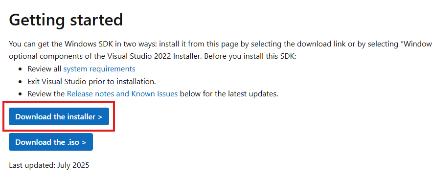

Make sure to "install the SDK on this computer".


When it comes time to select which features to install, I suggest installing all of them.  In particular, make sure the **Debugging Tools for Windows** get installed.

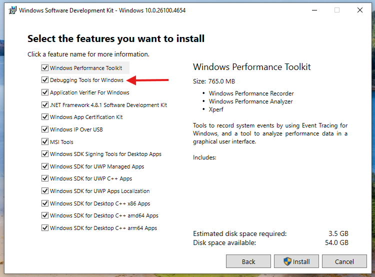

### Windows 11 Driver Kit
Download the Windows Driver Kit from [the official download page](https://learn.microsoft.com/en-us/windows-hardware/drivers/download-the-wdk#download-icon-for-wdk-step-3-install-wdk).

As before, make sure to "install the WDK to this computer".

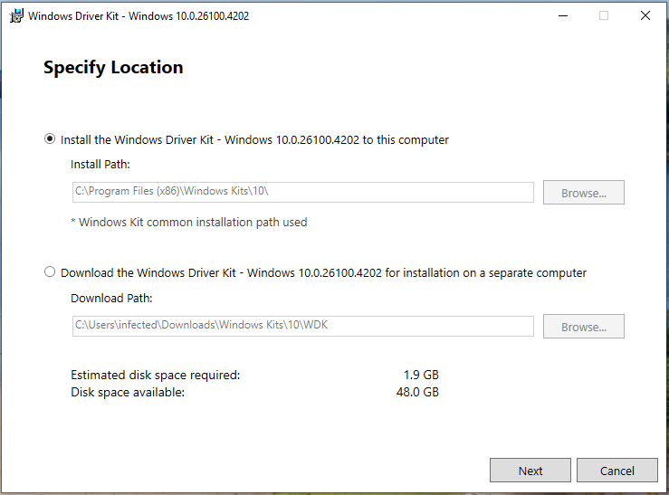

If you've completed it correctly, there should be no error messages.  That said, the versioning between Visual Studio, the SDK, and the WDK can be finicky.  If you follow the above steps in the exact order you should be fine.  Otherwise, Google is your friend.

## Creating the project
Start Visual Studio, then select **Create a new project**

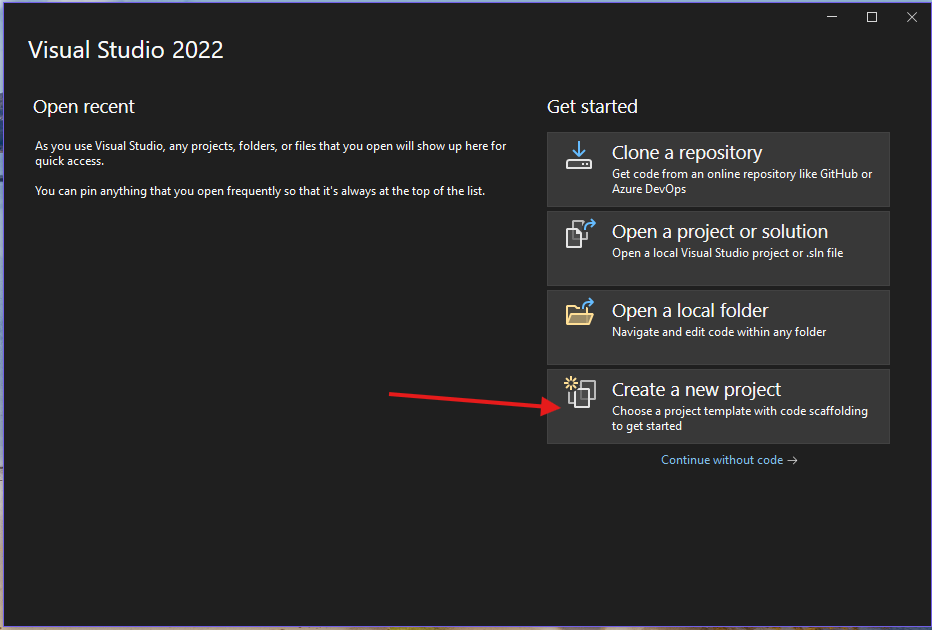

Search for and select **Empty WDM Driver** then click Next.

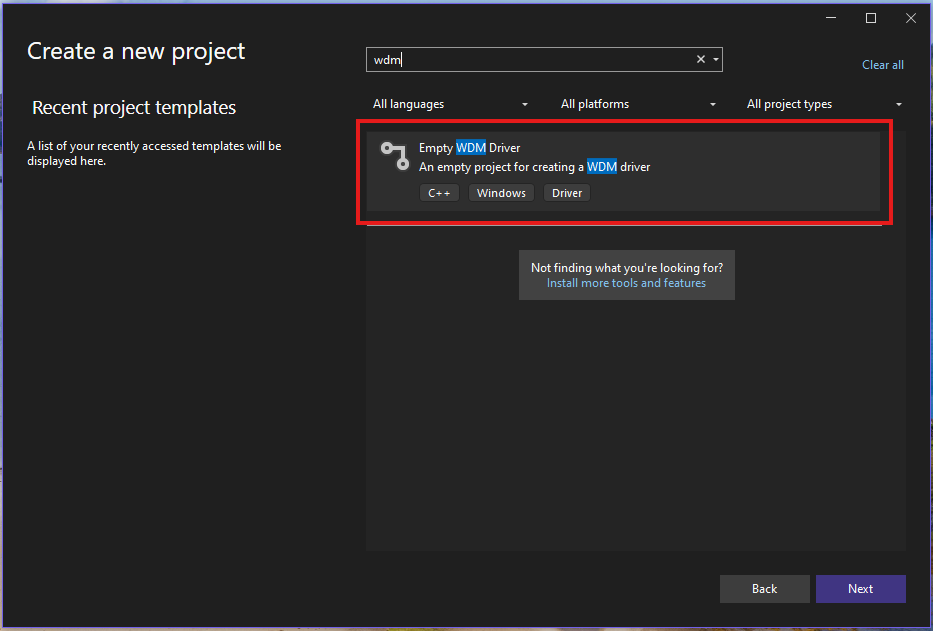

On the next screen call the driver whatever you want and put it wherever you want in the filesystem.

In the project files on the right hand side under **Driver Files**, delete the inf file with your driver's name by right clicking on it.

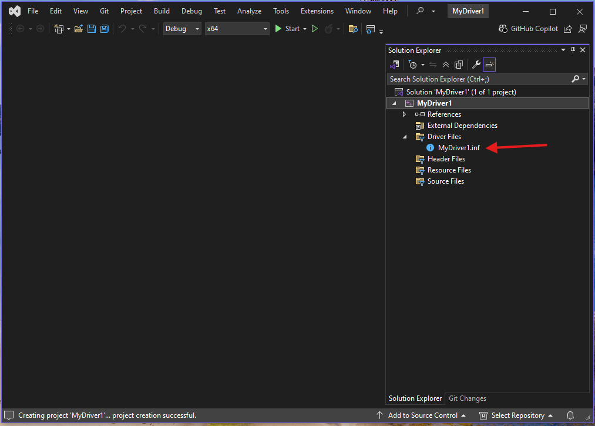

Now right click on **Source Files** then select **Add** then **New Item**

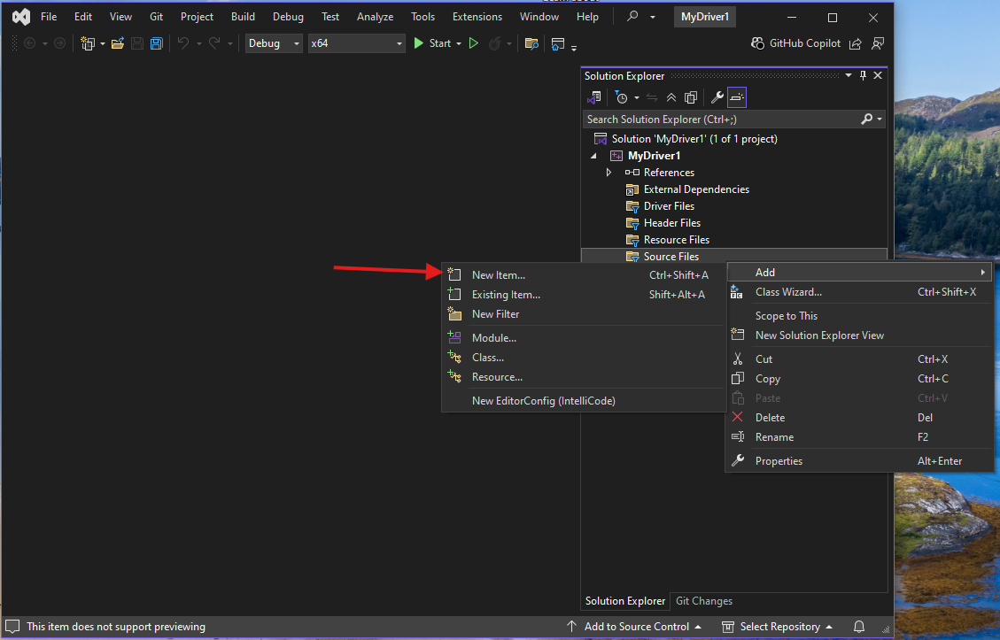

Name the new item *Your driver name*.cpp.  For example, mine is named MyDriver1.cpp.

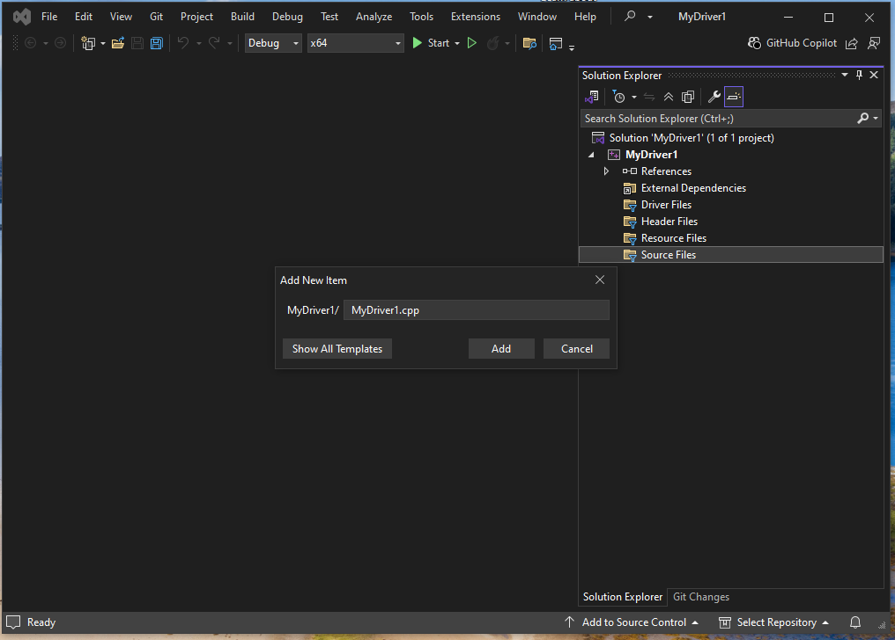

Now, finally, we can start to code.

## DriverEntry and Unload
If you have previous coding experience, you are probably used to a progam starting in the **main** function.  Drivers have an equivalent, called **DriverEntry**.  

**DriverEntry** is run once, when the driver is loaded into the kernel.  It does not run each time the driver is interfaced with.  It's complement, the **Unload** routine, is run when the driver is unloaded.

The signature of a DriverEntry function is as follows:

```c++
#include <ntddk.h>

extern "C" NTSTATUS 
DriverEntry(_In_ PDRIVER_OBJECT DriverObject, _In_ PUNICODE_STRING RegistryPath) {
    return STATUS_SUCCESS;
}
```

There are a few things about this function that will look strange to the C++ developer coming from userland.

- `#include <ntddk.h>` - an external library where many types used for drivers can be imported from.
- `extern "C" NTSTATUS` - the return type of this function is an NTSTATUS code, which is a well defined [enum from Microsoft](https://learn.microsoft.com/en-us/openspecs/windows_protocols/ms-erref/596a1078-e883-4972-9bbc-49e60bebca55).  The `extern "C"` keyword is included to have the compiler link to the C library where the NTSTATUS enum lives, which is not done by default for a C++ driver.
- `_In_` and `_Out_` - part of the **SAL** (Source (code) Annotation Language).  Most kernel functions return status values only.  Therefore, the only way to return data from functions is to pass an allocated piece of memory as an argument that the called function can write to.  The SAL annotations are transparent to the compiler, and are present to remind the programmer which arguments are true arguments and which ones are actually return values.
- `PUNICODE_STRING` - equivalent to `UNICODE_STRING *RegistryPath`.  Just a helpful typedef for cleaner code.  If you see a `P` in front of a known type, its a pointer.

The two arguments DriverEntry takes are initialized and passed in by the kernel for use in the driver. `PUNICODE_STRING RegistryPath` is simply a path to a place in the registry the driver can store and retrieve its configuration keys from.

`PDRIVER_OBJECT DriverObject` is a [struct defined in the MSDN](https://learn.microsoft.com/en-us/windows-hardware/drivers/ddi/wdm/ns-wdm-_driver_object) as follows:

```c++
typedef struct _DRIVER_OBJECT {
  CSHORT             Type;
  CSHORT             Size;
  PDEVICE_OBJECT     DeviceObject;
  ULONG              Flags;
  PVOID              DriverStart;
  ULONG              DriverSize;
  PVOID              DriverSection;
  PDRIVER_EXTENSION  DriverExtension;
  UNICODE_STRING     DriverName;
  PUNICODE_STRING    HardwareDatabase;
  PFAST_IO_DISPATCH  FastIoDispatch;
  PDRIVER_INITIALIZE DriverInit;
  PDRIVER_STARTIO    DriverStartIo;
  PDRIVER_UNLOAD     DriverUnload;
  PDRIVER_DISPATCH   MajorFunction[IRP_MJ_MAXIMUM_FUNCTION + 1];
} DRIVER_OBJECT, *PDRIVER_OBJECT;
```

For right now, the only field in this struct we care about is `PDRIVER_UNLOAD DriverUnload`. This is an uninitialized pointer to the driver's **Unload** function.  

The job of an **Unload** function is to undo everything done during **DriverEntry**.  For example, if you allocate memory during **DriverEntry**, you must free it in **Unload** or else there will be a memory leak in the kernel.

A minimal **Unload** function looks like the following:

```c++
void MyDriverUnload(_In_ PDRIVER_OBJECT DriverObject) {
  UNREFERENCED_PARAMETER(DriverObject);
}
```

An **Unload** function receives the same `PDRIVER_OBJECT` as the **DriverEntry** function does and returns nothing.  Since we didn't do anything in our **DriverEntry**, there is no need to do anything in **Unload**.

The compiler complains if there are unused variables in the code, so the `UNREFERENCED_PARAMETER` macro simply references the variable in place to clear the error.

To tell the kernel where the driver's **Unload** function is, we need to set the appropriate field in the `DeviceObject` in **DriverEntry**.  

```c++
DriverObject->DriverUnload = MyDriverUnload;
```

## Full Minimal Driver
Once everything is set, the final code for the minimum viable driver is as follows:
```c++
#include <ntddk.h>

void MyDriverUnload(_In_ PDRIVER_OBJECT DriverObject) {
  UNREFERENCED_PARAMETER(DriverObject);
}

extern "C" NTSTATUS
DriverEntry(PDRIVER_OBJECT DriverObject, PUNICODE_STRING RegistryPath) {
  UNREFERENCED_PARAMETER(RegistryPath);

  DriverObject->DriverUnload = MyDriverUnload;

  return STATUS_SUCCESS;
}
```

Read through each line of code, and make sure you know what everything is doing.  If you don't understand how something is supposed to work, you'll have a much harder time trying to find bugs in it.

## Building the Driver
Once you're ready, simply click **Build->Build Solution* and build the driver.


## Loading the Driver
Now that we have a driver, we have to load it.

In order to load a driver on a live Windows system, it needs to be signed with a certificate issued by Microsoft.  The signing process isn't complicated but it does cost money, which isn't practical for a test driver.

We can bypass the requirement by enabling test signing.  **DO THIS ON A VM NOT YOUR LOCAL MACHINE**.  To enable test signing, run the following then reboot the system:

```ps1
bcdedit /set testsigning on
```

If you used the default location for the Visual Studio project, your driver will be stored at `C:\Users\[YOUR USER]\repos\[YOUR DRIVER NAME]\x64\Release\[YOUR DRIVER NAME].sys`

Open the Release directory in an Administrative command prompt, then run the following command to install the driver.  **USE CMD, NOT POWERSHELL.  ALIASING ISN'T YOUR FRIEND RIGHT NOW**.

```ps1
sc create sample type= kernel binPath= C:\Users\[YOUR USER]\repos\[YOUR DRIVER NAME]\x64\debug\[YOUR DRIVER NAME].sys
```

Note the locations of the spaces in regards to the equals signs after type and binPath.  Yes it is weird, but it won't work if the spaces aren't attached correctly.

You should receive the message:

```ps1
[SC] CreateService SUCCESS
```

Now run:

```ps1
sc start sample
```

You'll see a message like the following:

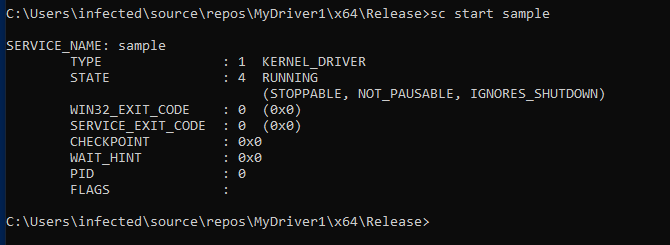

Note that the service name has nothing to do with the name of your driver's source file.

To unload the driver, just issue:

```ps1
sc stop sample
```

And you'll see:

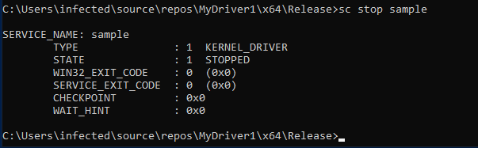

## Final thoughts

Congratulations, you've written and installed a kernel driver!  Admittedly not very useful yet, but we'll work on that in the next post.

Most of the source here (and throughout my examples) is taken heavily from [Pavel Yosifovich's Windows Kernel Programming](https://www.amazon.com/Windows-Kernel-Programming-Pavel-Yosifovich/dp/B0BW2X91L2).  If you're interested in the programming aspect of this, I highly recommend buying the book, he does a fantastic job of explaining concepts and there's a lot more information than I am providing here.

## More reading
- [Pavel Yosifovich's Windows Kernel Programming](https://www.amazon.com/Windows-Kernel-Programming-Pavel-Yosifovich/dp/B0BW2X91L2)
- [MSDN NTSTATUS Codes](https://learn.microsoft.com/en-us/openspecs/windows_protocols/ms-erref/596a1078-e883-4972-9bbc-49e60bebca55)
- [MSDN Write a HelloWorld Driver](https://learn.microsoft.com/en-us/windows-hardware/drivers/gettingstarted/writing-a-very-small-kmdf--driver)
- [MSDN Building a Driver](https://learn.microsoft.com/en-us/windows-hardware/drivers/develop/building-a-driver)

## Series Index
- [Part 1 - Overview](https://stolenfootball.github.io/posts/series/windows_drivers/p1_overview/index.html)
- [Part 2 - What's a Driver Anyways?](https://stolenfootball.github.io/posts/series/windows_drivers/p2_whats_a_driver/index.html)
- [Part 3 - The Minimum Viable Driver](https://stolenfootball.github.io/posts/series/windows_drivers/p3_minimum_viable_driver/index.html)
- [Part 4 - Interacting with the Driver](https://stolenfootball.github.io/posts/series/windows_drivers/p4_interacting_with_driver/)
- [Part 5 - Basic Driver Functionality](https://stolenfootball.github.io/posts/series/windows_drivers/p5_basic_driver_function/)
- [Part 6 - Debugging and Basic Rev](https://stolenfootball.github.io/posts/series/windows_drivers/p6_debugging_drivers/)