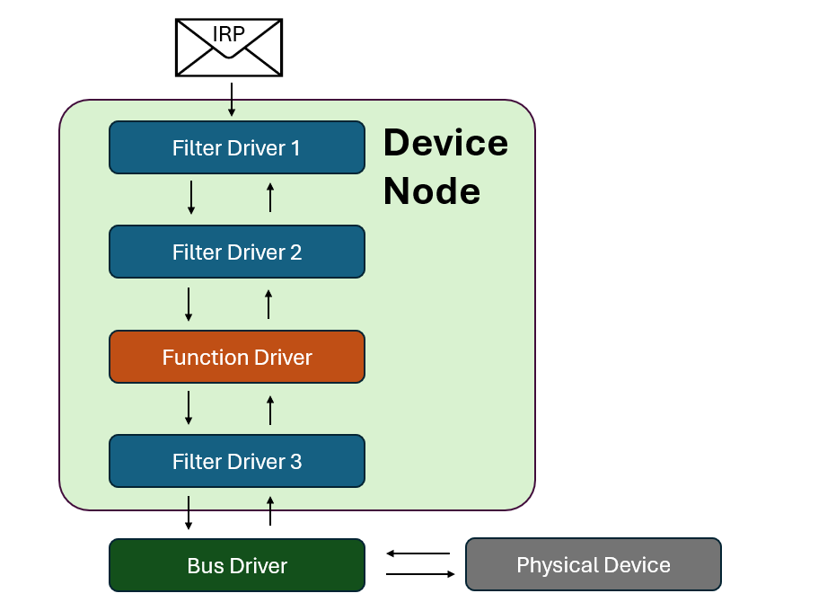
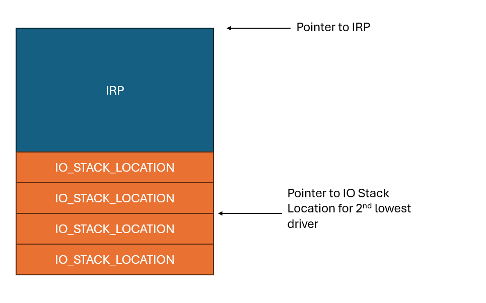

If you've been following along with this series, in [the last post](https://stolenfootball.github.io/posts/series/windows_drivers/p3_minimum_viable_driver/index.html) I walked through how to build a minimum viable driver and how to load it into Windows.

That said, the previous driver simply loaded and unloaded itself, nothing more.  In this post we're going to go over how to send messages to our driver and have it respond.

## The IRP

As I explained in [part 2](https://stolenfootball.github.io/posts/series/windows_drivers/p2_whats_a_driver/index.html), a driver in Windows is a small piece of software that sits in kernel space and responds to requests.

These requests come in the form of a struct called an **IO Request Packet**, or more commonly an **IRP**.   

A single IRP contains all of the information a driver needs to handle an IO request.  Any return values from the driver are also written to the IRP, and are returned to the caller later.

The IRP is always allocated along with one or more **IO Stack Locations**.  An IO Stack Location is another struct that contains information about the request.  The IO Manager creates one IO Stack Location for each driver in the device node's driver stack.

For example, if the devnode's driver stack consists of four drivers:



The IRP would have 4 IO stack locations, like in the picture below.  The IO Stack Location for the function driver is the second one from the bottom, since the function driver is second from the bottom.



IRPs and IO Stack Locations are a detailed topic I'd recommend learning in more detail than I will provide here. For a great writeup on them see chapter 7 of [Pavel Yosifovich's Windows Kernel Programming](https://www.amazon.com/Windows-Kernel-Programming-Pavel-Yosifovich/dp/B0BW2X91L2). 


## Function codes
Each IO Stack Location struct has a [major function code](https://learn.microsoft.com/en-us/windows-hardware/drivers/kernel/irp-major-function-codes) field.  The major function code is an enum that indicates what kind of functionality the IRP is requesting from the driver.  

Some common values are:

- `IRP_MJ_CREATE` (0)
- `IRP_MJ_CLOSE` (2)
- `IRP_MJ_DEVICE_CONTROL` (14)

## Dispatch functions
Every driver is associated with a [`_DRIVER_OBJECT`](https://learn.microsoft.com/en-us/windows-hardware/drivers/ddi/wdm/ns-wdm-_driver_object) struct when it is loaded.  The `_DRIVER_OBJECT` struct contains information about how the driver behaves.  This struct is passed into **DriverEntry** when the function is loaded, and **DriverEntry** modifies it to fit the developer's needs.

For more information on this, see [part 3 of this series](https://stolenfootball.github.io/posts/series/windows_drivers/p3_minimum_viable_driver/index.html).

The final field in `_DRIVER_OBJECT` is an array of function pointers called **MajorFunction**. Each of these functions has a `PDRIVER_DISPATCH` signature, and knows how to handle IRPs for a specific major function code.  A `PDRIVER_DISPATCH` function signature looks like this:

```c++
NSTATUS DispatchFunction(_In_ PDEVICE_OBJECT DeviceObject, _Inout_ PIRP Irp) 
```

To tell the kernel which dispatch function corresponds to which major function code, we set the index in the array corresponding to the major function code to a pointer to the function we want to use.

For example, if I made a function called `MyCustomDeviceControlHandler` and wanted to use it to hande any device control operations sent to my driver, I would have the following line in **DriverEntry**.

```c++
DriverObject->MajorFunction[14] = MyCustomDeviceControlHandler;
```

It's preferable to use the enum for clarity though, so the line would actually be the equivalent:

```c++
DriverObject->MajorFunction[IRP_MJ_DEVICE_CONTROL] = MyCustomDeviceControlHandler;
```

Each time an IRP comes in with a major function code the dispatch function is registered to, the dispatch function is called with the IRP passed in as an argument.  

## Handling an IRP

So how do we "handle an IRP" in a dispatch function?

The most common operation a function driver will perform on an IRP is completing it. Completing an IRP means that the function driver has completed its operation, and the IRP is ready to propagate back to the user.  In user space terms, this is "return IRP", although the actual process is a bit more complicated here.

To complete the IRP, we must set the IRP's **IoStatus** field correctly. The **IoStatus** field is a struct of type [`_IO_STATUS_BLOCK`](https://learn.microsoft.com/en-us/windows-hardware/drivers/ddi/wdm/ns-wdm-_io_status_block), which has two members:

- `Status` - The NTSTATUS code the IRP will complete with
- `Information` - A generic pointer which can mean different things depending on how the developer wants to use it.

Setting these fields in the dispatch handler function looks like this:

```c++
Irp->IoStatus.Status = STATUS_SUCCESS;
Irp->IoStatus.Information = 0;
```

In this case, we're just setting the IRP to complete with a successful status and returning no information.

Once this is done, we need to call the `IoCompleteRequest` function on the IRP.  This function actually completes the request, and sends the IRP back up to whomever created it.  You can think of it as "return IRP", even though it doesn't end the function.

```c++
IoCompleteRequest(Irp, IO_NO_INCREMENT);
```

The second field in `IoCompleteRequest` is an optional temporary priority boost for the thread handling the IRP.  It should be set to `IO_NO_INCREMENT`, which doesn't boost the thread, unless you have a convincing reason to do otherwise.

So finally our dispatch function that will complete an IRP with a success status looks like the following:

```c++
NSTATUS DispatchFunction(_In_ PDEVICE_OBJECT DeviceObject, _Inout_ PIRP Irp) {
    UNREFERENCED_PARAMETER(DeviceObject);

    Irp->IoStatus.Status = STATUS_SUCCESS;
    Irp->IoStatus.Information = 0;

    IoCompleteRequest(Irp, IO_NO_INCREMENT);

    return STATUS_SUCCESS;
}
```

> As a small side note, we have the first of the many [footguns](https://en.wiktionary.org/wiki/footgun) here.  The dispatch function must complete with the same NTSTATUS as is set in the IRP.  As such, you might be tempted to do the following:
> 
> ```c++
> Irp->IoStatus.Status = STATUS_SUCCESS;
> IoCompleteRequest(Irp, IO_NO_INCREMENT);
> 
> return Irp->IoStatus.Status;
> ```
> 
> This is **undefined behavior**, as the IRP may be freed by **IoCompleteRequest**.  The `Irp->IoStatus` pointer may be pointing to uninitialized memory.

## Objects and Handles
We now have a driver that can receive an IRP and complete it.  But how can we actually send an IRP to the driver?

Windows represents all system resources through an data structure called an **object**.  An object can be a file, thread, graphical image, or even a physical device.  All the object does is provide a consistent interface to access the resource.

Apps can't directly interface with objects.  Instead, they must obtain a **handle** to the object, which is simply a pointer that can be used to examine or modify the object.

The function used to open a handle to an object is the somewhat incongruously named `CreateFile` function.  `CreateFile` doesn't create a file by default.  Instead, it looks for an object with the file name given and returns a handle to it if possible.  It's only if the object doesn't exist that it will fall back to making a new file.

## The Device Object
The Windows IO model is *device centric*.  This means we can only obtain handles to Device Objects, not our Driver Object.

As such, we need to create a Device Object so users can obtain a handle to our driver.  This is done during **DriverEntry** with the [`IoCreateDevice`](https://learn.microsoft.com/en-us/windows-hardware/drivers/ddi/wdm/nf-wdm-iocreatedevice) function.  It's definition is as follows:

```c++
NTSTATUS IoCreateDevice(
  [in]           PDRIVER_OBJECT  DriverObject,
  [in]           ULONG           DeviceExtensionSize,
  [in, optional] PUNICODE_STRING DeviceName,
  [in]           DEVICE_TYPE     DeviceType,
  [in]           ULONG           DeviceCharacteristics,
  [in]           BOOLEAN         Exclusive,
  [out]          PDEVICE_OBJECT  *DeviceObject
);
```

The arguments are:
- `DriverObject` - the driver object the device belongs to (our driver object)
- `DeviceExtensionSize` - if we should allocate any extra bytes to the Device Object
- `DeviceName` - the name of the device object to be created
- `DeviceType` - useful for hardware devices, for software drivers should be set to `FILE_DEVICE_UNKNOWN`
- `DeviceCharacteristics` - flag field only relevant in some cases
- `Exclusive` - should we prevent multiple handles being opened at once
- `DeviceObject` - the device object (return value)

We'll need to initialize a Unicode String for the device name, which can be done with `RtlInitUnicodeString`.  

Putting it all together, the code for creating the Driver Object looks like this:

```c++
UNICODE_STRING devName;
RtlInitUnicodeString(&devName, L"\\Device\\MyDriver");

PDEVICE_OBJECT DeviceObject;
NTSTATUS status = IoCreateDevice(
    DriverObject,           // Driver object from earlier in DriverEntry
    0,                      // no extra bytes
    &devName,               // device name
    FILE_DEVICE_UNKNOWN,    // software device
    0,                      // no characteristics flags needed
    FALSE,                  // no need for exclusive access
    &DeviceObject           // return pointer
);

if (!NT_SUCCESS(status)) {
    KdPrint(("Failed to create device object (0x%08X)\n", status));
    return status;
}
```

There are two things of note here that I haven't mentioned before:
- The NT_SUCCESS macro simply returns false if any NTSTATUS error code is present
- The `KdPrint` macro allows for debug printing within the driver.  Note the double parenthesis since this is a macro, not a function.  Needed for variable argument printing.  We'll go over how to view this output later.

By returning the status code if it is a failure, the driver won't load if the `IoCreateDevice` function fails to create the device object, which is what we want.

There is one more step we need to take.  Userland programs cannot access the `\\Devices` directory, so we'll need to make a symbolic link they can access.

This is done with the [`IoCreateSymbolicLink`](https://learn.microsoft.com/en-us/windows-hardware/drivers/ddi/wdm/nf-wdm-iocreatesymboliclink) function, which only takes two arguments:

```c++
NTSTATUS IoCreateSymbolicLink(
  [in] PUNICODE_STRING SymbolicLinkName,
  [in] PUNICODE_STRING DeviceName
);
```

Simple enough.  Let's add the code to DriverEntry:

```c++
UNICODE_STRING symLinkName;
RtlInitUnicodeString(&symLinkName, L"\\??\\MyDriver");

status = IoCreateSymbolicLink(&symLinkName, &devName);
if (!NT_SUCCESS(status)) {
    KdPrint(("Failed to create symbolic link (0x%08X)\n", status));
    IoDeleteDevice(DeviceObject);
    return status;
}
```

None of this should be unfamiliar by this point, but there is a design point I want to stress that is different for developers coming from user space.  **If you allocate something in the kernel, you must deallocate it**.  

The device object we made is allocated directly in the kernel - the driver doesn't have its own "virtual space" that is automatically cleaned up after the process ends.  If something is allocated in the kernel, it stays there until the next reboot of the computer.  Memory leaks in kernel space don't get cleaned up, and can eventually BSOD the computer.

As such, if the symlink creation fails, we call `IoDeleteDevice` and clean up the device object we created earlier before exiting.  We'll also need to update the **Unload** function, which now has some cleanup work to do.

```c++
void MyDriverUnload(_In_ PDRIVER_OBJECT DriverObject) {
    UNICODE_STRING symLinkName;
    RtlInitUnicodeString(&symLinkName, L"\\??\\MyDriver");

    IoDeleteSymbolicLink(&symLinkName);
    IoDeleteDevice(DriverObject->DeviceObject);
}
```

As I mentioned in the last post, the job of the **Unload** function is to clean up everything allocated in **DriverEntry**.  We allocated a symlink and a DeviceObject, so we use unload to delete those and prevent a memory leak.

## Putting it all together

Combining all of the pieces of code we looked at earlier, our driver will now look like the code below:

```c++
#include <ntddk.h>


extern "C" NTSTATUS
CreateCloseHandler(_In_ PDEVICE_OBJECT DeviceObject, _Inout_ PIRP Irp) {
    UNREFERENCED_PARAMETER(DeviceObject);

    Irp->IoStatus.Status = STATUS_SUCCESS;
    Irp->IoStatus.Information = 0;

    IoCompleteRequest(Irp, IO_NO_INCREMENT);

    return STATUS_SUCCESS;
}


void MyDriverUnload(_In_ PDRIVER_OBJECT DriverObject) {
    UNICODE_STRING symLinkName;
    RtlInitUnicodeString(&symLinkName, L"\\??\\MyDriver");

    IoDeleteSymbolicLink(&symLinkName);
    IoDeleteDevice(DriverObject->DeviceObject);
}


extern "C" NTSTATUS
DriverEntry(PDRIVER_OBJECT DriverObject, PUNICODE_STRING RegistryPath) {
    UNREFERENCED_PARAMETER(RegistryPath);

    // Create the Device Object
    UNICODE_STRING devName;
    RtlInitUnicodeString(&devName, L"\\Device\\MyDriver");

    PDEVICE_OBJECT DeviceObject;
    NTSTATUS status = IoCreateDevice(
        DriverObject,           // Driver object from earlier in DriverEntry
        0,                      // no extra bytes
        &devName,               // device name
        FILE_DEVICE_UNKNOWN,    // software device
        0,                      // no characteristics flags needed
        FALSE,                  // no need for exclusive access
        &DeviceObject           // return pointer
    );

    if (!NT_SUCCESS(status)) {
        KdPrint(("Failed to create device object (0x%08X)\n", status));
        return status;
    }

    // Create the symbolic link
    UNICODE_STRING symLinkName;
    RtlInitUnicodeString(&symLinkName, L"\\??\\MyDriver");

    status = IoCreateSymbolicLink(&symLinkName, &devName);
    if (!NT_SUCCESS(status)) {
        KdPrint(("Failed to create symbolic link (0x%08X)\n", status));
        IoDeleteDevice(DeviceObject);
        return status;
    }

    // Register handler functions
    DriverObject->MajorFunction[IRP_MJ_CREATE] = CreateCloseHandler;
    DriverObject->MajorFunction[IRP_MJ_CLOSE] = CreateCloseHandler;
    DriverObject->DriverUnload = MyDriverUnload;

    return STATUS_SUCCESS;
}
```

The only change I made was to rename **DispatchFunction** to **CreateCloseHandler** for more clarity.  

> As a note, having a dispatch function to successfully complete all Create and Close IRPs that are sent to the driver is a very common design pattern.
> 
> This is due to a small idiosyncracy of the Windows driver model - we need to be able to open and close a handle to our driver.  This is done by sending Create and Close IRPs to the driver respectively.  If `IRP_MJ_CREATE` and `IRP_MJ_CLOSE` aren't handled, we won't be able to obtain a handle even if we made the Device Object.
>
> The most common way to do this is simply to compete the IRP as a success, which is what the above function does.

## Client code

We're finally at a point where a client can interact with our driver!

We'll open a handle to the device with [`CreateFileW`](https://learn.microsoft.com/en-us/windows/win32/api/fileapi/nf-fileapi-createfilew).  The options for `CreateFileW` are:

```c++
HANDLE CreateFileW(
  [in]           LPCSTR                lpFileName,
  [in]           DWORD                 dwDesiredAccess,
  [in]           DWORD                 dwShareMode,
  [in, optional] LPSECURITY_ATTRIBUTES lpSecurityAttributes,
  [in]           DWORD                 dwCreationDisposition,
  [in]           DWORD                 dwFlagsAndAttributes,
  [in, optional] HANDLE                hTemplateFile
);
```

> Yes, `CreateFile` is roughly equivalent to `CreateFileW`.  The `W` just means use UTF-16LE, which is Windows default.

The source for the client is fairly self explanatory. 

```c++
#include <windows.h>
#include <stdio.h>


int main() {
    HANDLE hDevice = CreateFileW(
        L"\\\\.\\MyDriver",             // Name of the file or device to be opened
        GENERIC_READ | GENERIC_WRITE,   // Permissions to open with
        0,                              // Whether the handle can be shared
        nullptr,                        // Additional security attributes
        OPEN_EXISTING,                  // Whether to open an existing handle or create a new file
        0,                              // Optional flags field
        nullptr                         // Optional template file for new file creation
    );

    if (hDevice == INVALID_HANDLE_VALUE) {
        printf("Failed to open device: %lu\n", GetLastError());
        return 1;
    }

    printf("Device opened successfully.\n");

    CloseHandle(hDevice);
    return 0;
}
```

As usual, a couple of things to look for:
- Make sure to import `windows.h`
- The symbolic link is has the `??` replaced with a `.`
- The `L` in front of the symbolic link name just means use a wide char string

The client code can be compiled with:

```cmd
g++ driverClient.cpp -o driverClient.exe
```

## Testing it out

Now, compile the driver code and load the driver on to a VM.  If you don't know how to do this, please refer to the instructions in [part 3 of this series](https://stolenfootball.github.io/posts/series/windows_drivers/p3_minimum_viable_driver/index.html).

First, run the client before starting the driver, and you'll see:
```
C:\Users\jeremy\Desktop> driverClient.exe
Failed to open device: 2
```

Then, start the driver, and run the client again:

```
C:\Users\jeremy\Desktop>driverClient.exe
Device opened successfully.
```

Congratulations, you've successfully sent an IRP to your driver and it responded!

## Next steps

In the next post, we'll finally be able to add some functionality to the driver by making some more detailed dispatch functions.

The next post will be the last "development" post for those of you only interested in the VR aspect of this.  After that, I'll move on to debugging, and then to actual bugs and exploit code.

## More reading
- [MSDN IRP Documentation](https://learn.microsoft.com/en-us/windows-hardware/drivers/gettingstarted/i-o-request-packets)
- [MSDN Handling IRPs](https://learn.microsoft.com/en-us/windows-hardware/drivers/kernel/handling-irps)
- [MSDN Handles and Objects](https://learn.microsoft.com/en-us/windows/win32/sysinfo/handles-and-objects)

## Series Index
- [Part 1 - Overview](https://stolenfootball.github.io/posts/series/windows_drivers/p1_overview/index.html)
- [Part 2 - What's a Driver Anyways?](https://stolenfootball.github.io/posts/series/windows_drivers/p2_whats_a_driver/index.html)
- [Part 3 - The Minimum Viable Driver](https://stolenfootball.github.io/posts/series/windows_drivers/p3_minimum_viable_driver/index.html)
- [Part 4 - Interacting with the Driver](https://stolenfootball.github.io/posts/series/windows_drivers/p4_interacting_with_driver/)
- [Part 5 - Basic Driver Functionality](https://stolenfootball.github.io/posts/series/windows_drivers/p5_basic_driver_function/)
- [Part 6 - Debugging and Basic Rev](https://stolenfootball.github.io/posts/series/windows_drivers/p6_debugging_drivers/)