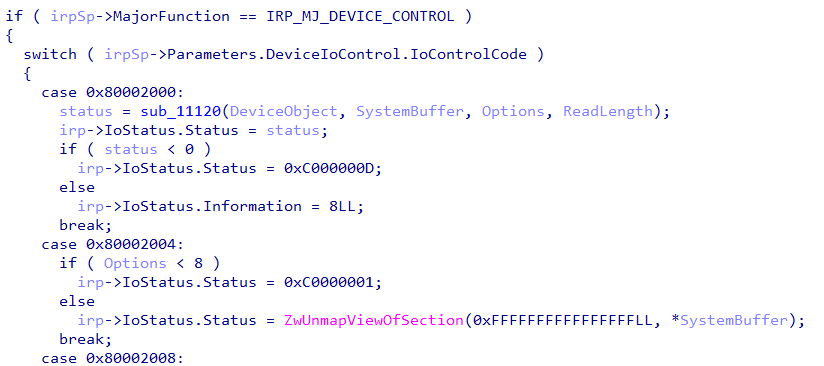
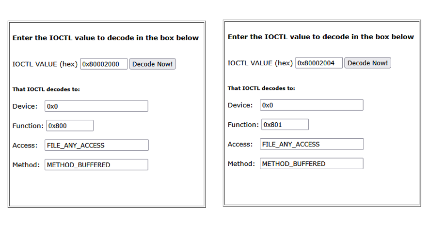
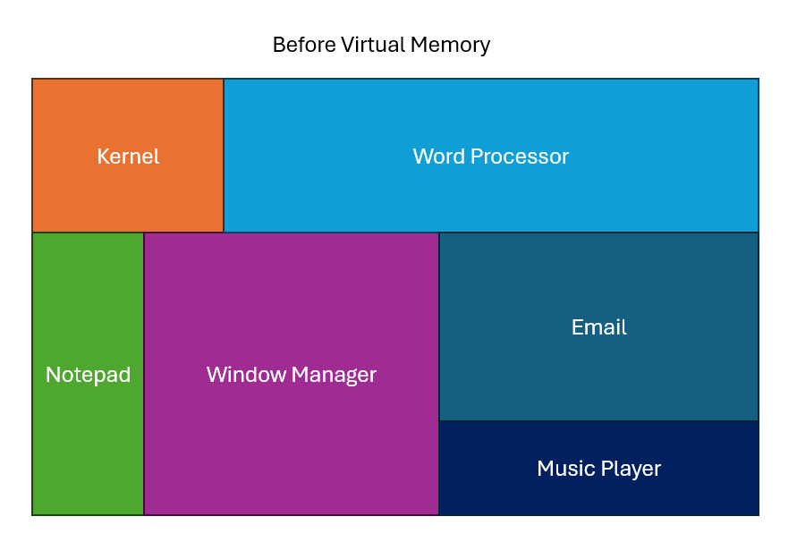
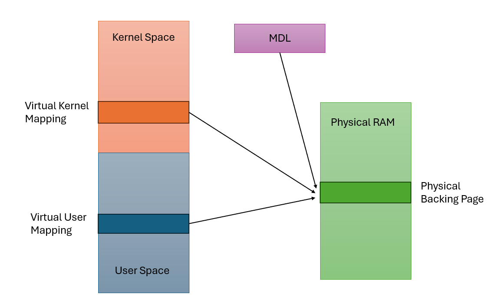

Alright, all the work in the previous posts has led up to this: a driver that does something!

Admittedly, it won't do much.  The driver I will be going over here heavily takes code from the [example IOCTL driver in the Windows driver samples repo](https://github.com/microsoft/Windows-driver-samples/tree/main/general/ioctl/wdm), and all that does is copy data from one buffer to another.  It will, however, give a good idea of how drivers handle I/O from their calling applications, as well as some of the benefits and drawbacks of different IO methods.

This will be the last post in the "driver development crash course" part of this series.  The goal of these posts isn't to make you a great driver developer, but rather to give enough of a baseline understanding of how driver code works that it will be possible for you to follow the rev and pwn posts to come without becoming too lost.

## Device Control

The majority of the time you are interfacing with a function driver, it will be through the `IRP_MJ_DEVICE_CONTROL` major function code.  From userspace, you send Device Control IRPs to a driver with the [`DeviceIoControl`](https://learn.microsoft.com/en-us/windows/win32/api/ioapiset/nf-ioapiset-deviceiocontrol) function, which is defined like this:

```c++
BOOL DeviceIoControl(
  [in]                HANDLE       hDevice,
  [in]                DWORD        dwIoControlCode,
  [in, optional]      LPVOID       lpInBuffer,
  [in]                DWORD        nInBufferSize,
  [out, optional]     LPVOID       lpOutBuffer,
  [in]                DWORD        nOutBufferSize,
  [out, optional]     LPDWORD      lpBytesReturned,
  [in, out, optional] LPOVERLAPPED lpOverlapped
);
```

Effectively, you pass in a control code, an input buffer, and an output buffer.  The driver reads from the input buffer, does something based on the control code, then writes to the output buffer.

Most of the specific fields should be self-explanatory at this point (ignoring `lpOverlapped`, which is useful for advanced cases and can safely be set to `NULL` for our purposes).

The one field that is new and important is `dwIoControlCode`, which we'll get into below.

To "catch" `IRP_MJ_DEVICE_CONTROL` IRPs when they come to our driver, we define a dispatch function to handle them:

```c++
NSTATUS MyDriverDeviceControl(_In_ PDEVICE_OBJECT DeviceObject, _Inout_ PIRP Irp) {
    return STATUS_SUCCESS;
}
```

And we set the corresponding entry in the MajorFunction array in the DriverObject during DriverEntry:

```c++
DriverObject->MajorFunction[IRP_MJ_DEVICE_CONTROL] = MyDriverDeviceControl;
```

Now, any `IRP_MJ_DEVICE_CONTROL` IRPs that are sent to our driver will be handled by MyDriverDeviceControl.

## IOCTLs
The **IOCTL**, or **IO Control Code**, is a number that tells the driver which action to take.  They are typically handled by a large switch statement in the DeviceControl dispatch function, which has different actions to take depending on which IOCTL is received.

For example, in an antivirus driver, there are any number of functions you may want, but you don't want to make a new driver for each one.  In that case, you could define an IOCTL for:

- Protect a file from deletion
- Make an alternate data stream the default
- Hide a file from the operating system

And so on an so forth.  Each operation would get a code, and you pass the code in through the `DeviceIoControl` function when calling the driver.

IOCTLs aren't just random numbers though.  They are actually mini-structs that contain four fields about how the driver should process the request.

- `DeviceType` - a [large enum](https://learn.microsoft.com/en-us/windows-hardware/drivers/kernel/specifying-device-types) that specifies the type of device the driver is.  For a software driver such as ours, the value can be set to anything over `0x8000`.
- `Function` - arbitrary number that serves as the actual function code. Should be different for each function the driver can take.  The minimum value should be `0x800`.
- `Method` - sets the buffering method used to access the input and output buffers passed in with the IRP.  Important and slightly complex, will get into it below.
- `Access` - determines the direction of data flow, whether from the client to the driver or driver to the client.  In practice, should always use `FILE_ANY_ACCESS` to allow full access to input and output structs.

In practice, IOCTLs are created using the `CTL_CODE` macro, which is defined as follows:
```c++
#define CTL_CODE( DeviceType, Function, Method, Access ) ( \
    ((DeviceType) << 16) | ((Access) << 14) | ((Function) << 2) | (Method))
```

What this means is that when you see IOCTLs in a decompilation, they will look simply like numbers, but they actually have more information.  Skipping slightly ahead, this is what a typical IOCTL handler will look like in IDA



The IOCTLs are `0x80002000`, `0x80002004`, and `0x80002008`.  You can use a tool such as the [OSR Online IOCTL Decoder](https://www.osronline.com/article.cfm%5Earticle=229.htm) to retrieve the packed info.  The decodings of the first two IOCTLs using this tool are shown below:



> Note that whoever wrote this driver did not follow best practices and use a DeviceType higher than 0x8000.  Although this isn't a bug in itself, failure to follow best coding practices can be indicitive of poorly written code.  This driver would be worth inspecting closer for any bugs. 

Let's take a look at what our DeviceControl function will look like with a basic IOCTL handler switch statement:

```c++
NSTATUS MyDriverDeviceControl(_In_ PDEVICE_OBJECT DeviceObject, _Inout_ PIRP Irp) {
    
    PIO_STACK_LOCATION irpSP = IoGetCurrentIrpStackLocation(Irp);

    switch (irpSp->Parameters.DeviceIoControl.IoControlCode) {
        ...
    }

    return STATUS_SUCCESS;
}
```

We use the `IoGetCurrentIrpStackLocation` function to retrieve the `IO_STACK_LOCATION` associated with our driver.  Then, we switch on the IOCTL field to find the appropriate handler. 

## Virtual Memory and Context
To understand IOCTL IO buffering methods, we need to dive into the Windows memory model a bit further.  This section will be technical, but given that this series is about exploiting memory corruption vulnerabilities within drivers, I believe it is important to understand virtual memory in the kernel and how it is used. 

Virtual memory is a big concept that would usually cover a week or two of a university course.  To avoid getting too off topic (since we're discussing drivers here) this section will be more of a review than a deep dive.

If virtual memory and context switching are new concepts to you, [this video](https://www.youtube.com/watch?v=A9WLYbE0p-I) is a great intro to virtual memory, and even though I haven't found a great context switching video on YouTube, [this one](https://www.youtube.com/watch?v=DKmBRl8j3Ak) is decent.

### Kernel and User Memory
Back in the day, computers only had one memory space.  It was word addressable and ran from 0x000000 to 0xFFFFFF, or whatever the maximum was on that system.

This meant that wherever your program wrote, it physically wrote to.  If your word processor accidentally tried to overwrote part of your kernel, the computer [simply died](https://users.rust-lang.org/t/was-crowdstrike-a-null-pointer-related-c-bug/114696).  (Incidentally, this wasn't fixed on MacOS until [shockingly recently](https://en.wikipedia.org/wiki/System_7)).  It also meant that programs only got a small section of the computer's memory to work with, and could accidentally write to or read from other processes as well.



For the non-Apple world, this was changed in 1985 with the release of the i386, which supported **virtual memory**. With virtual memory, each process could use the full address space and not worry about writing to other processes at all.


In Windows, the kernel always exists in the lower half of the virtual address space (0x000000 to 0x7FFFFF) and the currently in context process exists in the upper half of the process space (0x800000 to 0xFFFFFF).

### Pages and Page Tables
Virtual memory was accomplished through pages and [page tables](https://en.wikipedia.org/wiki/Page_table).  The physical memory of the computer is separated into 4096 byte blocks called pages, which is the smallest unit of memory a process can request.

When a program accesses memory at an address, it actually reaches out to its page table.  The page table checks to see if it has a physical block of memory mapped at that address, and if it does not, reaches out for one.  The page table then allows for access to that physical memory block as though it exists at that requested address.

Pages can also be swapped out to disk if the computer is asking for more physical memory than is currently available.  Any access to a page that is not currently mapped results in a **page fault**, during which the operating system will pause the current program and retrieve the page before continuing.

### Context Switching
Modern computers are asked to do many tasks at the same time and only have a few processors to complete them.  To accomplish this, they use **context switching**, which effectively means they switch back and forth between all of their processes very quickly in order to make it look like they're all running at the same time.  

The process space virtual memory that the kernel sees depends on the currently in-context process, as can be seen in the graphic above.

## IOCTL Buffering Methods
With the above information in mind, let's consider some possible issues when we attempt to access a user allocated buffer from kernel space.  

First, the requesting process could no longer be in context.  In this case, even though we access the correct virtual address, because we are in a different process's context that pointer could contain anything.  This is obviously bad.

Second, another thread in the process could free the buffer before we access it.  The steps would go:

1. Thread 1 allocates a buffer, calls DeviceIoControl with that buffer as an argument
2. Thread 1 is switched out of context and Thread 2 is switched in
3. Thread 2 frees buffer
4. The driver attempts to access the original buffer, which has been freed (bad)

Third, suppose the thread is boosted to a higher interrupt request level (IRQL).  At high IRQLs, which are used for tasks that can't be interrupted, no page fault handling can occur.  Therefore accessing any page not already in physical memory would result in a BSOD.

There are even more problems that could occur when accessing user memory from kernel space, but I'm not going to go into them here.  This should at least provide enough motivation to convince you that it can cause problems.

Fortunately, the Windows IO manager provides built in functionality to help circumvent these problems.  There are four options for how a DeviceControl handler can accept buffers from user space, and which one is used is dependent on the IOCTL.

### METHOD_BUFFERED
Buffered IO is the simplest method to understand from the programmer's perspective.  When the IRP is created, the IO manager just copies the user buffer to kernel space.  It then provides a pointer to the kernel space buffer in the **SystemBuffer** field the in the IRP.  The dispatch function can then just use the SystemBuffer like a normal pointer.

When writing back, the dispatch function will again write to the SystemBuffer.  The IO manager will handle copying the SystemBuffer back to user space when the IRP is completed.

Because Buffered IO copies the entire user buffer to kernel space, all accesses are trivially safe from the above issues.  However, Buffered IO can be slow for large buffers because we are performing a physical copy each time we send data to the driver.

Let's make a Buffered IO IOCTL hander that sets the output buffer to be the first byte of the input buffer repeated.  For example, if the input buffer is "ABCD", the output buffer would be "AAAA".

```c++
#define MYDRIVER_IOCTL_METHOD_BUFFERED \
    CTL_CODE( 0x8765, 0x900, METHOD_BUFFERED, FILE_ANY_ACCESS )
```

```c++
inBufLen = irpSp->Parameters.DeviceIoControl.InputBufferLength;
outBufLen = irpSp->Parameters.DeviceIoControl.OutputBufferLength;

switch (irpSp->Parameters.DeviceIoControl.IoControlCode) {

    case MYDRIVER_IOCTL_METHOD_BUFFERED:
    {
        inBuf = Irp->AssociatedIrp.SystemBuffer;
        outBuf = Irp->AssociatedIrp.SystemBuffer;

        CHAR firstChar = inBuf[0];

        memset(outBuf, firstChar, outBufLen);

        break;
    }
    ...
}
```

This should all be understandable quickly.  We retrieve the lengths of the user buffers from the correct fields in the IRP.  The input and output buffers are both the SystemBuffer.  We copy everything over, and we're good to go.

### METHOD_IN_DIRECT and METHOD_OUT_DIRECT
Although Buffered IO is safe, we perform two full copies of the data during the transaction, one on the way in and one on the way out.  As such, it will be quite slow for larger buffers.

The fix for this is Direct IO. Direct IO allows both user space and kernel space to have virtual mappings to the same physical page, which means accessing the user page from kernel space becomes safe.

`METHOD_IN_DIRECT` and `METHOD_OUT_DIRECT` both indicate Direct IO, the only difference is that `METHOD_IN_DIRECT` reads from the output buffer and  `METHOD_OUT_DIRECT` writes to the output buffer.

Direct IO works as follows:
1. The IO manager makes sure the user buffer is paged into physical memory
2. It locks the buffer in memory so it can't be paged out anymore
3. It builds an **MDL** (Memory Descriptor List), which is a data structure that describes a buffer in physical memory.  It then stores the MDL in the *MDLAddress* field of the IRP.
4. The dispatch routine is called.  The driver passes the MDL to [`MmGetSystemAddressForMdlSafe`](https://learn.microsoft.com/en-us/windows-hardware/drivers/ddi/wdm/nf-wdm-mmgetsystemaddressformdlsafe), which maps the physical memory to an address in the kernel.  Now there are two page tables pointing to the same physical address.
5. When the driver completes the IRP, the second mapping and MDL are removed, and the user can access their buffer like normal.

Effectively, the MDL points to physical memory and allows the kernel page table and the user space page table to both point to the same backing page.  Then any writes to the kernel address also write to the user address.



Note that even in Direct IO, the input buffer always uses Buffered IO.  The output buffer is the only one that can use Direct IO.

Let's define a `METHOD_OUT_DIRECT` IOCTL and add it to the DeviceControl dispatch function.

```c++
#define MYDRIVER_IOCTL_METHOD_OUT_DIRECT \
    CTL_CODE( 0x8765, 0x901, METHOD_OUT_DIRECT, FILE_ANY_ACCESS )
```

```c++
switch (irpSp->Parameters.DeviceIoControl.IoControlCode) {

    case MYDRIVER_IOCTL_METHOD_OUT_DIRECT:
    {
        inBuf = Irp->AssociatedIrp.SystemBuffer;
        
        outBuf = MmGetSystemAddressForMdlSafe(Irp->MdlAddress, NormalPagePriority | MdlMappingNoExecute);
        if !(outBuf) {
            status = STATUS_INSUFFICIENT_RESOURCES;
            break;
        }

        CHAR firstChar = inBuf[0];
        memset(outBuf, firstChar, outBufLen);

        break;
    }
    ...
}
```

All of this should be fairly self explanatory.  The only pieces to note are:
- [`MmGetSystemAddressForMdlSafe`](https://learn.microsoft.com/en-us/windows-hardware/drivers/ddi/wdm/nf-wdm-mmgetsystemaddressformdlsafe) takes flags as a second argument.  Read through the linked docs for a description of what they are and which ones you should use.
- `MmGetSystemAddressForMdlSafe` can return NULL if system resources are very low.  Drivers should handle that case to avoid a null pointer dereference.


### METHOD_NEITHER
`METHOD_NEITHER` means that there is no help provided by the IO manager at all.  Any of the bugs I mentioned earlier could happen, and it's up to the programmer to prevent them.

In practice, you see most commonly see `METHOD_NEITHER` IOCTLs when the DeviceControl handler requires no information beyond the control code, so user input isn't needed.  An example might be a "shutdown now" signal.

However, if you do see a `NEITHER_IO` IOCTL handling buffers, odds are you've found a bug.  Because `NEITHER_IO` requires a lot of manual checking and buffer copying to get right, developers get it wrong all the time.

I'm not including code for a safe `NEITHER_IO` handler below since it's long and involved, but a link to an example provided by Microsoft can be found [here](https://github.com/microsoft/Windows-driver-samples/blob/7bc5255321145137d51beff5cc450932cb8db8b7/general/ioctl/wdm/sys/sioctl.c#L367).  More or less what it does is all of the steps for Direct IO, except instead of letting Windows handle them for us we do it manually.  Read through and try to understand the big picture.

## The IOCTL handler driver
Finally, it is time to add IOCTL handling to our driver!  Read through the following source and make sure you understand everything.

```c++
#include <ntddk.h>

#define MYDRIVER_IOCTL_METHOD_BUFFERED \
    CTL_CODE( 0x8765, 0x900, METHOD_BUFFERED, FILE_ANY_ACCESS )

#define MYDRIVER_IOCTL_METHOD_OUT_DIRECT \
    CTL_CODE( 0x8765, 0x901, METHOD_OUT_DIRECT, FILE_ANY_ACCESS )


extern "C" NTSTATUS
DeviceControlHandler(_In_ PDEVICE_OBJECT DeviceObject, _Inout_ PIRP Irp) {
    UNREFERENCED_PARAMETER(DeviceObject);

    PIO_STACK_LOCATION irpSp;
    ULONG inBufLen, outBufLen;
    PCHAR inBuf, outBuf;

    LONG status = STATUS_SUCCESS; // Assume success, change later if needed

    irpSp = IoGetCurrentIrpStackLocation(Irp);
    inBufLen = irpSp->Parameters.DeviceIoControl.InputBufferLength;
    outBufLen = irpSp->Parameters.DeviceIoControl.OutputBufferLength;

    switch (irpSp->Parameters.DeviceIoControl.IoControlCode) {
    case MYDRIVER_IOCTL_METHOD_BUFFERED:
    {
        inBuf = (CHAR *)Irp->AssociatedIrp.SystemBuffer;
        outBuf = (CHAR*)Irp->AssociatedIrp.SystemBuffer;

        CHAR firstChar = inBuf[0];

        memset(outBuf, firstChar, outBufLen);
        outBuf[outBufLen - 1] = '\0';

        break;
    }
    case MYDRIVER_IOCTL_METHOD_OUT_DIRECT:
    {
        inBuf = (CHAR*)Irp->AssociatedIrp.SystemBuffer;

        outBuf = (CHAR*)MmGetSystemAddressForMdlSafe(Irp->MdlAddress, NormalPagePriority | MdlMappingNoExecute);
        if (!outBuf) {
            status = STATUS_INSUFFICIENT_RESOURCES;
            break;
        }

        CHAR firstChar = inBuf[0];
        memset(outBuf, firstChar, outBufLen);
        outBuf[outBufLen - 1] = '\0';

        break;
    }
    default:
    {
        status = STATUS_INVALID_DEVICE_REQUEST;
        break;
    }
    }

    Irp->IoStatus.Status = status;
    Irp->IoStatus.Information = outBufLen;

    IoCompleteRequest(Irp, IO_NO_INCREMENT);

    return status;
}


extern "C" NTSTATUS
CreateCloseHandler(_In_ PDEVICE_OBJECT DeviceObject, _Inout_ PIRP Irp) {
    UNREFERENCED_PARAMETER(DeviceObject);

    Irp->IoStatus.Status = STATUS_SUCCESS;
    Irp->IoStatus.Information = 0;

    IoCompleteRequest(Irp, IO_NO_INCREMENT);

    return STATUS_SUCCESS;
}


void MyDriverUnload(_In_ PDRIVER_OBJECT DriverObject) {
    UNICODE_STRING symLinkName;
    RtlInitUnicodeString(&symLinkName, L"\\??\\MyDriver");

    IoDeleteSymbolicLink(&symLinkName);
    IoDeleteDevice(DriverObject->DeviceObject);
}


extern "C" NTSTATUS
DriverEntry(PDRIVER_OBJECT DriverObject, PUNICODE_STRING RegistryPath) {
    UNREFERENCED_PARAMETER(RegistryPath);

    // Create the Device Object
    UNICODE_STRING devName;
    RtlInitUnicodeString(&devName, L"\\Device\\MyDriver");

    PDEVICE_OBJECT DeviceObject;
    NTSTATUS status = IoCreateDevice(
        DriverObject,           // Driver object from earlier in DriverEntry
        0,                      // no extra bytes
        &devName,               // device name
        FILE_DEVICE_UNKNOWN,    // software device
        0,                      // no characteristics flags needed
        FALSE,                  // no need for exclusive access
        &DeviceObject           // return pointer
    );

    if (!NT_SUCCESS(status)) {
        KdPrint(("Failed to create device object (0x%08X)\n", status));
        return status;
    }

    // Create the symbolic link
    UNICODE_STRING symLinkName;
    RtlInitUnicodeString(&symLinkName, L"\\??\\MyDriver");

    status = IoCreateSymbolicLink(&symLinkName, &devName);
    if (!NT_SUCCESS(status)) {
        KdPrint(("Failed to create symbolic link (0x%08X)\n", status));
        IoDeleteDevice(DeviceObject);
        return status;
    }

    // Register handler functions
    DriverObject->MajorFunction[IRP_MJ_CREATE] = CreateCloseHandler;
    DriverObject->MajorFunction[IRP_MJ_CLOSE] = CreateCloseHandler;
    DriverObject->MajorFunction[IRP_MJ_DEVICE_CONTROL] = DeviceControlHandler;
    DriverObject->DriverUnload = MyDriverUnload;

    return STATUS_SUCCESS;
}
```

The only meaningful change from the driver in the last post is the **DeviceControlHandler** function, which you should understand pretty well by this point.  It should look similar to the handler snippets above, with some additional casting thrown in to make it all work.  Don't forget to register it in **DriverEntry**!.

Let's create a client for this driver:

```c++
#include <windows.h>
#include <stdio.h>

#define MYDRIVER_IOCTL_METHOD_BUFFERED \
    CTL_CODE( 0x8765, 0x900, METHOD_BUFFERED, FILE_ANY_ACCESS )

#define MYDRIVER_IOCTL_METHOD_OUT_DIRECT \
    CTL_CODE( 0x8765, 0x901, METHOD_OUT_DIRECT, FILE_ANY_ACCESS )


int testIoctlMethodBuffered(HANDLE hDevice);
int testIoctlMethodOutDirect(HANDLE hDevice);


int main() {
    HANDLE hDevice = CreateFileW(
        L"\\\\.\\MyDriver", 
        GENERIC_WRITE, 
        0, 
        nullptr,
        OPEN_EXISTING, 
        0, 
        nullptr
    );

    if (hDevice == INVALID_HANDLE_VALUE) {
        printf("Failed to open device: %lu\n", GetLastError());
        return 1;
    }

    printf("Device opened successfully.\n");

    int result;
    
    result = testIoctlMethodBuffered(hDevice);
    if (result != 0) {
        CloseHandle(hDevice);
        return result;
    }

    result = testIoctlMethodOutDirect(hDevice);
    if (result != 0) {
        CloseHandle(hDevice);
        return result;
    }

    // Clean up
    printf("Cleaning up and closing device handle.\n");
    CloseHandle(hDevice);
    return 0;
}

int testIoctlMethodBuffered(HANDLE hDevice) {
    CHAR inputBuffer[] = {"Hello"};
    CHAR outputBuffer[10] = {0};

    DWORD bytesReturned;

    printf("Sending IOCTL with METHOD_BUFFERED...\n");
    printf("Input: %s\n", inputBuffer);
    printf("Output: %s\n", outputBuffer);

    BOOL result = DeviceIoControl(
        hDevice,
        MYDRIVER_IOCTL_METHOD_BUFFERED,
        inputBuffer,
        sizeof(inputBuffer),
        outputBuffer,
        sizeof(outputBuffer),
        &bytesReturned,
        nullptr
    );
    if (!result) {
        printf("Failed to send IOCTL with METHOD_BUFFERED: %lu\n", GetLastError());
        return 1;
    }

    printf("IOCTL with METHOD_BUFFERED sent successfully.  Bytes returned: %lu\n", bytesReturned);
    printf("Input: %s\n", inputBuffer);
    printf("Output: %s\n", outputBuffer);

    return 0;
}

int testIoctlMethodOutDirect(HANDLE hDevice) {
    CHAR inputBuffer[] = {"Hello"};
    CHAR outputDirectBuffer[10] = {0};

    DWORD bytesReturned;

    printf("Sending IOCTL with METHOD_OUT_DIRECT...\n");
    printf("Input: %s\n", inputBuffer);
    printf("Output: %s\n", outputDirectBuffer);

    BOOL result = DeviceIoControl(
        hDevice,
        MYDRIVER_IOCTL_METHOD_OUT_DIRECT,
        inputBuffer,
        sizeof(inputBuffer),
        outputDirectBuffer,
        sizeof(outputDirectBuffer),
        &bytesReturned,
        nullptr
    );
    if (!result) {
        printf("Failed to send IOCTL with METHOD_OUT_DIRECT: %lu\n", GetLastError());
        return 1;
    }

    printf("IOCTL with METHOD_OUT_DIRECT sent successfully. Bytes returned: %lu\n", bytesReturned);
    printf("Input: %s\n", inputBuffer);
    printf("Output: %s\n", outputDirectBuffer);

    return 0;
}
```

Note that in this case, the **Information** field refers to the number of bytes returned by the driver.

Now, all that's left is to compile and run both pieces of code.  Run both on your test VM, and you should see something along the lines of the following:

```
C:\Users\jeremy\Desktop>ioctlDriverClient.exe
Device opened successfully.
Sending IOCTL with METHOD_BUFFERED...
Input: Hello
Output:
IOCTL with METHOD_BUFFERED sent successfully.  Bytes returned: 10
Input: Hello
Output: HHHHHHHHH
Sending IOCTL with METHOD_OUT_DIRECT...
Input: Hello
Output:
IOCTL with METHOD_OUT_DIRECT sent successfully. Bytes returned: 10
Input: Hello
Output: HHHHHHHHH
Cleaning up and closing device handle.
```

## Last remarks
As I mentioned earlier, this will be the last post in the "driver development" part of this series.  I just wanted to get you all familiar with what a driver looks like in its most basic form and how it works so that some later more advanced concepts make sense.  The next posts will start to get into reverse engineering and bug finding.

If you've taken an interest and want to learn more about building drivers, [Pavel Yosifovich's Windows Kernel Programming](https://www.amazon.com/Windows-Kernel-Programming-Pavel-Yosifovich/dp/B0BW2X91L2) is still your best bet.  If you plan on working with drivers long term, you're going to want to get it eventually.

## More reading
- [Windows Driver IOCTL Handler Example from Microsoft](https://github.com/microsoft/Windows-driver-samples/tree/main/general/ioctl/wdm)
- [MSDN Defining IOCTL Control Codes](https://learn.microsoft.com/en-us/windows-hardware/drivers/kernel/defining-i-o-control-codes)
- [What is Virtual Memory by Tech with Nikola](https://www.youtube.com/watch?v=A9WLYbE0p-I)
- [OS Context Switching by Computerphile](https://www.youtube.com/watch?v=DKmBRl8j3Ak)

## Series Index
- [Part 1 - Overview](https://stolenfootball.github.io/posts/series/windows_drivers/p1_overview/index.html)
- [Part 2 - What's a Driver Anyways?](https://stolenfootball.github.io/posts/series/windows_drivers/p2_whats_a_driver/index.html)
- [Part 3 - The Minimum Viable Driver](https://stolenfootball.github.io/posts/series/windows_drivers/p3_minimum_viable_driver/index.html)
- [Part 4 - Interacting with the Driver](https://stolenfootball.github.io/posts/series/windows_drivers/p4_interacting_with_driver/)
- [Part 5 - Basic Driver Functionality](https://stolenfootball.github.io/posts/series/windows_drivers/p5_basic_driver_function/)
- [Part 6 - Debugging and Basic Rev](https://stolenfootball.github.io/posts/series/windows_drivers/p6_debugging_drivers/)