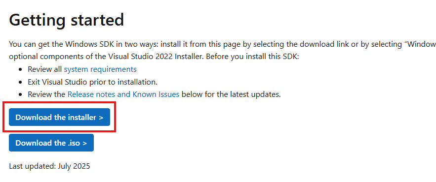
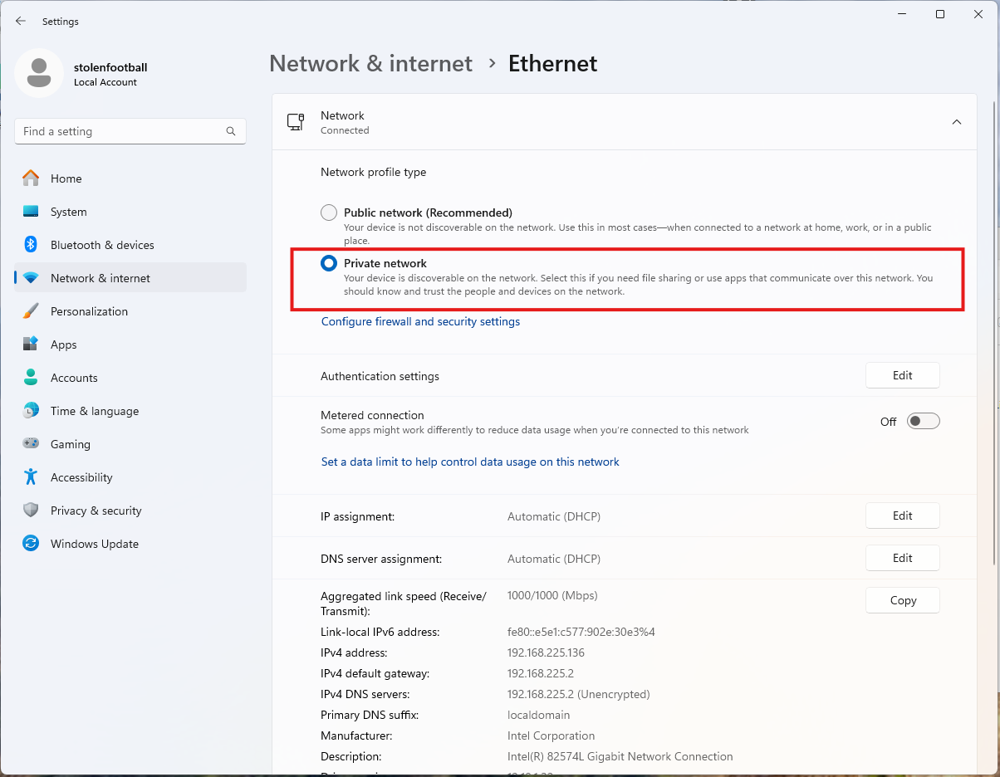
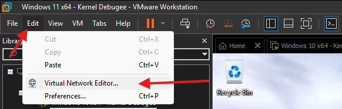

Finally, time to get to what I promised in the first place - reversing a driver!

The first step, of course, will be to set up a debugger.  Then we'll put our driver into IDA, rebase the .text segment, and look at some IRPs flowing through it.

## Install the VM
I'll be using [VMWare Workstation Pro](https://www.vmware.com/products/desktop-hypervisor/workstation-and-fusion) as my hypervisor for this.  It's the most ubiquitous hypervisor out there (and in my opinion the easiest to use).  

> A lot of people use Hyper-V when doing kernel debugging as well, and if you want to take that route there's plenty of tutorials online.

First, set up and install a new Windows VM.  It doesn't need a license, the unlicensed version is more than adequate as a debugee.

Kernel offsets and mitigations change all the time in Windows, so make sure you're installing the correct verion of the operating system.  If the exploit you are looking at doesn't work, it's possible that the version of Windows you're running doesn't match the exploit.

For this post, the most recent version of either Windows 10 or 11 will be fine.  I will be using the most recent version of Windows 11, which can be obtained from [the Microsoft download page](https://www.microsoft.com/en-us/software-download/windows11).

> Windows 11 doesn't let you add a local account by default.  To bypass this and create a local account anyways, do the following:
>
> 1. When you get to the screen that says "How would you like to set up this device?", press `SHIFT+F10`
> 2. In the command prompt that opens, run `start ms-cxh://setaddlocalonly`
> 3. Create the local account like normal
>
> The computer should reboot when the account is created.  If it doesn't, just use the VMWare menu to reboot the VM.

## Install WinDbg on the host
The first step to take is to install WinDbg on your host computer, which is the bare metal OS running your hypervisor.  

> Yes, that means you should be running Windows while doing Windows development work.  It is possible to do all of this from MacOS or Linux, but your life will be more difficult than it needs to be, and exploit development is difficult enough as it is.  
>
> If you're daily driving Linux I'll assume you know enough to set up a dual boot.  If you're using an ARM Mac, I'd recommend getting a cheap x64 computer you can write exploits on.  A decent used Thinkpad should be less than $100 on eBay, or you could take a dumpster diving trip to your local office park if that isn't feasible for some reason.  Dumpster diving for parts is a well respected pastime in the security world.

If you followed along from [part 3 of this series](https://stolenfootball.github.io/posts/series/windows_drivers/p3_minimum_viable_driver/index.html), you may already have installed WinDbg along with the Windows SDK.

If not, you can download the Windows 11 SDK by navigating to [the official download page](https://developer.microsoft.com/en-us/windows/downloads/windows-sdk/) and clicking "Download the installer".



Make sure to "install the SDK on this computer".


When it comes time to select which features to install, I suggest installing all of them.  In particular, make sure the **Debugging Tools for Windows** get installed, as that is where WinDbg is located.  If you just want WinDbg, uncheck all of the other boxes and continue the installation.


## Copy files to the guest VM
On the guest VM, create a directory called `C:\KDNET`.  We'll need to copy two files from the host computer to that directory:

- `kdnet.exe`
- `VerifiedNICList.xml`

Both of these will be located on the host machine at `C:\Program Files (x86)\Windows Kits\10\Debuggers\x64`.

When you're done, the `KDNET` directory on the VM should look like the following:


## Set up networking on the debugee
The next thing we need to do is establish a way for our VM and host machine to communicate.  This is typically done over a network connection these days.

To keep things simple, we'll keep the VM on the VMware internal NAT network, which is what it should be on by default.  To confirm this, right click on the VM and select "Settings":


Then make sure "NAT" is selected.


Now we need to make sure that the network on the VM is trusted.  Open the Windows Settings menu on the VM, click on "Network & internet" in the left hand menu bar, then click on "Ethernet".  Make sure that the network is set as a "Private network".



## Get the Host's IP address
We'll need an IP address so we can ping the host from the VM.  The VMware NAT network is set up on VMnet8 by default, which can be confirmed by navigating to "Edit" -> "Virtual Network Editor" in VMWare Workstation.



In this screenshot you can see NAT is VMnet8, as expected.


Now on the host machine, run `ipconfig` and scroll until you find the entry for VMnet8.  Write down the host IP - in my case it's `192.168.225.1`.

```
C:\Users\jerem>ipconfig

Windows IP Configuration


Ethernet adapter Ethernet:

   Media State . . . . . . . . . . . : Media disconnected
   Connection-specific DNS Suffix  . : hsd1.nh.comcast.net

...

Ethernet adapter VMware Network Adapter VMnet8:

   Connection-specific DNS Suffix  . :
   Link-local IPv6 Address . . . . . : fe80::7357:15af:c3ca:2d3b%24
   IPv4 Address. . . . . . . . . . . : 192.168.225.1
   Subnet Mask . . . . . . . . . . . : 255.255.255.0
   Default Gateway . . . . . . . . . :
```

## Set up debugging on the VM
On the VM, open up an **Administrative** command prompt and `cd` into the `C:\KDNET` directory.

Run `kdnet.exe`.  You should see something along the lines of the following output, which means debugging is supported on your adapter.

```
C:\KDNET>kdnet.exe

Network debugging is supported on the following NICs:
busparams=3.0.0, Intel(R) 82574L Gigabit Network Connection, Plugged in.

Network debugging is not supported on any of this machine's USB controllers.
```

Next, we'll open a port for network debugging using `kdnet.exe`.  The port number typically used for this is between `50000-50039`.  For this, I arbitrarily chose `50017`.

The command to enable debugging to be run on the VM is:
```
kdnet.exe [HOST IP ADDRESS] [PORT NUMBER]
```

Using my IP and port, a run of the command looks like this:

```
C:\KDNET>kdnet.exe 192.168.225.1 50017

Enabling network debugging on Intel(R) 82574L Gigabit Network Connection.

To debug this machine, run the following command on your debugger host machine.
windbg -k net:port=50017,key=10p145zzlg28h.8rtmc2s2tujk.6f4kt1ekmx9t.1pnjw2uxvjpk4

Then reboot this machine by running shutdown -r -t 0 from this command prompt.
```

Copy the command that starts with **windbg** to a safe place.  **Your key will be different from mine.  Use the one from your machine**.

## Connect to the VM with WinDbg
Open WinDbg on the host machine, then click on "File" -> "Attach to kernel" -> "Net"


Make sure to set the port number to the number we chose earlier, and the "Key" should be the key from the output from the VM.

If everything went right, WinDbg should open a window that looks like the following:


Now reboot the VM.  This can be accomplished through running `shutdown -r -t 0` from the same Administrative command prompt as earlier, or simply from the start menu.

Once the VM reboots, you should see it connect to the debugger.  WinDbg will output some messages that look like the following:


## Basic WinDbg Functionality
Let's load our driver from [the last post](https://stolenfootball.github.io/posts/series/windows_drivers/p5_basic_driver_function/) into our new debugee VM and take a look at it.  For those of you joining now, you can download the sample from [here](./example/MyDriver1.sys).

To enable test signing on the VM so the driver loads, run `bcdedit /set testsigning on` in an Administrative command prompt the reboot the VM again.

Now drop the driver on the Desktop of the VM and run the following in an Administrative command prompt:

```cmd
sc create MyDriver1 type= kernel binPath= C:\Users\[YOUR USERNAME]\Desktop\MyDriver1.sys
```

Then run:

```cmd
sc start MyDriver1
```

Now connect with WinDbg again and click the "Break" button in the upper left hand corner.  You should see something like the following:


The VM should now be frozen, as we have hit a breakpoint in the kernel. 

Windows has a bunch of publically available debugging symbols, but they are not loaded by WinDbg by default.  One of the first things you should do when starting a kernel debugging session is to resolve those symbols.

To do this, go to the `kd>` prompt in the debugger, and run the following:

```
.sympath srv*
```


Then:

```
.reload
```


Once the symbols finish loading, type `lm` to get a list of loaded modules.  `MyDriver1` should be among them.


Now let's get some information about the module.  Run the command `lmDvm MyDriver1`.

This is the `lm` (List Loaded Modules) command with the following options:
- `D`: use debugger markup language.  Makes clickable links and prettier output
- `v`: give more verbose output
- `m`: only list modules that match the pattern given


You can also click on the `MyDriver1` link in the `lm` output to get the same result.

To examine all symbols for the module, we can use the following command:

```
x /D MyDriver1!*
```

- `x`: Examine symbols
- `/D`: Use debugger markup language
- `MyDriver1!*`: Takes the form [Module]![Symbol].  This gives us all symbols associated with the MyDriver1 module.  If we wanted all symbols in MyDriver1 that start with the letter "a", we could run `x /D MyDriver1!a*`

This is a stripped binary, so there are no symbols for it.  We'll go over how to work around that in a second.

The last command to check out is:

```
!lmi MyDriver1
```

This will give detailed information about a loaded module.  An example of the output is below:


The big thing to note down here is the *base address*.  In my case it is `fffff80043db0000`.

## Starting rev in IDA
Now let's open `MyDriver1.sys` in IDA.  Keep the default options when opening it, and let IDA do it's autoanalysis.

The first thing I usually do in IDA is open the pseudocode window.  This can be done by pressing `F5`.

IDA typically identifies an initializer function as DriverEntry.  As a result, your window probably looks like this:


Click on the second function (in this case `sub_140001150`) and you'll see something that looks more familiar.


Now is the time to do rev.  I'm going to get on my soapbox for a second. **Do not skip doing rev**.  There are so many posts online of people doing pwn with the default decompilation, and it makes life so much more difficult than it needs to be.

For those of you new to this, here are some tips for reverse engineering with a decompiler.

- Let the decompiler do most of the work.  Your job is mostly to apply structs and types.  When you apply a correct type, the decompiler will fix itself and look nicer.
- Do not rely only on the pseudo-c.  Unless the correct types are applied, the decompilation can be incorrect.  Read the assembly, its not as bad as you think.
- Use API calls to infer types.  For example, we know `IoCreateDevice` returns a `PDEVICE_OBJECT` as it's 6th parameter.  If that wasn't already set, we could apply the type in IDA.

The following options should be your best friend.  

- `N`: Rename variable
- `Y`: Set variable type
- `M`: Set enum varient
- `ALT+Y`: Select union field

Continue doing this to the point where you **thoroughly** understand the function.  Do it to the point where a college freshman could read the pseudo-c.  When it doubt, **do more rev**.

For this DriverEntry function, I did the following:

- Use `N` to rename the function to `DriverEntry_0` to better represent its function.
- Use `N` to rename `DestinationString` to `DeviceName`
- Use `N` to rename `result` to `status`
- Use `=` to map `v3` to `status`.  Sometimes IDA will create multiple variables where the source only used one.  This is usually due to something the compiler did. Be careful when using this option, only do it when you're sure.
- Use `M` to change the MajorFunction codes to their respective enums.  If you don't see the correct enum in the first window, select `<NEW>` and search for it.


- Use `N` to rename all of the dispatch functions
- Use `\` to hide casts (sometimes helpful, but usually just makes the decompilation harder to read)
- Right click on the declarations at the top and select "Collapse declarations"

Now, the decompilation looks like this:


In this case, it's not that dramatic (although we have located our handler functions).  But what happens with a more complex function?

## Reversing DeviceControlHandler
Let's open the `DeviceControlHandler` function, which is what handles main program logic.  The default decompilation looks like this:


I'm going to leave fixing the decompilation as an exercise to the reader.  When you are done however, it should look like this:


If any of that code looks confusing, refer back to [part 5 of this series](https://stolenfootball.github.io/posts/series/windows_drivers/p5_basic_driver_function/) and review the source of this driver and its explanation there.

## Using IDA with WinDbg
Now it's time to make use of our module's base address we got from WinDbg earlier.

Due to [KASLR](https://en.wikipedia.org/wiki/Address_space_layout_randomization), the Windows kernel is loaded at a different base address each time the computer is rebooted.  This is very analagous to user space ASLR, which loads a process at a different address each time it runs.

Because of this, IDA will have all of the offsets right, but has no way of knowing the base address the driver was loaded at.

We can provide it that information.  Go to "Edit" -> "Segments" -> "Rebase Program"


Set the value to the value we got from the `!lmi` command in WinDbg.


This makes it so that the absolute addresses in IDA are the same as they are in WinDbg.

Once you do that, I'd also recommend enabling line prefixes in the graph view so you can see the addresses.  You can do this by clicking on the graph view, then selection "Options" -> "General" then clicking "Line prefixes (graph)".


Now your graph view should look something like this:


The last thing I recommend is putting the graph view next to the psuedocode and synchronizing them.  Putting them next to each other can be done with a drag and drop in IDA:


Finally, to see where you are in the pseudocode and assembly at the same time, right click on the assembly, select "Synchronize with" then select "Pseudocode-A".


Now IDA will highlight both the pseudocode and the section of the assembly that corresponds to it when you click on it.

Let's check to make sure all of the addresses line up.  My rebased DeviceControlHandler function starts at address `FFFFF80043DB1070`, as you can see in the graph view:


Let's use WinDbg to disassemble 0x10 lines of assembly at that address in our test VM.  The command is:

```
u FFFFF80043DB1070 L10
```

Remember, your base address will be different.

The output of that looks like this:


The assembly matches!  Now we can use the decompilation in IDA to set breakpoints and generally know where we are when executing our driver.

As a last important note: **Take a snapshot of your VM now.** Every time you reboot, the kernel will be loaded at a different offset and you'll have to rebase your program in IDA again.  When you want to roll back, just use the snapshot from now on.

## Debugging IRPs
The main thing we will want to debug when developing exploits for our driver is the IRP handlers.  In this driver, IRPs are handled by the DeviceControlHandler function.

Let's set a breakpoint in DeviceControlHandler.  We know it's address, so let's set a breakpoint at the entry of the function.

The command for setting a breakpoint at an address in WinDbg is simply:

```
bp [ADDRESS]
```

You can also use `bl` to list your breakpoints.


Now hit "Go" in the upper right hand corner to resume execution of the VM (you could also type `g` in the `kd>` prompt). We'll need it running so we can send the IRP.


To send an IRP to the driver, we'll use the same client program from the last post.  If you don't have that for whatever reason, it can be downloaded from [here](./example/ioctlDriverClient.exe).

Drop the client on the Desktop of the VM and run it.  You should see WinDbg hit a breakpoint.


Now we can step through instructions, examine memory, and even change variables on the fly.  Everything you're used to from a user land debugger.  I'm not going to go into exact WinDbg functionality now as I'll be spending a lot of time with it throughout the next several posts, but a good cheat sheet can be found [here](https://blog.lamarranet.com/wp-content/uploads/2021/09/WinDbg-Cheat-Sheet.pdf).


## Final thoughts
This is the last of the "setup" posts.  From here on out, I'll be covering exploits and how to write them.

If you're starting with this post, I *highly* recommend going through the rest of this series and following all of the exercises.  It will take more time to get started, but with a good base foundation you'll be able to do the more advanced exercises much faster and with a better understanding.

## More reading
- [Debug Windows drivers step-by-step lab (echo kernel mode)](https://learn.microsoft.com/en-us/windows-hardware/drivers/debugger/debug-universal-drivers---step-by-step-lab--echo-kernel-mode-)
- [Get started with Windows debugging](https://learn.microsoft.com/en-us/windows-hardware/drivers/debugger/getting-started-with-windows-debugging)
- [Debugging Tools for Windows](https://learn.microsoft.com/en-us/windows-hardware/drivers/debugger/debugger-download-tools)
- [Debugging the Windows kernel on VMware](https://cra0.net/blog/posts/debugging-the-windows-kernel-vmware-p2/)

## Series Index
- [Part 1 - Overview](https://stolenfootball.github.io/posts/series/windows_drivers/p1_overview/index.html)
- [Part 2 - What's a Driver Anyways?](https://stolenfootball.github.io/posts/series/windows_drivers/p2_whats_a_driver/index.html)
- [Part 3 - The Minimum Viable Driver](https://stolenfootball.github.io/posts/series/windows_drivers/p3_minimum_viable_driver/index.html)
- [Part 4 - Interacting with the Driver](https://stolenfootball.github.io/posts/series/windows_drivers/p4_interacting_with_driver/)
- [Part 5 - Basic Driver Functionality](https://stolenfootball.github.io/posts/series/windows_drivers/p5_basic_driver_function/)
- [Part 6 - Debugging and Basic Rev](https://stolenfootball.github.io/posts/series/windows_drivers/p6_debugging_drivers/)