This challenge came with two files - an encrypted 7-zip file named `backup.7z` and a memory dump named `win10_memdump.elf`. There was also a docker container available online running [Starkiller](https://github.com/bc-security/starkiller), which is a front-end management app for the post exploitation framework [PowerShell Empire](https://github.com/EmpireProject/Empire). When I visited the site, there was a login page requesting a username and password to access Starkiller, but no username and password were provided with the challenge.

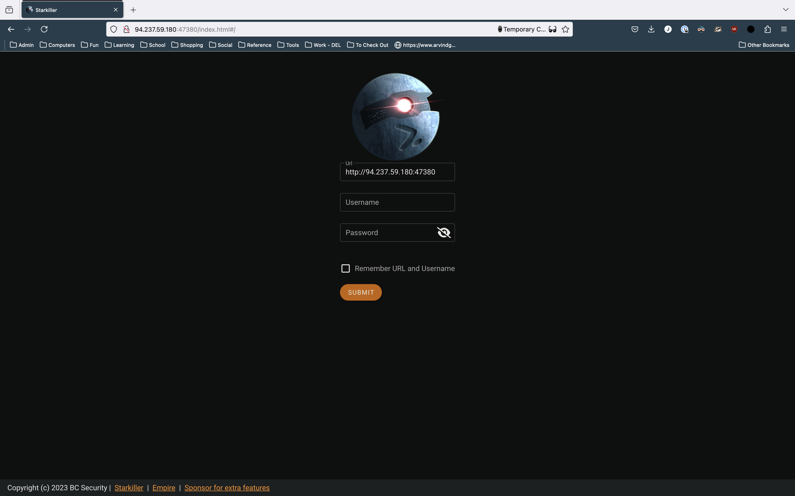

## Accessing the backup

The first thing I decided to do was attempt to decrypt the backup file. I tried a couple of basic passwords, but nothing worked. Next, I began to look through the memory dump using [Volatility3](https://github.com/volatilityfoundation/volatility3).

When scanning the processes that were active when the memory image was taken, I noticed two things. First, Signal was actively running. This stuck out at me, since the challenge was called _Signaling Victorious_, and I took note of it for later. The other process that jumped out was `backuper.exe`. Given the weird spelling and the fact that it was at the end of the process list (which usually indicates user-started processes), I figured it may be a custom backup application.

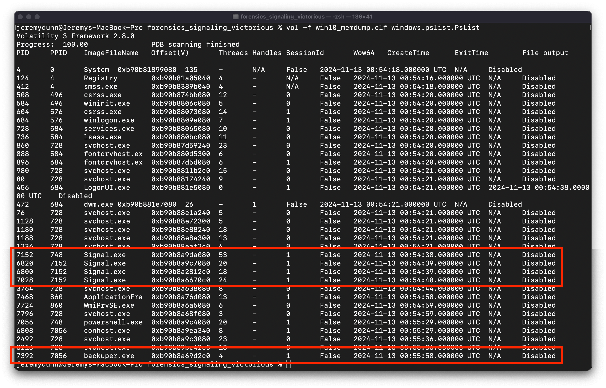

Next I did a file scan looking for the `backuper.exe` application, and found it on the user's Desktop.

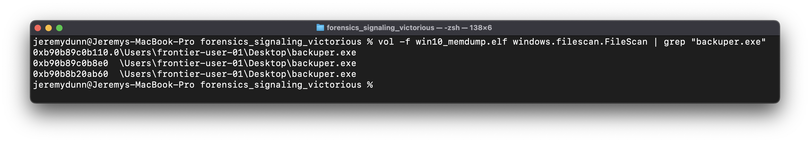

I dumped the file using the `windows.dumpfiles.DumpFiles` plugin, and opened the executable in [Binary Ninja](https://binary.ninja/). I searched for strings, and found the command: `7z.exe a -t7z backup.7z \"C:\\Users\\\" -p%ws`, then found the function that utilizes that string in the XREFs. The pseudo-c (cleaned up a bit) of the function is below:

```c
int main() {
    LSA_HANDLE LsaHandle = 0;
    wchar16 const* const OfflineBackupKey = u"OfflineBackupKey";

    void command;
    memset(&command, 0, 0xc8);

    struct _OBJECT_ATTRIBUTES ObjectAttributes;
    memset(&ObjectAttributes, 0, 0x30);

    NTSTATUS Status;
    Status = LsaOpenPolicy(nullptr, &ObjectAttributes, 0x20, &LsaHandle);

    int64_t result;

    if (!Status)
    {
        struct LSA_UNICODE_STRING* LsaUnicodeString = nullptr;
        NTSTATUS Status_1 = LsaRetrievePrivateData(LsaHandle, &KeyName, &LsaUnicodeString);
        
        if (!Status_1)
        {
            sprintf(&command, 0xc8, "7z.exe a -t7z backup.7z \"C:\\Users\\\" -p%ws", LsaUnicodeString->Buffer);
            execute(&command);
            memset(LsaUnicodeString, 0, 8);
            memset(&command, 0, 0xc8);
            LsaFree(LsaUnicodeString);
            LsaClose(LsaHandle);
            result = 0;
        }
        else
        {
            dbgPrint("LsaRetrievePrivateData failed, e…", LsaNtStatusToWinError(Status_1));
            LsaClose(LsaHandle);
            result = 1;
        }
    }
    else
    {
        dbgPrint("LsaOpenPolicy failed, error: 0x%…", LsaNtStatusToWinError(Status));
        result = 1;
    }

    return result;
}
```

The function retrieves the value `OfflineBackupKey` from the Windows Local Security Authority (LSA) and uses it as the password to encrypt the backup when it is zipped. The LSA is a common place within a Windows system that sensitive information such as passwords are stored, and it's contents can usually be retrieved if you have a memory dump.

I ran the `windows.lsadump.Lsadump` Volatility plugin, and retrieved the following:

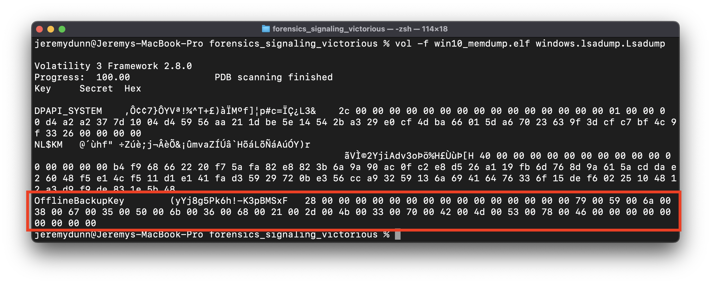

The offline backup key is stored as a `UNICODE_STRING` , which is a common structure for storing strings in Windows programs. A `UNICODE_STRING` is defined as follows, with the actual string buffer stored in `UTF-16LE` format (again, incredibly common for Windows strings).

```c
typedef struct _UNICODE_STRING {
  USHORT Length;
  USHORT MaximumLength;
  PWSTR  Buffer;
} UNICODE_STRING, *PUNICODE_STRING;
```

Which means the key is:

```c
OfflineBackupKey {
  Length: 0x28
  MaximumLength: UNDEFINED
  Buffer: "yYj8g5Pk6h!-K3pBMSxF"
}
```

I used 7-zip and the key to decrypt the `backup.7z` file, and found a copy of the `C:\Users` directory of the computer.

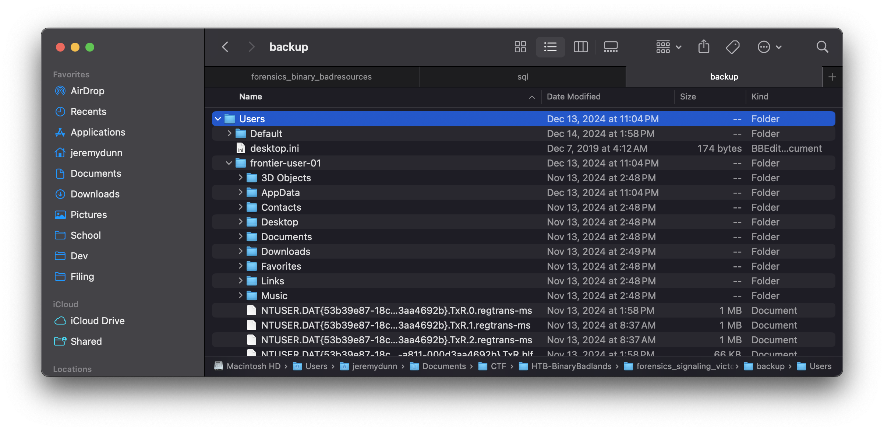

## Signal Messaging

Given that the challenge was called _Signaling Victorious_, as well as the fact that Signal was one of the only user space applications running on the device, I figured the point of the challenge was to retrieve the Signal messages.

After some quick research, I found that the Signal Windows app stores its messages in the `%APPDATA%\Roaming\Signal\sql\db.sqlite` file. This is a SQL-Cipher encrypted database, and sure enough, the one on this device was encrypted.

This is where it got interesting. Apparently Signal used to store the key for this database in plaintext in `%APPDATA%\Roaming\Signal\config.json`. This obviously wasn't great (because `%APPDATA%\Roaming` is fairly accessible by default), but the person who broke this was apparently Elon Musk?

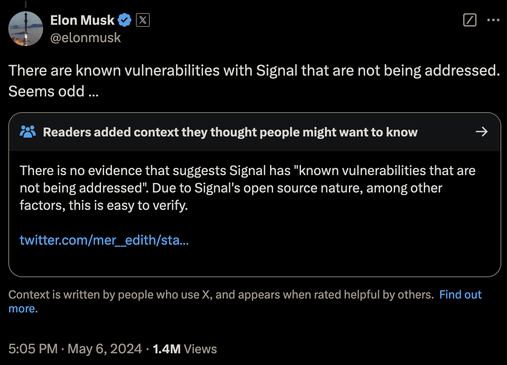

In a strange turn of events, Musk was absolutely right, I have no idea what was going on with the community note. Any user or program with access to the `%APPDATA%` folder could read all Signal messages, and this was a known issue in Signal since 2018 that was in fact not being addressed.


Anyways, after all of the publicity that came in the aftermath of Musk's tweet, Signal decided fix the problem, and began to use device-native solutions to store all of its encryption keys. In Linux, this meant the keyring, on Mac, this means keychain, and on Windows, this means DPAPI.

## A Brief Aside - DPAPI

DPAPI is the Windows Data Protection API. Application developers can use the API through the `CryptProtectData` and `CryptUnprotectData` functions. `CryptProtectData` takes plaintext and returns a `DPAPI_BLOB` structure, which contains the encrypted data and metadata regarding the encryption. `CryptUnprotectData` takes a `DPAPI_BLOB`, and returns plaintext.

Under the hood DPAPI (when encrypting secrets for a specific user) uses a 64 byte "Master Key" during encryption, which is saved in the `%APPDATA\Roaming\Microsoft\Protect\[USER_SID]` folder. The Master Key is combined with the SHA1 hash of the user's password, the user's SID, and some metadata stored in the `DPAPI_BLOB` to derive the encryption key used to encrypt the plaintext.

The end result of all of this is that an application developer can store serialized `DPAPI_BLOB` structures on the disk and have a degree of assurance that they cannot be decrypted without the user's password.

For a more detailed discussion of DPAPI internals, I highly recommend the blog post I linked below. It does a great job of making a complex topic clear, and provides a lot of detail.

https://www.insecurity.be/blog/2020/12/24/dpapi-in-depth-with-tooling-standalone-dpapi/

## Back to it

Theoretically, according to Signal, not much was changed in the actual storage of the database key after the update - they just replaced the `key` field in `config.json` with `encryptedKey`, which was encrypted using DPAPI. Below are examples of the previous "plaintext" config file and the new "encrypted" one after the update.

Old Version:

```json
{
  "key": "d07de8ee1be42b41d040cf9090a31115671cfe812a6305d0517a2da88bf5c7fc",
  "mediaPermissions": true,
  "mediaCameraPermissions": true
}
```

New Version:

```json
{
  "encryptedKey": "763130cc1843cbf3949e872b373031e89c85f8e8d6e9ec3bd9340bb9c6fd844ca424d7e666feac3663f6c2810d6ddbdfb82f7faa4456eda119bacd2709fc2404eeeb74e69b2b3f2f71e765b74a068c5549a1871559d537de08a25c700a97cd"
}
```

The problem is, this encrypted key is clearly not a DPAPI blob. Using the DPAPI blob parser built into [pypykatz](https://github.com/skelsec/pypykatz), we can see that.

```bash
jeremydunn@Jeremys-MacBook-Pro % pypykatz dpapi describe blob 763130cc1843cbf3949e872b373031e89c85f8e8d6e9ec3bd9340bb9c6fd844ca424d7e666feac3663f6c2810d6ddbdfb82f7faa4456eda119bacd2709fc2404eeeb74e69b2b3f2f71e765b74a068c5549a1871559d537de08a25c700a97cd
== DPAPI_BLOB ==
version: 3425710454
credential_guid: b'\x18C\xcb\xf3\x94\x9e\x87+701\xe8\x9c\x85\xf8\xe8'
masterkey_version: 1005382102
masterkey_guid: b90b34d9-fdc6-4c84-a424-d7e666feac36
flags: 2177037923
description_length: 3755699469
description: b"\xb8/\x7f\xaaDV\xed\xa1\x19\xba\xcd'\t\xfc$\x04\xee\xebt\xe6\x9b+?/q\xe7e\xb7J\x06\x8cUI\xa1\x87\x15Y\xd57\xde\x08\xa2\\p\n\x97\xcd"
crypto_algorithm: 0
crypto_algorithm_length: 0
salt_length: 0
salt: b''
HMAC_key_length: 0
HMAC_key: b''
hash_algorithm: 0
HMAC: b''
data_length: 0
data: b''
signature_length: 0
signature: b''
hash_algorithm_length: 0
HMAC_length: 0
to_sign: b"\xd6\xe9\xec;\xd94\x0b\xb9\xc6\xfd\x84L\xa4$\xd7\xe6f\xfe\xac6c\xf6\xc2\x81\rm\xdb\xdf\xb8/\x7f\xaaDV\xed\xa1\x19\xba\xcd'\t\xfc$\x04\xee\xebt\xe6\x9b+?/q\xe7e\xb7J\x06\x8cUI\xa1\x87\x15Y\xd57\xde\x08\xa2\\p\n\x97\xcd"
```

None of the fields populate, and the ones that do are clearly incorrect.

So where is the actual DPAPI blob?

## A Breakthrough

Figuring this out took a lot longer than I care to admit. If I'd been smart, I probably could have just grepped for the GUID of the data provider used for DPAPI (which is always the same and is a part of every valid blob), but I didn't think of that until days later.

What I did eventually do (after much trial and error) is find an open-source [Signal backup tool](https://github.com/bepaald/signalbackup-tools) which is still in active development. Since they have to decrypt the data in order to back it up, I figured they'd know where the DPAPI blob with the key was stored on the disk.

I searched through the Github repo for the string "DPAPI", and came across [getkeyfromencrypted_win.cc](https://github.com/bepaald/signalbackup-tools/blob/82ee591f5115576210ab8ddc1c01d1d1ec5ff2d4/desktopdatabase/getkeyfromencrypted_win.cc#L85).

From this tool, I learned a couple of important things.

First, Signal appends the string "DPAPI" in ASCII to the front of the blob after it gets returned from `CryptProtectData`, and then strips it off again before sending it to `CryptUnprotectData`. I can't even begin to guess why, `DPAPI_BLOB` structures already have a unique signature in the form of the provider GUID, so it's not like another magic number is necessary. Maybe someone's bonus was attached to the number of lines of code they wrote?

The relevant code from `getkeyfromencrypted_win.cc` is here:

```c
  // the encrypted key starts with 'D' 'P' 'A' 'P' 'I' {0x44, 0x50, 0x41, 0x50, 0x41}, skip this...
  DATA_BLOB encrypted_encryptedkey_key_blob{static_cast<unsigned long>(encrypted_encryptedkey_key.second - STRLEN("DPAPI")), encrypted_encryptedkey_key.first + STRLEN("DPAPI")};
```

Second, the blob is stored under the json key `encrypted_key`, not `encryptedKey` as seen in `config.json` (snake case supremacy yet again). Unfortunately, `getkeyfromencrypted_win.cc` seems to be getting the key by doing a regex search of the `%APPDATA%\Roaming\Signal\Local State` file for `encrypted_key` and pulling the blob out of the regex.

```c
// 2. get the key to decrypt the encrypted key
//*****  2a. get the base64 encoded encrypted key to decrypt the encrypted key ******//
std::fstream localstate(d_configdir + "/Local State", std::ios_base::in | std::ios_base::binary);
if (!localstate.is_open())
{
  Logger::error("Failed to open input: ", d_configdir, "/Local State");
  return false;
}
std::string line;
std::regex keyregex(".*\"encrypted_key\":\\s*\"([^\"]*)\".*");
std::smatch m;
bool found = false;
while (std::getline(localstate, line))
{
  //std::cout << "Line: " << line << std::endl;
  if (std::regex_match(line, m, keyregex))
    if (m.size() == 2) // m[0] is full match, m[1] is first submatch (which we want)
    {
      found = true;
      break;
    }
}

if (!found)
{
  Logger::error("Failed to read key from Local State");
  return false;
}
```

I can't hate on this codebase too much since they provided my major breakthrough for the challenge, but for the love of all that is good in this world people json parsers were invented for a reason.

Also, as a side note - why does `Local State` not have a file extension? Why is there a space? Who at Signal is doing code review?

Regardless, in the `Local State` file, we finally have what we are looking for:

```json
{
  "os_crypt": {
    "audit_enabled": true,
    "encrypted_key": "RFBBUEkBAAAA0Iyd3wEV0RGMegDAT8KX6wEAAAD8tnGruNB7TaoSbs4Z/xkXEAAAABIAAABDAGgAcgBvAG0AaQB1AG0AAAAQZgAAAAEAACAAAACKakPvCWDeRdef30ik+0RfHTUXhQrfAdfcEOuzfv8sDQAAAAAOgAAAAAIAACAAAAAad9BHSVFuYmI0D8QG9924xL4pzewU1LemGmaTlTzcOjAAAAAg0SNGW/NP4egaKEv0Tgl9JE3d0tFQpx6G6lMcoOlF3EyR/dr0hbbBbQksTEkECcxAAAAAHaurRLkbh4yTcD+/hxG67Vfa0zLEIJpQOAWw6BIDUw+jRHY3AuIU0wdyxy5lv6CZEYmIQqUbyJSXzPIPpqYn6w=="
  }
}
```

After decoding the Base64 and stripping the incredibly necessary "DPAPI" from the front, we can use `pypykatz` to decode the `DPAPI_BLOB`

```bash
jeremydunn@Jeremys-MacBook-Pro % pypykatz dpapi describe blob 01000000d08c9ddf0115d1118c7a00c04fc297eb01000000fcb671abb8d07b4daa126ece19ff191710000000120000004300680072006f006d00690075006d0000001066000000010000200000008a6a43ef0960de45d79fdf48a4fb445f1d3517850adf01d7dc10ebb37eff2c0d000000000e80000000020000200000001a77d04749516e6262340fc406f7ddb8c4be29cdec14d4b7a61a6693953cdc3a3000000020d123465bf34fe1e81a284bf44e097d244dddd2d150a71e86ea531ca0e945dc4c91fddaf485b6c16d092c4c490409cc400000001dabab44b91b878c93703fbf8711baed57dad332c4209a503805b0e81203530fa344763702e214d30772c72e65bfa09911898842a51bc89497ccf20fa6a627eb
== DPAPI_BLOB ==
version: 1
credential_guid: b'\xd0\x8c\x9d\xdf\x01\x15\xd1\x11\x8cz\x00\xc0O\xc2\x97\xeb'
masterkey_version: 1
masterkey_guid: ab71b6fc-d0b8-4d7b-aa12-6ece19ff1917
flags: 16
description_length: 18
description: b'C\x00h\x00r\x00o\x00m\x00i\x00u\x00m\x00\x00\x00'
crypto_algorithm: 26128
crypto_algorithm_length: 256
salt_length: 32
salt: b'\x8ajC\xef\t`\xdeE\xd7\x9f\xdfH\xa4\xfbD_\x1d5\x17\x85\n\xdf\x01\xd7\xdc\x10\xeb\xb3~\xff,\r'
HMAC_key_length: 0
HMAC_key: b''
hash_algorithm: 32782
HMAC: b'\x1aw\xd0GIQnbb4\x0f\xc4\x06\xf7\xdd\xb8\xc4\xbe)\xcd\xec\x14\xd4\xb7\xa6\x1af\x93\x95<\xdc:'
data_length: 48
data: b' \xd1#F[\xf3O\xe1\xe8\x1a(K\xf4N\t}$M\xdd\xd2\xd1P\xa7\x1e\x86\xeaS\x1c\xa0\xe9E\xdcL\x91\xfd\xda\xf4\x85\xb6\xc1m\t,LI\x04\t\xcc'
signature_length: 64
signature: b"\x1d\xab\xabD\xb9\x1b\x87\x8c\x93p?\xbf\x87\x11\xba\xedW\xda\xd32\xc4 \x9aP8\x05\xb0\xe8\x12\x03S\x0f\xa3Dv7\x02\xe2\x14\xd3\x07r\xc7.e\xbf\xa0\x99\x11\x89\x88B\xa5\x1b\xc8\x94\x97\xcc\xf2\x0f\xa6\xa6'\xeb"
hash_algorithm_length: 512
HMAC_length: 32
to_sign: b'\x01\x00\x00\x00\xfc\xb6q\xab\xb8\xd0{M\xaa\x12n\xce\x19\xff\x19\x17\x10\x00\x00\x00\x12\x00\x00\x00C\x00h\x00r\x00o\x00m\x00i\x00u\x00m\x00\x00\x00\x10f\x00\x00\x00\x01\x00\x00 \x00\x00\x00\x8ajC\xef\t`\xdeE\xd7\x9f\xdfH\xa4\xfbD_\x1d5\x17\x85\n\xdf\x01\xd7\xdc\x10\xeb\xb3~\xff,\r\x00\x00\x00\x00\x0e\x80\x00\x00\x00\x02\x00\x00 \x00\x00\x00\x1aw\xd0GIQnbb4\x0f\xc4\x06\xf7\xdd\xb8\xc4\xbe)\xcd\xec\x14\xd4\xb7\xa6\x1af\x93\x95<\xdc:0\x00\x00\x00 \xd1#F[\xf3O\xe1\xe8\x1a(K\xf4N\t}$M\xdd\xd2\xd1P\xa7\x1e\x86\xeaS\x1c\xa0\xe9E\xdcL\x91\xfd\xda\xf4\x85\xb6\xc1m\t,LI\x04\t\xcc'
```

Yay, data.

## Decrypting the blob

Now we have the our encrypted `DPAPI_BLOB`, but we still need the master key to retrieve it.

If you read the earlier bit about [DPAPI](#a-brief-aside---dpapi), you'll know that the master key seed is stored in the `%APPDATA\Roaming\Microsoft\Protect\[USER_SID]` folder in a file with the same name as the GUID of the master key. In this case, we know from the blob that we are looking for a master key with a GUID of `ab71b6fc-d0b8-4d7b-aa12-6ece19ff1917`, so we know exactly what file we're looking for. It's contents are here, decoded once again by `pypykatz`.

```bash
jeremydunn@Jeremys-MacBook-Pro % pypykatz dpapi describe masterkey backup/Users/frontier-user-01/AppData/Roaming/Microsoft/Protect/S-1-5-21-1208348762-991206961-812773293-1001/ab71b6fc-d0b8-4d7b-aa12-6ece19ff1917
== MasterKeyFile ==
version: 2
unk1: 0
unk2: 0
guid: ab71b6fc-d0b8-4d7b-aa12-6ece19ff1917
unk3: 0
policy: 0
flags: 5
masterkey_length: 176
backupkey_length: 144
credhist_length: 20
domainkey_length: 0
masterkey: == MasterKey ==
version: 2
salt: b'\x95T\xd8\xdb\r\r\xaa:\x93\x93\x1f\xaf?Z_\x9b'
iteration_count: 8000
hash_algorithm: 32782
crypto_algorithm: 26128
data: b'^x\x0c\xe9\x94,\xff\xe5\x9e\xa2\xcb\x82\xb2\xed[\x82-\x848>\xbe3\x10c\x83.{\xab\xd1\xf5\xb7\xf5\xda\xff`\x9e\xe5\xac\xbf6L\xdc\xc0\xec\xeb\x9c\xf0\xa6\x8bI=\xf9\xbeLh\xf5=\x14X\xadM\xb7-\xeeY\xbd\xff\x12D\xa3\xeb\x18,v\x8e\x11\x02\xd9\xcf\x19\x80\x9d\xab\x04B\xe3\xb0\xa9\xbd!N\xd6\x1d\xf3?\x1eR\xff\x906\xab\tm\x19J\xb8\nA\xe5a\x0b\x92\xcd\x06-}\xa7\xac\n\xac\xae\x1e7\xb1\xbe\xad]\xb6\xe7\x14r.\xb10\x9b*?\x08\xdf/,\x1b89'

backupkey: == MasterKey ==
version: 2
salt: b'q\xb0\xcc\\b[\x8d<\xc8\xdf\xc8\xa5\xdfh;\x83'
iteration_count: 8000
hash_algorithm: 32782
crypto_algorithm: 26128
data: b'\xe1tq~I\xe1m\xf6"\x02R\xc0\x81~h\xcfAzA\x85\xe8\x0b\xdaP\xee_\xfa\xb6\xca\xfa\x05\xa9e\xf8\x1et\xf4\x89\xf4B\x1d\xd8\x9c\xbf\xbc\xfc\x90t\xb4\x8a\x83$\xe4E\x80\x038\x8f6M\xe1\x98@\xd7\xe7\x1aYU\x87\xa4q)\x7f\n\x0c\xa7>,\xb1gU\xfeK\x86)N\xc3/\xaa\xea\x7f\xa8\xc4\xf8\xf7\x1f\xe0\xd3\xb8\xab\x0b\xe1\xfaY\x9e\xc8\x0f\xcd#\x83I\xf9'

credhist: == CredHist ==
version: 3
guid: b'\x1c\xfe\xf2\x8fg~\xe0C\xa3\xbf8\xde#\x87p\xb5'

domainkey: None
```

Great, now all we need are the user's SID and a SHA1 hash of the user's password. We have the SID obviously (it's the folder name) but how can we get the SHA1 hash?

Fortunately for us, the SHA1 hash of the user's password is yet another thing that is stored in the LSA. There are any number of ways to parse this out of the memory dump, but the cleanest one I found was this very nice [pypykatz Volatility3 plugin](https://github.com/skelsec/pypykatz-volatility3). Just run the plugin, and we get:

```bash
jeremydunn@Jeremys-MacBook-Pro % vol -f win10_memdump.elf -p pypykatz-volatility3 pypykatz
Volatility 3 Framework 2.8.0
credtype	domainname	username	NThash	LMHash	SHAHash	masterkey	masterkey(sha1)	key_guid	password
msv	DESKTOP-6MBJBAP	frontier-user-01	1d3e3e030ba1a179e1281406efd980bf		ded871d3a3992be2179840890d061c9f30a59a77
dpapi						791ca70e650987684b043745c6f4b1c0f97eb2369317302c6c60f9cda19e1b4864fbece48341141501606d8d359ff7f54ee71e4a2b821d3df69582927742809f	8d53efa8456b9ba43206f4c3a6dc1c957d26105a	ab71b6fc-d0b8-4d7b-aa12-6ece19ff1917
msv	DESKTOP-6MBJBAP	frontier-user-01	1d3e3e030ba1a179e1281406efd980bf		ded871d3a3992be2179840890d061c9f30a59a77
```

(Incidentally, yes, the calculated master key is also in the LSA. Doing the extra steps to derive it from the raw key is more interesting though)

Now, we can use pypykatz to generate some prekeys that will be used for master key decryption:

```bash
jeremydunn@Jeremys-MacBook-Pro % pypykatz dpapi prekey sha1 S-1-5-21-1208348762-991206961-812773293-1001 ded871d3a3992be2179840890d061c9f30a59a77
d63766f8e020781d1b9c694b19af724aed16284b
ded871d3a3992be2179840890d061c9f30a59a77
```

And use those prekeys to calculate the correct master key.

```bash
jeremydunn@Jeremys-MacBook-Pro % pypykatz dpapi masterkey ./backup/Users/frontier-user-01/AppData/Roaming/Microsoft/Protect/S-1-5-21-1208348762-991206961-812773293-1001/ab71b6fc-d0b8-4d7b-aa12-6ece19ff1917 prekeys.txt
[GUID] ab71b6fc-d0b8-4d7b-aa12-6ece19ff1917
[MASTERKEY] 791ca70e650987684b043745c6f4b1c0f97eb2369317302c6c60f9cda19e1b4864fbece48341141501606d8d359ff7f54ee71e4a2b821d3df69582927742809f
```

Note that the master key does match the one pulled directly out of the memory dump.

Now, all we have to do is run the `DPAPI_BLOB` earlier through `pypykatz` with our new master key!

```bash
jeremydunn@Jeremys-MacBook-Pro % pypykatz dpapi blob masterkey_decrypted.json 01000000d08c9ddf0115d1118c7a00c04fc297eb01000000fcb671abb8d07b4daa126ece19ff191710000000120000004300680072006f006d00690075006d0000001066000000010000200000008a6a43ef0960de45d79fdf48a4fb445f1d3517850adf01d7dc10ebb37eff2c0d000000000e80000000020000200000001a77d04749516e6262340fc406f7ddb8c4be29cdec14d4b7a61a6693953cdc3a3000000020d123465bf34fe1e81a284bf44e097d244dddd2d150a71e86ea531ca0e945dc4c91fddaf485b6c16d092c4c490409cc400000001dabab44b91b878c93703fbf8711baed57dad332c4209a503805b0e81203530fa344763702e214d30772c72e65bfa09911898842a51bc89497ccf20fa6a627eb
HEX: 7582f084a7d00872eebe919c2c02da0a8f4d8e67e648bb55805e8994a8a165ef
STR: 艵蓰킧爈뻮鲑Ȭ૚䶏枎䣦喻庀钉ꆨ
```

## Decrypting the database

This looks a lot like a raw database encryption key! Unfortunately, using it to try to open the SQL-Cipher file doesn't work. What's going on?

At this point, I reopened the trusty Signal backup software from eariler, and found something interesting:

```c
  // 3. Now decrypt the encrypted_key using the decrypted key from local state
  // the encrypted key (from step 1) is made up of
  // - a 3 byte header ('v', '1', '0')
  // - a 12 byte nonce
  // - 64 bytes of encrypted data
  // - 16 bytes mac
  uint64_t header_length = 3;
  unsigned char *header = encryptedkey_data.get();
  uint64_t nonce_length = 12;
  unsigned char *nonce = encryptedkey_data.get() + header_length;
  uint64_t mac_length = 16;
  unsigned char *mac = encryptedkey_data.get() + (encryptedkey_data_length - mac_length);
  uint64_t encdata_length = encryptedkey_data_length - mac_length - header_length - nonce_length;
  unsigned char *encdata = nonce + nonce_length;
```

The first three bytes of `encrypted_key` are yet another header. The next 12 are a nonce, 64 bytes of encrypted data, and a 16 byte mac respectively. These seem like parameters for an authenticated encryption scheme. My suspicions were confirmed when I found these lines of code later in the program:

```c
// Create and initialize the decryption context & cipher
std::unique_ptr<EVP_CIPHER_CTX, decltype(&::EVP_CIPHER_CTX_free)> ctx(EVP_CIPHER_CTX_new(), &::EVP_CIPHER_CTX_free);
std::unique_ptr<EVP_CIPHER, decltype(&::EVP_CIPHER_free)> cipher(EVP_CIPHER_fetch(NULL, "AES-256-GCM", NULL), &::EVP_CIPHER_free);
```

So we're dealing with `AES-256-GCM`. [Galois/Counter Mode](https://en.wikipedia.org/wiki/Galois/Counter_Mode) is one of the most common methods of modern authenticated encryption, which describes crypto-systems that allow for verifiying the integrity of the data that was encrypted as a native part of the encryption scheme, which a more basic construction like `AES-CBC$` would not do.

That said, cryptography isn't the point of this blog post, so we'll skip the nitty-gritty details (as cool as GCM is). What we need is the ciphertext that was encrypted using `encrypted_key`. Although it isn't explicity mentioned anywhere, I had a pretty good idea of where the ciphertext could be found. Remember `config.json`, with our `encryptedKey` that was definitely not a `DPAPI_BLOB`?

```json
{
  "encryptedKey": "763130cc1843cbf3949e872b373031e89c85f8e8d6e9ec3bd9340bb9c6fd844ca424d7e666feac3663f6c2810d6ddbdfb82f7faa4456eda119bacd2709fc2404eeeb74e69b2b3f2f71e765b74a068c5549a1871559d537de08a25c700a97cd"
}
```

Let's try to decrypt it using `AES-256-GCM` and the key retrieved from `encrypted_key` above.

Parsed out, `encryptedKey` from `config.json` looks like this:

```json
{
  "header": "763130", // ('v', '1', '0') in ASCII hex
  "nonce": "cc1843cbf3949e872b373031",
  "encrypted_data": "e89c85f8e8d6e9ec3bd9340bb9c6fd844ca424d7e666feac3663f6c2810d6ddbdfb82f7faa4456eda119bacd2709fc2404eeeb74e69b2b3f2f71e765b74a068c",
  "mac": "5549a1871559d537de08a25c700a97cd"
}
```

We can use [CyberChef](https://gchq.github.io/CyberChef) to decrypt the data. A link to the exact recipe I used is [here](<https://gchq.github.io/CyberChef/#recipe=AES_Decrypt(%7B'option':'Hex','string':'7582f084a7d00872eebe919c2c02da0a8f4d8e67e648bb55805e8994a8a165ef'%7D,%7B'option':'Hex','string':'cc1843cbf3949e872b373031'%7D,'GCM','Hex','Raw',%7B'option':'Hex','string':'5549a1871559d537de08a25c700a97cd'%7D,%7B'option':'Hex','string':''%7D)&input=ZTg5Yzg1ZjhlOGQ2ZTllYzNiZDkzNDBiYjljNmZkODQ0Y2E0MjRkN2U2NjZmZWFjMzY2M2Y2YzI4MTBkNmRkYmRmYjgyZjdmYWE0NDU2ZWRhMTE5YmFjZDI3MDlmYzI0MDRlZWViNzRlNjliMmIzZjJmNzFlNzY1Yjc0YTA2OGM>).

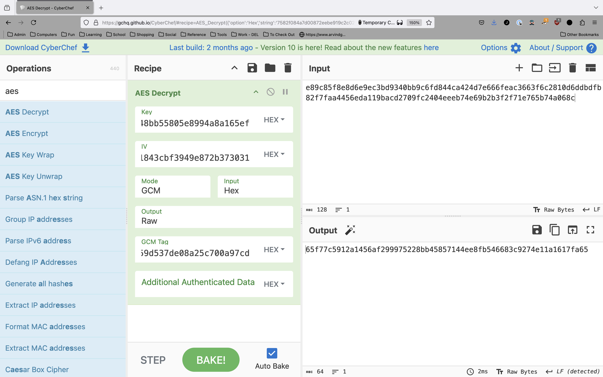

Now we can go ahead and open the database with [DB Browser for SQLite](https://sqlitebrowser.org/).

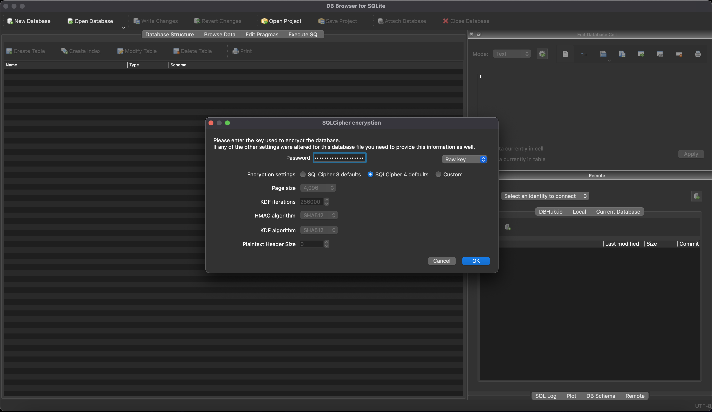

And, it opens!

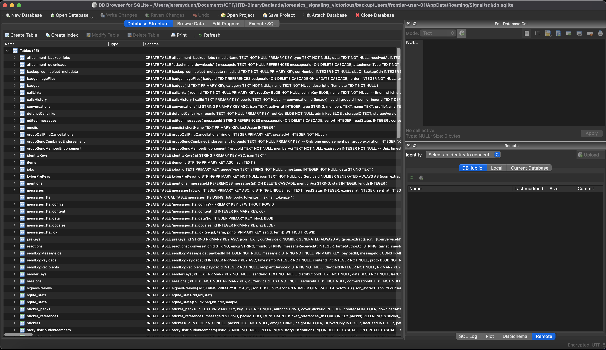


## Finding the messages

A quick scan of the database structure shows that the messages are stored in the `json` field of the `messages` table. It's a bit odd to store serialized json objects within a SQL database, but hey, it's not nearly the weirdest thing we've seen so far, so let's roll with it.

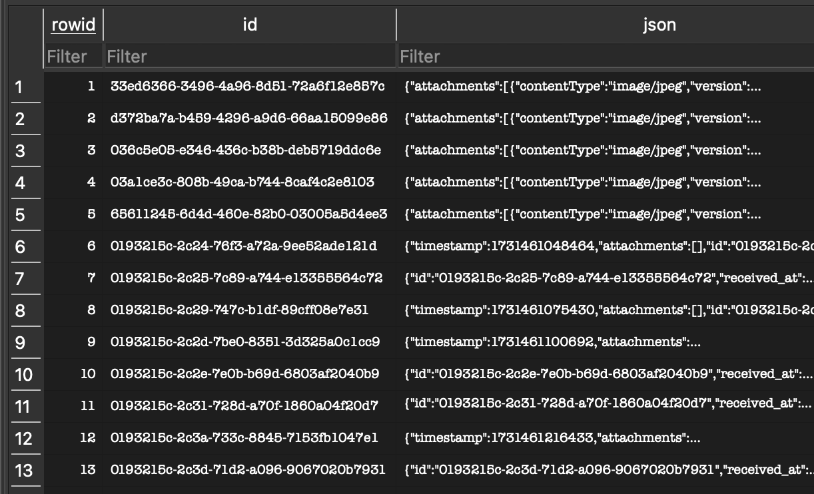

A quick sql query pulls out all of the json objects with the message data.

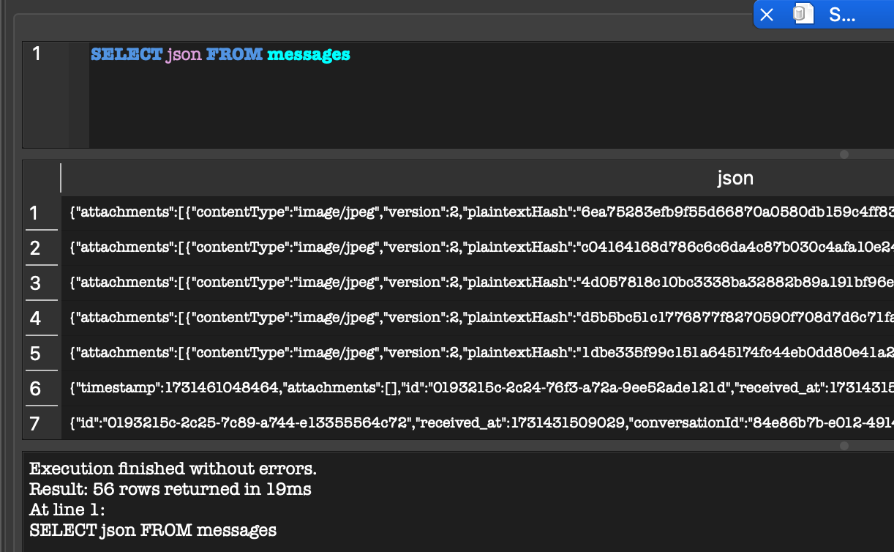

A typical message looks like this:

```json
{
  "timestamp": 1731461048464,
  "attachments": [],
  "id": "0193215c-2c24-76f3-a72a-9ee52ade121d",
  "received_at": 1731431509028,
  "conversationId": "84e86b7b-e012-4914-a9c1-f78bff32391d",
  "readStatus": 0,
  "received_at_ms": 1731461048688,
  "seenStatus": 2,
  "sent_at": 1731461048464,
  "serverGuid": "8a1537e1-cf59-4513-b88a-dd868a95fb1b",
  "serverTimestamp": 1731461049368,
  "sourceDevice": 1,
  "sourceServiceId": "2faa6b1d-1d1e-4fc7-a7e5-46c07a18aa47",
  "type": "incoming",
  "unidentifiedDeliveryReceived": false,
  "schemaVersion": 14,
  "body": "Alright Ace, let’s get this operation underway!",
  "bodyRanges": [],
  "contact": [],
  "decrypted_at": 1731461048849,
  "errors": [],
  "flags": 0,
  "hasAttachments": 0,
  "isViewOnce": false,
  "mentionsMe": false,
  "preview": [],
  "requiredProtocolVersion": 0,
  "supportedVersionAtReceive": 7
}
```

Clearly, the body field contains the content of the message.  I exported the messages to a `json` file from DB Browser, then used the following Python script to pull out all of the `body` fields from messages that had them and reconstruct the conversation.

```python
import json

with open("messages.json", "r") as fd:
    raw = json.loads(fd.read())
    
for y in list(map(lambda x: json.loads(x['json']), raw)):
    print(y["body"] if "body" in y.keys() else "")
```

It's not the prettiest code ever written, but it did the job.  The message thread that it pulled out is below:

```
Alright Ace, let’s get this operation underway!
We’ll need a solid C2 server
I was thinking maybe Sliver, Havoc or Empire! What do you think?
Empire works. It's reliable versatile and runs quiet!
Plus, it's got those nifty user access controls, keeps things tidy in case we want to bring in more gunslingers later. We're set to expand if need be!
Good thinking! This setup needs to hold up under pressure. No room for slip-ups!!
Agreed!
I'll get Starkiller loaded up on one of the dead satellites orbiting the belt, should mask our activity as stray signals
I'll use a few spoofed IPs and a layered encryption stack for extra cover, but there's a catch
What catch?
Empire's not exactly "low-maintenance" for this kind of op. Its log storage can swell up if we're not careful.
if they start a data sweep, too many logs could leave a trail back to us!
Understood. Set the logs to overwrite every hour. Clear it up as we go
Can’t risk a breadcrumb trail…
Done!
Alright Empire is live. Credentials are almost set. Username is `empireadmin`. Will send the password later, need to change it and fix up some other things!
Noted
Now let’s discuss the main play
We are going after the loot in Free Station 47
Free Station 47... risky target, but that station is one of the last holdouts in the Cluster that's not under Frontier Board's control
They've got civilian resources, medical supplies, independent traders, event intel of sage routes outside our surveillance
But I'm getting the feeling this is not just about supplies... is it?
Exactly! Free Station 47 also shelters some of the best engineers and medics left in the frontier who are not loyal to us
When we seize those assets we will cripple resistance across the sector and send a clear message that nobody stands up to the board
I'll route a beacon to their communication relay, intercepting logs of incoming and outgoing transmissions. Might take a bit but we'll have a live feed on everything happening on their channels
But they've got backup power sources. If they get alerted, they'll lock us out quickly!
So we’ll sabotage those power sources
While they’re fumbling with emergency power, we’re in and out
What about the station’s defense grid?
I can set up a signal jammer disguised as a drifting asteroid. It'll hover near their perimeter giving us about fifteen minutes to move before their secondary systems kick in.
Any longer, and we'll lose our window
Also, here's the password for Starkiller `eNSrj4qHp0pG#075D98@` Keep it safe boss!
That’s all we need Once we have the supplies and personnel data, we’ll rendezvous near Blackreach Comet
There’s an extraction pod if we need to make a quick getaway
Understood
We'll grab their resources, lock down the station, and disable their transmissions to cover our retreat
Good!
It’s time these rebels learned what happens when you they defy the Board!
Couldn't agree more, Boss!
Our new station is coming along really nicely
Nice work pulling that access credential for their medical wing, Ace!
What kind of clearance did it give us?
Full access, Boss!!
We're talking patient logs, personnel records, medical inventories
We can see where they're hiding critical resources and key personnel across the Cluster
Now that’s useful. Think we can make some of their inventory “disappear” without raising suspicion?
Absolutely! I'll re-route essential medical supplies to the Board's stations, bit by bit. Undetectable!
Plus, we'll use this access to plant a few hidden controls, let us override their systems whenever we need!
Perfect! Free Station 47’s supplies and people just became another tool for the Board’s expansion. Let’s bleed them dry!
```

From this conversation, we can see that the username for the Starkiller instance from earlier is `empireadmin` and the password is `eNSrj4qHp0pG#075D98@`.

## Into Starkiller

Using the credentials, I was able to log into Starkiller.

I clicked through a few screens, and eventually came to the stored credentials page, which is where the flag was stored.

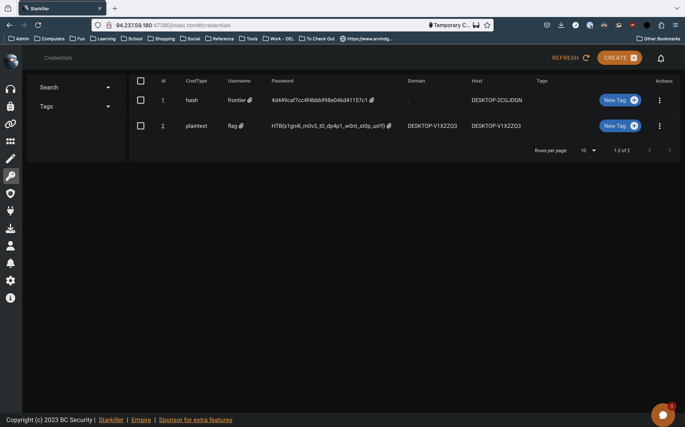

## Conclusions

This was a really fun challenge, and provided a great opportunity to look further into Signal internals.  I couldn't find any resources online at all about decrypting the new Signal messages database, so this could actually end up being valuable information for real forensic investigations.  I may make up another more direct writeup on just the database decryption portion for easy reference.